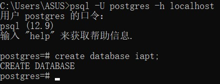
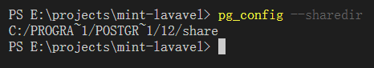
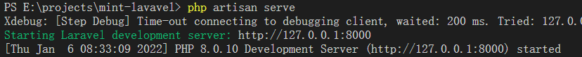
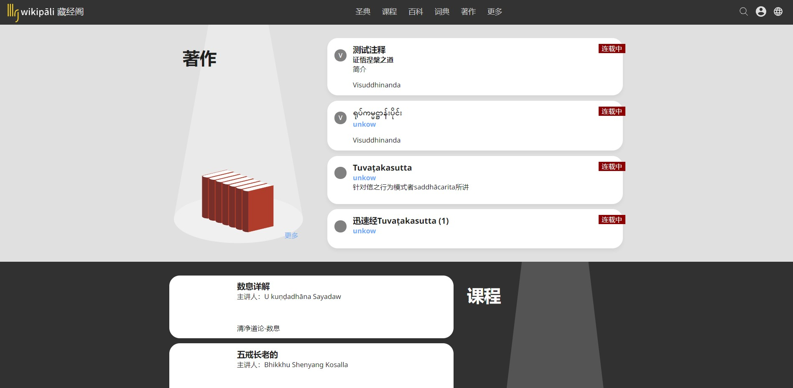

# IAPT Pali Canon Platform

## About

这是一个开放的基于语料库的巴利语学习和翻译平台。

后端：
- PHP 8.0+
- [laravel](https://laravel.com/docs) 8.x
- PostgreSQL v12+
- Redis

前端
- jQuery

工具
- git
- composer
- npm or yarn
- vscode

## 目录

目录遵从Laravel目录设置。有以下几点差别

- public/ 包含旧版php程序的全部文件
- public/tmp 旧版资源文件夹，含有sqlite数据文件 对于旧版到新版的迁移。**应该将旧版 /tmp 拷贝到 /public**
- v1 旧版数据迁移任务脚本
- deploy 运维代码 

## 开发环境

>请注意。此安装方法**只针对开发人员**。生产线请参考[deploy/README.md](deploy/README.md)

使用 **Linux** 的开发者请参阅 [<项目文件夹>/docker/readme.md](docker/readme.md) 容器中包含了全部开发环境。请忽略下面关于开发环境的安装。

### PostgreSQL

最小版本v12。下载链接
https://www.postgresql.org/download/

>温馨提示：windows环境安装完之后 将 安装目录/bin加入环境变量 PATH。重启电脑。在命令行输入 psql -v 查看版本号。

建立新的数据库，例如 数据库名为iapt：
在命令行输入
```
psql -U postgres -h localhost
create database iapt
```



`\q` 退出psql

### PHP 8
编辑 php.ini 文件，打开pgsql和sqlite的PDO扩展，以及fileinfo
```
extension=pdo_pgsql
extension=pdo_sqlite
extension=fileinfo
```

### Redis
最新版的Redis不支持Windows平台，可以安装第三方修改的[Windows版Redis5.0](https://github.com/tporadowski/redis)

### composer

### npm

### Rabbitmq

[Downloading and Installing RabbitMQ](https://www.rabbitmq.com/download.html)


## Fork

Fork https://github.com/iapt-platform/mint 到你自己的仓库

## Clone

```
git clone https://github.com/<your>/mint.git

```

## 安装依赖

项目根目录下运行

```
composer install
npm install
```

/public 目录下运行

```
composer install
npm install
```


## 修改配置文件

### .env

复制 `<项目目录>/.env.example` 的一个副本。改文件名为 `.env`

修改`.env`

**db配置**
```
DB_CONNECTION=pgsql
DB_HOST=127.0.0.1
DB_PORT=5432
DB_DATABASE=你的数据库名
DB_USERNAME=postgres
DB_PASSWORD=你的数据库密码
```

**ASSETS_SERVER**

ASSETS_SERVER ：网站资源文件，非用户的图片，音频，视频

- 对应/public/tmp/ 目录 开发线可以设置为 http://127.0.0.1:8000/tmp（ip port根据你的dev server修改）
- 所有文件存储在 https://drive.google.com/drive/folders/1-4dn4juD-0-lsKndDui2W9nT9wcS_Y33?usp=sharing
- 开发线可自行下载放到/public/tmp/
- 或直接引用离您最近的assets server


### public/app/config.php

复制 `<项目目录>/public/app/config.example.php` 改文件名为`config.php`

修改`config.php`

**db 设置**
```
define("Database",[
	"type"=>"pgsql",
	"server"=>"localhost",
	"port"=>5432,
	"name"=>"<database name>",
	"sslmode" => "disable",
	"user" => "<user name>",
	"password" => "<your db password>"
]);
```


**Redis 设置**
```
define("Redis",[
	"host" => "<host ip>",
	"port" => <port>,
	"password" => "<redis password>",
	"prefix"=>"aaa://"
]);
```

**ASSETS_SERVER**

**HELP_SERVER**

**GRAMMAR_SERVER**

参照下文 config.js
 
#### public/app/config.js

复制 `<项目目录>/public/app/config.example.js` 改文件名为`config.js`

修改`config.js`

**ASSETS_SERVER**

ASSETS_SERVER ：网站资源文件，非用户的图片，音频，视频

- 对应/public/tmp/ 目录
- 所有文件存储在 https://drive.google.com/drive/folders/1-4dn4juD-0-lsKndDui2W9nT9wcS_Y33?usp=sharing
- 开发线可自行下载放到/public/tmp/
- 或直接引用离您最近的assets server

范例：
>ip port根据你的dev server修改

```
var ASSETS_SERVER = "http://127.0.0.1:8000/tmp";
```

**HELP_SERVER**

网站帮助文档

- 直接引用离您最近的 help server

范例：
>ip port根据你的 dev server 修改

```
var HELP_SERVER = "https://help-hk.wikipali.org";
```

**GRAMMAR_SERVER**

语法手册文档

- 直接引用离您最近的 help server

范例：
>ip port根据你的 dev server 修改

```
var GRAMMAR_SERVER = "https://grammar-hk.wikipali.org";
```

## 复制巴利语全文搜索单词表

获取pg share dir
在命令行窗口运行
```
pg_config --sharedir
```
程序会输出 shardir.


**Liunx**
把下面`/usr/share/postgresql/14`替换为你自己的shardir
```bash
sudo cp ./public/app/fts/pali.stop /usr/share/postgresql/14/tsearch_data/
sudo cp ./public/app/fts/pali.syn /usr/share/postgresql/14/tsearch_data/
```
**Windows**

复制
- ./public/app/fts/pali.stop
- ./public/app/fts/pali.syn

到你的 shardir/tsearch_data 目录下


## application encryption key

在<工程目录>下运行
```dash
php artisan key:generate
```

## 数据库迁移

在根目录下运行

```dash
php artisan migrate
```

## Redis数据库填充

在命令行运行<项目目录>下面的命令

**Liunx**
```dash
cd ./v1/scripts
sh ./upgrade_redis.sh
```

**Window**
```dash
cd ./v1/scripts
./upgrade_redis.bat
```

## 语料数据库填充

**Liunx**
```dash
cd ./v1/scripts
sh ./install.sh
```

**Window**
```dash
cd ./v1/scripts
./install.bat
```
运行时间较长。本地开发环境大约4小时。

如果不想等待，可以导入其他人已经部署好的postgresql数据库

## 启动消息队列works

```dash
php artisan mq:discussion
php artisan mq:pr
php artisan mq:progress
php artisan mq:wbw.analyses
```

## 运行dev server

```dash
php artisan serve
```


在浏览器中访问

http://127.0.0.1:8000

应该出现网站首页



