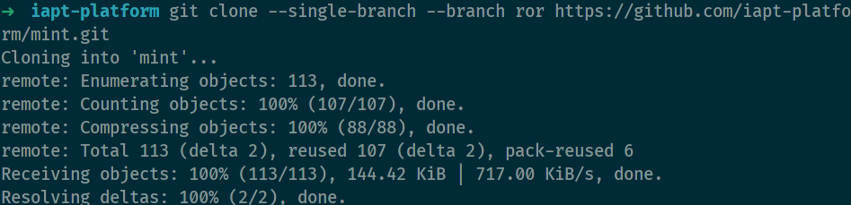

# README

This README would normally document whatever steps are necessary to get the
application up and running.

- Clone code
  
    

- [System dependencies](docker/)
  
    ```bash
    # install gem dependencies
    bundle install
    ```

- Database creation & initialization
    
  
    ```bash
    # migrate the database to latest
    rake db:migrate    
    # rolls the schema back to the previous version
    rake db:rollback
    # loads the seed data
    rake db:seed
    ```

- Create a model & migration
  
    ```bash
    # plain model
    rails generate model Item --no-fixture --no-test-framework
    # plain migration
    rails generate migration AddHiToUsers
    ```

- How to run the test suite

- Services (job queues, cache servers, search engines, etc.)

- Deployment instructions

## Documents

- [A Scope & Engine based, clean, powerful, customizable and sophisticated paginator for modern web app frameworks and ORMs](https://github.com/kaminari/kaminari)
- [Minimal authorization through OO design and pure Ruby classes](https://github.com/varvet/pundit)
