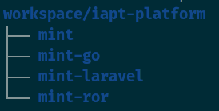

# Usage for Ubuntu 22.04(jammy) and newer

- Install podman: `sudo apt install crun podman buildah fuse-overlayfs`.

- Work with podman image

  ```bash
  # clear outdated images
  podman rmi -a -f
  # import new podman image
  podman load -q -i palm-spring-TIMESTAMP.tar  
  ```

- Enjoy it!

  
  

  ```bash
  # start container
  ./docker/start.sh
  # start servers
  > sudo supervisord -c /etc/supervisor/supervisord.conf

  # enable rabbitmq Management Plugin 
  > sudo rabbitmq-plugins enable rabbitmq_management

  # enable redis clusters
  > /etc/redis/redis.sh
  ```

  - RabbitMQ: `http://localhost:15672`, user `guest`, password `guest`
  - Redis cluster ports `6371~6376`
  - Minio server: `http://localhost:9001` user `admin`, password `12345678`
  - PostgreSql: `psql -U postgres -h 127.0.0.1 -p 5432`
  - ElasticSearch: `curl http://127.0.0.1:9200/`

- For VSCode **Run in your local host**

```bash
sudo apt install yarnpkg golang-go
```
