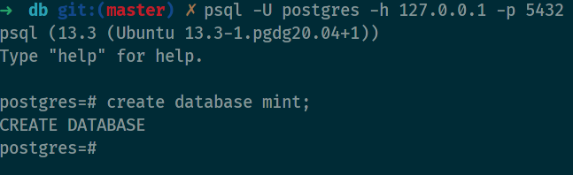
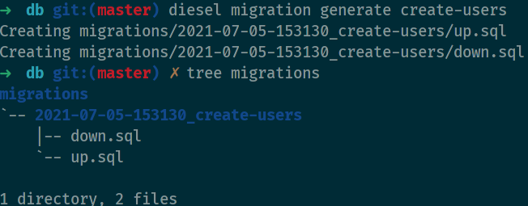

# USAGE



```

```bash
source .env

# Generate a new migration with the given name
diesel migration generate NAME
# Runs all pending migrations
diesel migration run
# Reverts the latest run migration
diesel migration revert
# Lists all available migrations
diesel migration list
```


