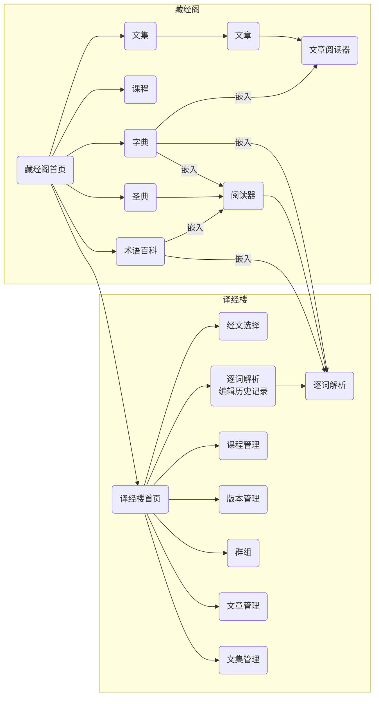
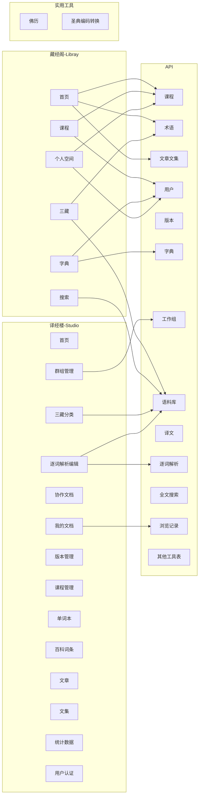

# 注意

- 该文档尚未完善，内容仅供参考
- 该文档中的技术方案尚未敲定，如涉及具体开发，需先行商议

# 说明

本文档是网站页面的前端设计文档

# 开发环境（待商议）

-   React
-   Umijs
-   Ant Design
-   Type Script

# 网站地图

> 注意：以下目录内，仅标星（*）项目有具体内容，其余尚未编写

-   藏经阁-Libray
    -   [首页](home.md)
    -   [三藏*](palicanon.md)
    -   [课程](course.md)
    -   [字典](dict.md)
    -   [搜索](search.md)
    -   [个人空间](myzone.md)
-   译经楼-Studio
    -   [首页](stu_home.md)
    -   [三藏分类](stu_pali.md)
    -   [我的文档（最近打开）](stu_doc.md)
    -   [逐词解析编辑](stu_wbw.md)
    -   [协作文档](stu_coop.md)
    -   [群组管理](stu_group.md)
    -   [版本管理](stu_channel.md)
    -   [课程管理](stu_course.md)
    -   [单词本](stu_dict.md)
    -   [百科词条](stu_term.md)
    -   [文章](stu_article.md)
    -   [文集](stu_collection.md)
    -   统计数据
-   用户中心- User Center
    -   [注册](sign_up.md)
    -   [登陆](sign_in.md)
    -   找回密码
    -   个性化设置
-   实用工具
    -   佛历
    -   圣典编码转换
-   后台管理
    -   栏目内容管理
    -   用户管理
    -   数据表管理

# 调用后端 API

# 藏经阁-Libray

## 首页

www.wikipali.org

### 已经实现的功能能

-   最新课程列表
-   最新百科词条列表

### 需要完善的功能

#### 最新课程列表

-   返回数量是写死的。应该在栏目后台里可以设置。

### 尚未实现的功能（目前的需求）

-   **最新课程列表**-报名数字显示和报名功能

-   最新三藏译文列表

-   手机版 css
    -   写不同的 css 在手机端和 pc 看到不同的页面。
    -   不一定用 css 切换，可以使用不同的技术实现方式。

### 未来可能的发展

-   实现类似 tweet 的文章推荐功能。根据用户阅读行为推荐不同类型和内容的文章。
-   文章类型
    -   逐词解析单词
    -   词典词条
    -   百科词条
    -   句子
    -   段落
    -   章节
-   文章属性标签
    -   译文
    -   新手试验田
    -   雅正（希望大家提修改意见）
    -   求助
-   应用场景
    -   当有学习者不知道某个词的拆分，他在编辑器（studio）中单词的位置选择“求助”按钮。会发布一个带有“求助”标签的“逐词解析”类型的文章。某老师或网友看到求助文章，可以以跟帖的方式回答。
