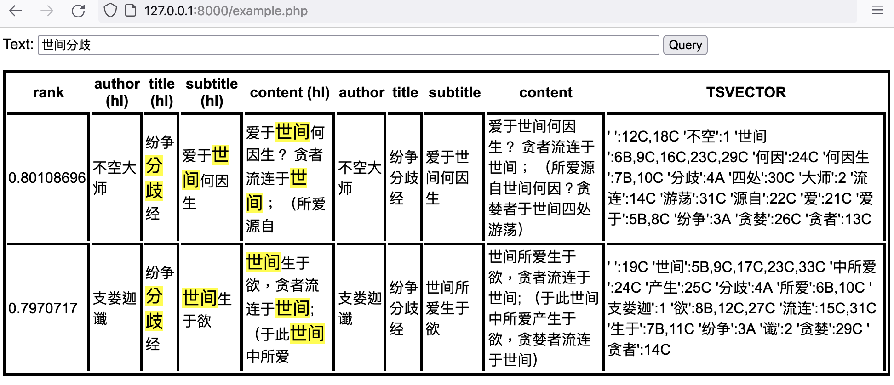
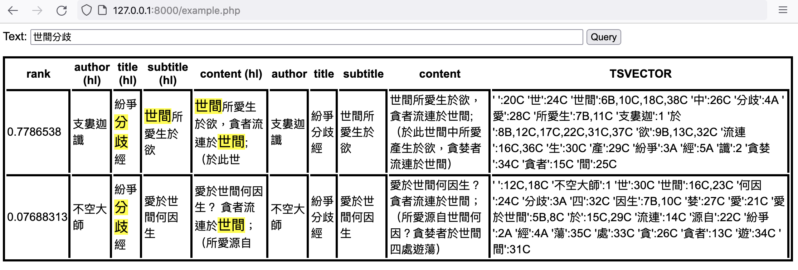

# 基于 PostgreSQL 的中文全文检索方案

## 概述

直接使用 PostgreSQL [结巴分词插件](https://github.com/jaiminpan/pg_jieba) 以及 [简繁转换插件](https://github.com/VitoVan/pg_opencc)，本处仅仅是做简化安装与配置。

### 特性

支持简繁混查。

## 安装 PostgreSQL 插件

此处仅整理 Ubuntu 的安装脚本，如果服务器类型有调整，可以联系我修正：

- 安装编译依赖

    ```bash
    # 安装 PostgreSQL 以及其他依赖项
    sudo apt install postgresql postgresql-contrib postgresql-server-dev-all libpq-dev libopencc-dev pkg-config gcc g++ cmake git
    ```

- 安装 pg_jieba 中文分词插件

    ```bash
    # 下载 pg_jieba 插件源码
    git clone https://github.com/jaiminpan/pg_jieba
    cd pg_jieba
    git submodule update --init --recursive

    # 编译插件 (当前目录 pg_jieba)
    mkdir build
    cd build
    # 编译插件 (当前目录 pg_jieba/build)
    cmake .. # <- 注意有两个小点点
    make
    # 安装插件 (当前目录 pg_jieba/build)
    sudo make install
    ```

- 配置支持繁体分词的词典文件

    ```bash
    # 切换到词典目录
    cd $(pg_config --sharedir)/tsearch_data

    # 下载字典
    sudo curl -L https://github.com/fxsjy/jieba/raw/master/extra_dict/dict.txt.big -o jieba_big.dict

    # 配置 PostgreSQL 使用该词典

    # 使用下面命令找到配置文件
    sudo -u postgres psql -c 'SHOW config_file'

    # 在文件末尾添加如下配置
    shared_preload_libraries = 'pg_jieba.so'
    pg_jieba.base_dict = 'jieba_big'

    # 重启 PostgreSQL
    sudo systemctl restart postgresql
    ```

- 安装 pg_opencc 汉字简繁转换插件

    ```bash
    # 下载 pg_opencc 插件源码
    git clone https://github.com/VitoVan/pg_opencc.git
    cd pg_opencc

    # 编译插件 （当前目录 pg_opencc）
    make

    # 安装插件 （当前目录 pg_opencc）
    sudo make install
    ```

## 使用

与巴利语全文检索不同，中文的全文检索需求比较纯粹，没有「变形词」、「黑体字」等需求，所以中文全文检索功能比较通用。

任意数据表均可使用该功能，只需要添加一个索引字段用来加快检索速度。

### 激活插件

Bash 命令

```bash
# 切换到 postgres 用户, 进入 psql 环境
sudo -i -u postgres psql
```

SQL 命令

```SQL
-- 激活插件
CREATE EXTENSION IF NOT EXISTS "pg_jieba";
CREATE EXTENSION IF NOT EXISTS "pg_opencc";
```

### 在已有数据表上使用

#### 测试数据准备

假设已有以下数据表：

```SQL
CREATE TABLE sample (
    id           SERIAL PRIMARY KEY,
    author       TEXT,
    title        TEXT,
    subtitle     TEXT,
    content      TEXT
);
```

数据表内有以下数据：

```SQL
-- 简体版本测试数据
INSERT INTO sample (author, title, subtitle, content)
       VALUES ('三藏法师', '纷争分歧经', '纷争分歧何处生', '请你说说，许多争吵争论及悲哀、忧伤和妒忌来源于何处？');
INSERT INTO sample (author, title, subtitle, content)
       VALUES ('鸠摩罗什', '纷争分歧经', '爱故纷争分歧生', '爱故纷争分歧生，（由于所爱，纷争、分歧生起）');
INSERT INTO sample (author, title, subtitle, content)
       VALUES ('不空大师', '纷争分歧经', '爱于世间何因生', '爱于世间何因生？ 贪者流连于世间； （所爱源自世间何因？贪婪者于世间四处游荡）');
INSERT INTO sample (author, title, subtitle, content)
       VALUES ('支娄迦谶', '纷争分歧经', '世间所爱生于欲', '世间所爱生于欲，贪者流连于世间; （于此世间中所爱产生于欲，贪婪者流连于世间）');
-- 繁体版本测试数据
INSERT INTO sample (author, title, subtitle, content)
       VALUES ('三藏法師', '紛爭分歧經', '紛爭分歧何處生', '請你說說，許多爭吵爭論及悲哀、憂傷和妒忌來源於何處？');
INSERT INTO sample (author, title, subtitle, content)
       VALUES ('鳩摩羅什', '紛爭分歧經', '愛故紛爭分歧生', '愛故紛爭分歧生，（由於所愛，紛爭、分歧生起）');
INSERT INTO sample (author, title, subtitle, content)
       VALUES ('不空大師', '紛爭分歧經', '愛於世間何因生', '愛於世間何因生？ 貪者流連於世間； （所愛源自世間何因？貪婪者於世間四處遊蕩）');
INSERT INTO sample (author, title, subtitle, content)
       VALUES ('支婁迦讖', '紛爭分歧經', '世間所愛生於欲', '世間所愛生於欲，貪者流連於世間; （於此世間中所愛產生於欲，貪婪者流連於世間）');
```

#### 创建动态索引

分别为 author / title / subtitle / content 设置权重标记 D / A / B / C

```SQL
-- 添加自动更新的 TSVECTOR 字段
ALTER TABLE sample
      ADD COLUMN full_text_search_weighted TSVECTOR
      GENERATED ALWAYS AS (
         setweight(to_tsvector('jiebacfg', coalesce(author,'')), 'D') || ' '  ||
         setweight(to_tsvector('jiebacfg', coalesce(title,'')), 'A')  || ' ' ||
         setweight(to_tsvector('jiebacfg', coalesce(subtitle,'')), 'B') || ' '  ||
         setweight(to_tsvector('jiebacfg', coalesce(content,'')), 'C')
      ) STORED;
-- 为该字段创建索引
CREATE INDEX full_text_search_weighted_idx
       ON sample USING GIN (full_text_search_weighted);
```

#### 查询

简体版本查询：

```SQL
SELECT
    ts_rank('{0.1, 0.2, 0.4, 1}',
        full_text_search_weighted,
        websearch_to_tsquery('jiebacfg', '世间分歧')) AS rank,
        author, title, subtitle, content, full_text_search_weighted
    FROM sample
    WHERE
        full_text_search_weighted @@ websearch_to_tsquery('jiebacfg', '世间分歧');
```

执行耗时： **2 ms**

匹配结果：

<details>
    <summary>点击展开结果</summary>
    <table>
<tr>
        <th>rank</th>
        <th>author</th>
        <th>title</th>
        <th>subtitle</th>
        <th>content</th>
        <th>TSVECTOR</th>
</tr>
<tr>
        <td>0.80108696</td>
        <td>不空大师</td>
        <td>纷争分歧经</td>
        <td>爱于世间何因生</td>
        <td>爱于世间何因生？ 贪者流连于世间； （所爱源自世间何因？贪婪者于世间四处游荡）</td>
        <td>' ':12C,18C '不空':1 '世间':6B,9C,16C,23C,29C '何因':24C '何因生':7B,10C '分歧':4A '四处':30C '大师':2 '流连':14C '游荡':31C '源自':22C '爱':21C '爱于':5B,8C '纷争':3A '贪婪':26C '贪者':13C</td>
</tr>
<tr>
        <td>0.7970717</td>
        <td>支娄迦谶</td>
        <td>纷争分歧经</td>
        <td>世间所爱生于欲</td>
        <td>世间所爱生于欲，贪者流连于世间; （于此世间中所爱产生于欲，贪婪者流连于世间）</td>
        <td>' ':19C '世间':5B,9C,17C,23C,33C '中所爱':24C '产生':25C '分歧':4A '所爱':6B,10C '支娄迦':1 '欲':8B,12C,27C '流连':15C,31C '生于':7B,11C '纷争':3A '谶':2 '贪婪':29C '贪者':14C</td>
</tr>
</table>
</details>

繁体版本查询：

```SQL
SELECT
    ts_rank('{0.1, 0.2, 0.4, 1}',
        full_text_search_weighted,
        websearch_to_tsquery('jiebacfg', '世間分歧')) AS rank,
        author, title, subtitle, content, full_text_search_weighted
    FROM sample
    WHERE
        full_text_search_weighted @@ websearch_to_tsquery('jiebacfg', '世間分歧');
```

执行耗时： **2 ms**

匹配结果：

<details>
    <summary>点击展开结果</summary>
    <table>
<tr>
                 <th>rank</th>
                 <th>author</th>
                 <th>title</th>
                 <th>subtitle</th>
                 <th>content</th>
                 <th>TSVECTOR</th>
              </tr>	<tr>
        <td>0.72886413</td>
        <td>不空大師</td>
        <td>紛爭分歧經</td>
        <td>愛於世間何因生</td>
        <td>愛於世間何因生？ 貪者流連於世間； （所愛源自世間何因？貪婪者於世間四處遊蕩）</td>
        <td>' ':15C,21C '不空':1 '世間':8B,12C,19C,25C,31C '何因':26C '何因生':9B,13C '分歧':4A '四處':32C '大師':2 '愛':6B,10C '所愛':23C '於':7B,11C,18C,30C '流連':17C '源自':24C '紛爭':3A '經':5A '貪婪':28C '貪者':16C '遊蕩':33C</td>
    </tr>
    <tr>
        <td>0.78083044</td>
        <td>支婁迦讖</td>
        <td>紛爭分歧經</td>
        <td>世間所愛生於欲</td>
        <td>世間所愛生於欲，貪者流連於世間; （於此世間中所愛產生於欲，貪婪者流連於世間）</td>
        <td>' ':20C '世間':6B,10C,18C,23C,34C '中':24C '分歧':4A '所愛':7B,11C,25C '支婁迦':1 '於':17C,33C '於此':22C '欲':9B,13C,28C '流連':16C,32C '生於':8B,12C,27C '產':26C '紛爭':3A '經':5A '讖':2 '貪婪':30C '貪者':15C</td>
    </tr>
</table>
</details>

简繁混查（简体输入）：

```SQL
WITH queries AS (
    SELECT
    '世间分歧' AS q1,
    CASE
        WHEN '世间分歧' = opencc_t2s('世间分歧') THEN opencc_s2t('世间分歧')
        ELSE opencc_t2s('世间分歧')
    END AS q2
)

SELECT
    ts_rank('{0.1, 0.2, 0.4, 1}',
        full_text_search_weighted,
        websearch_to_tsquery('jiebacfg', (SELECT q1 FROM queries))) AS rank,
        author, title, subtitle, content, full_text_search_weighted
    FROM sample
    WHERE
        full_text_search_weighted @@ websearch_to_tsquery('jiebacfg', (SELECT q1 FROM queries))

UNION

SELECT
    ts_rank('{0.1, 0.2, 0.4, 1}',
        full_text_search_weighted,
        websearch_to_tsquery('jiebacfg', (SELECT q2 FROM queries))) - 0.1 AS rank,
        author, title, subtitle, content, full_text_search_weighted
    FROM sample
    WHERE
        full_text_search_weighted @@ websearch_to_tsquery('jiebacfg', (SELECT q2 FROM queries))

ORDER BY rank DESC LIMIT 20;
```

执行耗时： **46 ms**

匹配结果：

<details>
    <summary>点击展开结果</summary>
<table>
<tr>
                 <th>rank</th>
                 <th>author</th>
                 <th>title</th>
                 <th>subtitle</th>
                 <th>content</th>
                 <th>TSVECTOR</th>
              </tr>	<tr>
        <td>0.801086962223053</td>
        <td>不空大师</td>
        <td>纷争分歧经</td>
        <td>爱于世间何因生</td>
        <td>爱于世间何因生？ 贪者流连于世间； （所爱源自世间何因？贪婪者于世间四处游荡）</td>
        <td>' ':12C,18C '不空':1 '世间':6B,9C,16C,23C,29C '何因':24C '何因生':7B,10C '分歧':4A '四处':30C '大师':2 '流连':14C '游荡':31C '源自':22C '爱':21C '爱于':5B,8C '纷争':3A '贪婪':26C '贪者':13C</td>
    </tr>
    <tr>
        <td>0.7970716953277588</td>
        <td>支娄迦谶</td>
        <td>纷争分歧经</td>
        <td>世间所爱生于欲</td>
        <td>世间所爱生于欲，贪者流连于世间; （于此世间中所爱产生于欲，贪婪者流连于世间）</td>
        <td>' ':19C '世间':5B,9C,17C,23C,33C '中所爱':24C '产生':25C '分歧':4A '所爱':6B,10C '支娄迦':1 '欲':8B,12C,27C '流连':15C,31C '生于':7B,11C '纷争':3A '谶':2 '贪婪':29C '贪者':14C</td>
    </tr>
    <tr>
        <td>0.680830442905426</td>
        <td>支婁迦讖</td>
        <td>紛爭分歧經</td>
        <td>世間所愛生於欲</td>
        <td>世間所愛生於欲，貪者流連於世間; （於此世間中所愛產生於欲，貪婪者流連於世間）</td>
        <td>' ':20C '世間':6B,10C,18C,23C,34C '中':24C '分歧':4A '所愛':7B,11C,25C '支婁迦':1 '於':17C,33C '於此':22C '欲':9B,13C,28C '流連':16C,32C '生於':8B,12C,27C '產':26C '紛爭':3A '經':5A '讖':2 '貪婪':30C '貪者':15C</td>
    </tr>
    <tr>
        <td>0.6288641333580017</td>
        <td>不空大師</td>
        <td>紛爭分歧經</td>
        <td>愛於世間何因生</td>
        <td>愛於世間何因生？ 貪者流連於世間； （所愛源自世間何因？貪婪者於世間四處遊蕩）</td>
        <td>' ':15C,21C '不空':1 '世間':8B,12C,19C,25C,31C '何因':26C '何因生':9B,13C '分歧':4A '四處':32C '大師':2 '愛':6B,10C '所愛':23C '於':7B,11C,18C,30C '流連':17C '源自':24C '紛爭':3A '經':5A '貪婪':28C '貪者':16C '遊蕩':33C</td>
    </tr>
</table>
</details>

简繁混查（繁体输入）：

```SQL
WITH queries AS (
    SELECT
    '世間分歧' AS q1,
    CASE
        WHEN '世間分歧' = opencc_t2s('世間分歧') THEN opencc_s2t('世間分歧')
        ELSE opencc_t2s('世間分歧')
    END AS q2
)

SELECT
    ts_rank('{0.1, 0.2, 0.4, 1}',
        full_text_search_weighted,
        websearch_to_tsquery('jiebacfg', (SELECT q1 FROM queries))) AS rank,
        author, title, subtitle, content, full_text_search_weighted
    FROM sample
    WHERE
        full_text_search_weighted @@ websearch_to_tsquery('jiebacfg', (SELECT q1 FROM queries))

UNION

SELECT
    ts_rank('{0.1, 0.2, 0.4, 1}',
        full_text_search_weighted,
        websearch_to_tsquery('jiebacfg', (SELECT q2 FROM queries))) - 0.1 AS rank,
        author, title, subtitle, content, full_text_search_weighted
    FROM sample
    WHERE
        full_text_search_weighted @@ websearch_to_tsquery('jiebacfg', (SELECT q2 FROM queries))

ORDER BY rank DESC LIMIT 20;
```

执行耗时： **8 ms**

匹配结果：

<details>
    <summary>点击展开结果</summary>
<table>
<tr>
                 <th>rank</th>
                 <th>author</th>
                 <th>title</th>
                 <th>subtitle</th>
                 <th>content</th>
                 <th>TSVECTOR</th>
              </tr>	<tr>
        <td>0.780830442905426</td>
        <td>支婁迦讖</td>
        <td>紛爭分歧經</td>
        <td>世間所愛生於欲</td>
        <td>世間所愛生於欲，貪者流連於世間; （於此世間中所愛產生於欲，貪婪者流連於世間）</td>
        <td>' ':20C '世間':6B,10C,18C,23C,34C '中':24C '分歧':4A '所愛':7B,11C,25C '支婁迦':1 '於':17C,33C '於此':22C '欲':9B,13C,28C '流連':16C,32C '生於':8B,12C,27C '產':26C '紛爭':3A '經':5A '讖':2 '貪婪':30C '貪者':15C</td>
    </tr>
    <tr>
        <td>0.7288641333580017</td>
        <td>不空大師</td>
        <td>紛爭分歧經</td>
        <td>愛於世間何因生</td>
        <td>愛於世間何因生？ 貪者流連於世間； （所愛源自世間何因？貪婪者於世間四處遊蕩）</td>
        <td>' ':15C,21C '不空':1 '世間':8B,12C,19C,25C,31C '何因':26C '何因生':9B,13C '分歧':4A '四處':32C '大師':2 '愛':6B,10C '所愛':23C '於':7B,11C,18C,30C '流連':17C '源自':24C '紛爭':3A '經':5A '貪婪':28C '貪者':16C '遊蕩':33C</td>
    </tr>
    <tr>
        <td>0.701086962223053</td>
        <td>不空大师</td>
        <td>纷争分歧经</td>
        <td>爱于世间何因生</td>
        <td>爱于世间何因生？ 贪者流连于世间； （所爱源自世间何因？贪婪者于世间四处游荡）</td>
        <td>' ':12C,18C '不空':1 '世间':6B,9C,16C,23C,29C '何因':24C '何因生':7B,10C '分歧':4A '四处':30C '大师':2 '流连':14C '游荡':31C '源自':22C '爱':21C '爱于':5B,8C '纷争':3A '贪婪':26C '贪者':13C</td>
    </tr>
    <tr>
        <td>0.6970716953277588</td>
        <td>支娄迦谶</td>
        <td>纷争分歧经</td>
        <td>世间所爱生于欲</td>
        <td>世间所爱生于欲，贪者流连于世间; （于此世间中所爱产生于欲，贪婪者流连于世间）</td>
        <td>' ':19C '世间':5B,9C,17C,23C,33C '中所爱':24C '产生':25C '分歧':4A '所爱':6B,10C '支娄迦':1 '欲':8B,12C,27C '流连':15C,31C '生于':7B,11C '纷争':3A '谶':2 '贪婪':29C '贪者':14C</td>
    </tr>
</table>
</details>

注意以上语句中 {0.1, 0.2, 0.4, 1} 分别对应上边 D, C, B, A 标记, 也就是：

- D = 0.1
- C = 0.2
- B = 0.4
- A = 1

给 ABCD 分别了赋予权重值，取值区间为 0 - 1，实际使用应当按照需求调整权重。

注意：这里的索引数据是通过将所有相关字段分词并计算权重之后拼接到了一起，针对通常情况是够用了，如果有其他需求，我们再进行商议调整。

另外，在 `UNION` 后边的 SQL 语句里，`rank` 统一减去了 0.1，因为此部分查询是自动简繁转换后的结果，应当比用户输入权重更低。

### 使用 PHP 查询数据：

可参考 [example.php](./example.php
)，在当前目录下执行：

```bash
php -d memory_limit=1024M -S 127.0.0.1:8000
```

即可通过浏览器测试效果：



繁体版本测试效果：



## 用户自定义字典

### 词典格式

1. 词语 权重 词性
2. 词语 词性
3. 词语

### 内容示例

```text
龙树林
异熟识
鸠摩 nr
罗什 nr
鳩摩 nr
羅什 nr
祗陀林 ns
我执 10 nz
```

> `鸠摩罗什` 拆分为 `鸠摩` 和 `罗什` 加入字典，可以使用户搜索 `鸠摩` 或者 `罗什` 均可命中目标。

更新字典这个变更涉及到所有的词形转换，所以需要手动重建全文检索索引。

两种方式（任选其一）：

1. 你知道改变更会影响哪些记录（比如先进行搜索得出结果）

```sql
-- dummy update
UPDATE sample SET author = author,
               title = title,
               subtitle = subtitle,
               content = content
               WHERE author LIKE '%鸠摩%' OR author LIKE '%鳩摩%';
```

请依照需要替换查询条件。

2. 这是一个普遍的变更，会影响到很多记录

```sql
-- dummy update
UPDATE sample SET author = author,
               title = title,
               subtitle = subtitle,
               content = content;
```

移除掉 WHERE 条件，将会触发所有记录重新建立索引，会花上很长时间，执行之前请三思。

词性[一览表](https://github.com/fxsjy/jieba#%E4%BD%BF%E7%94%A8%E7%A4%BA%E4%BE%8B)：

| 标签 | 含义     | 标签 | 含义     | 标签 | 含义     | 标签 | 含义     |
| ---- | -------- | ---- | -------- | ---- | -------- | ---- | -------- |
| n    | 普通名词 | f    | 方位名词 | s    | 处所名词 | t    | 时间     |
| nr   | 人名     | ns   | 地名     | nt   | 机构名   | nw   | 作品名   |
| nz   | 其他专名 | v    | 普通动词 | vd   | 动副词   | vn   | 名动词   |
| a    | 形容词   | ad   | 副形词   | an   | 名形词   | d    | 副词     |
| m    | 数量词   | q    | 量词     | r    | 代词     | p    | 介词     |
| c    | 连词     | u    | 助词     | xc   | 其他虚词 | w    | 标点符号 |
| PER  | 人名     | LOC  | 地名     | ORG  | 机构名   | TIME | 时间     |

### 词典位置

词典命名：`jieba_user.dict`

编辑后拷贝到对应位置：

```bash
cp jieba_user.dict /usr/share/pgsql/tsearch_data/jieba_user.dict
```

其中 `/usr/share/pgsql/` 路径可通过 `pg_config --sharedir` 获得。

## 感谢

https://github.com/jaiminpan/pg_jieba

https://github.com/yanyiwu/cppjieba

https://github.com/fxsjy/jieba
