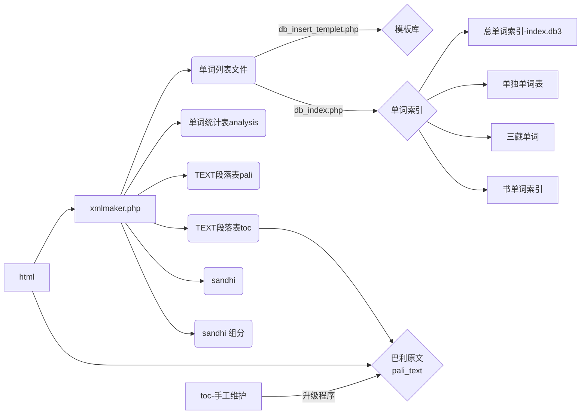

## 关于巴利语语料库的数据库生成

```mermaid
graph LR
html --> A[xmlmaker.php]
  A --> B(单词列表文件)
  A -->C(单词统计表analysis)
  A -->d(TEXT段落表pali)
  A -->e(TEXT段落表toc)
  A -->f(sandhi)
  A -->g(sandhi 组分)
  B -->|db_insert_templet.php| h{模板库}
  B -->|db_index.php| j{单词索引}
   e --> i
   html --> i{巴利原文<br>pali_text}
  j --> 总单词索引-index.db3
  j --> 单独单词表
  j --> 三藏单词
  j --> 书单词索引
  toc-手工维护 --> |升级程序|i
```
