# 测试日志 · /workspace/channel

| 项目     | 内容                                                        |
| -------- | ----------------------------------------------------------- |
| 路由     | `/workspace/channel`（含 `:channelId`、`:channelId/setting`）|
| 时间     | 2026-09-07 03:49                                            |
| 账号     | `test161`                                                   |
| 环境     | dashboard-v6 `:4000` · api-v13 `:8000` · 本地容器            |
| 脚本     | [`src/tests/channel.spec.ts`](../../src/tests/channel.spec.ts)         |
| 截图     | `assets/channel_20260907_034904/`                           |
| 复跑     | `E2E_SHOT=documents/testlog/assets/channel_20260907_034904 npm run test:channel` |

---

## 结论

17 个测试步骤（含破坏性操作），**通过 13 项，发现 2 个功能性缺陷 + 5 个体验/告警问题**。
其中 Webhooks 页签完全不可达（白屏），chapter 列表永远为空。

频道的增删改（CRUD）全链路正常，数据可持久化，删除后列表与详情页均正确失效。

---

## 一、通过的功能

| # | 功能                        | 结果                          |
| - | --------------------------- | ----------------------------- |
| 1 | 列表页加载                  | 3 条，无报错                  |
| 2 | 页签 此工作室 / 协作 / 社区 | 3 / 1 / 20 条，切换正常       |
| 3 | 关键词搜索 + 清空           | 搜 `test` → 1 条；清空 → 3 条 |
| 4 | 类型列筛选                  | 译文 / Nissaya / 注疏 / 原文  |
| 5 | 创建时间排序                | 正常                          |
| 6 | 新建频道表单                | 名称 / 类型 / 语言 正常弹出   |
| 7 | 频道详情页                  | 标题、面包屑正常              |
| 8 | 详情页 term 页签            | 正常                          |
| 9 | 分享弹窗                    | 正常打开                      |
| 10| 设置页 - 基本信息           | 表单正常渲染                  |
| 11| **新建频道（真实提交）**    | rows 3 → 4，提示「操作成功」  |
| 12| **编辑基本信息（真实保存）**| 提示「操作成功」，重载后 summary 已持久化 |
| 13| **删除频道（真实删除）**    | 确认弹窗文案正确，rows 4 → 3  |
| 14| **删除后访问原详情页**      | 正确失效（接口 400）          |

### 列表页

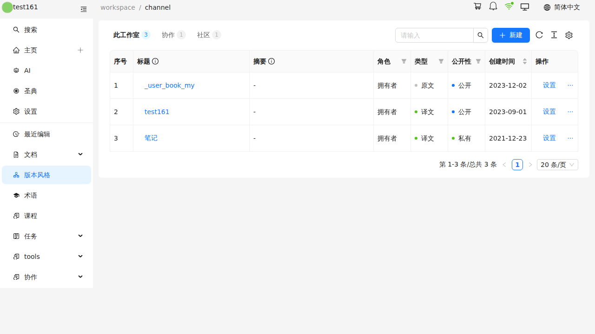

### 新建频道

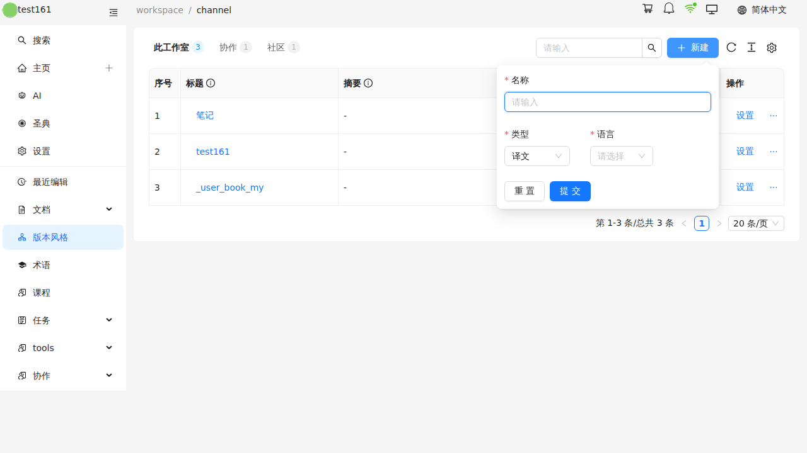

### 频道详情

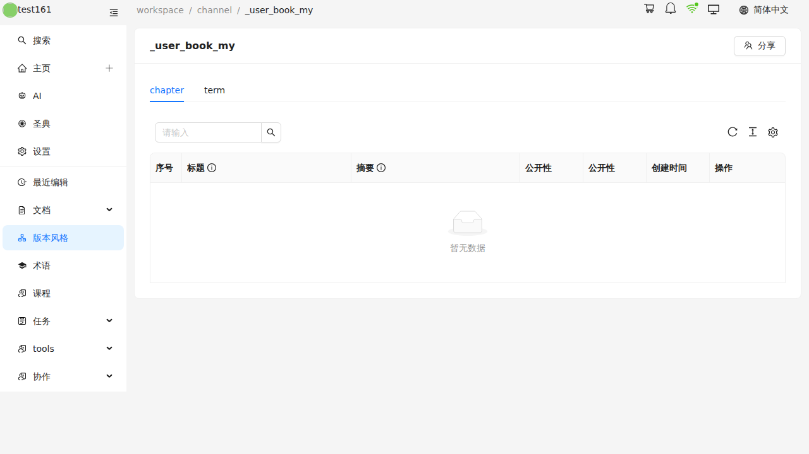

### 设置页

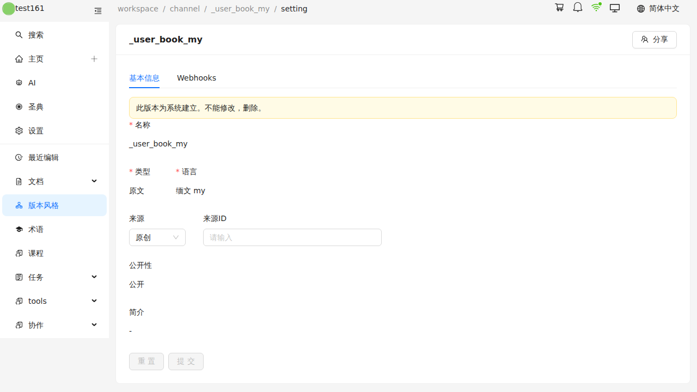

### 破坏性操作

新建频道（填入临时名称 `e2e-tmp-<timestamp>`）：

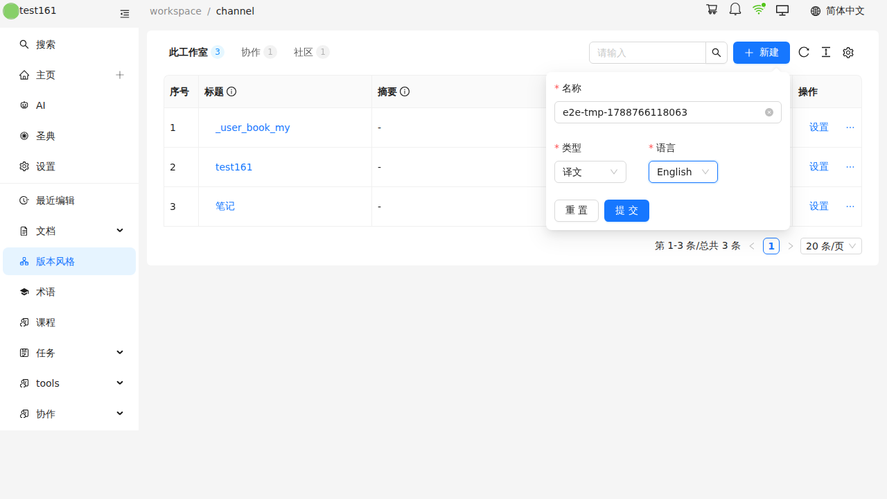

编辑基本信息并保存，重载后确认 summary 已写库：

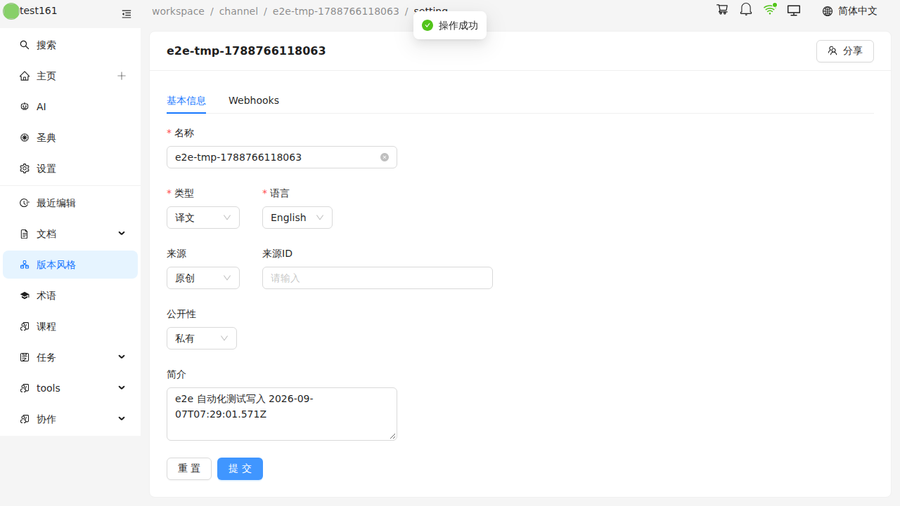

行操作菜单（分享 / 转让 / 删除）与删除确认弹窗：

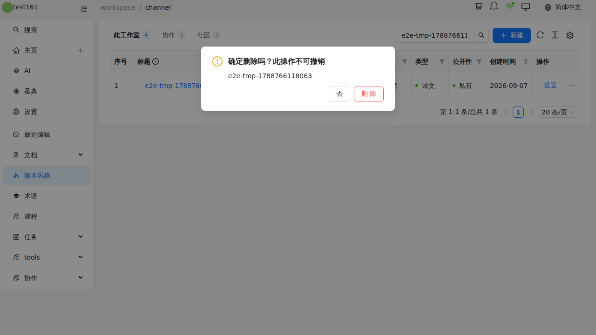

> 转让弹窗文案：「将 e2e-tmp-… 转让下面的用户。操作后需要等待对方确认后，资源才会被转移。」
> 因需要接收方账号，**未实际提交**，仅确认弹窗与用户选择器正常渲染。
>
> 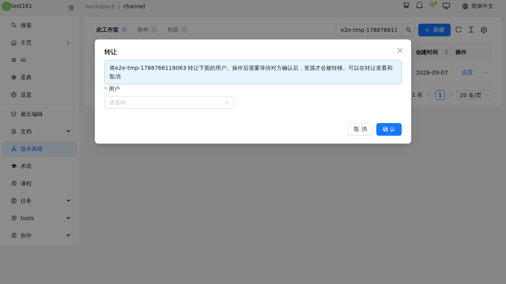

---

## 二、待修复

### - [ ] BUG-1 🔴 Webhooks 页签跳转到不存在的路由，整页白屏

点设置页 **Webhooks** 标签后跳到
`/studio/test161/channel/{id}/setting/webhooks` → **404 Unexpected Application Error**。

```
[warning] No routes matched location "/studio/test161/channel/.../setting/webhooks"
[error]   Error handled by React Router default ErrorBoundary: ErrorResponseImpl
```

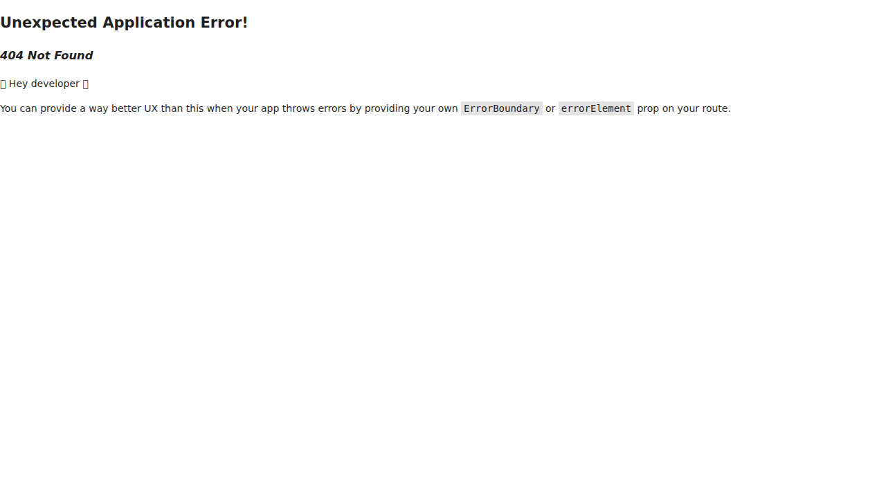

**原因**：`src/pages/workspace/channel/setting.tsx:55` 仍使用 v4 旧路径：

```js
navigate(`/studio/${studioName}/channel/${channelId}/setting/${activeKey}`);
```

而 `src/routes/channelRoutes.ts` 中 setting 的实际路径是
`/workspace/channel/:channelId/setting`。

**附带问题**：`setting.tsx:20-22` 读取 `useParams()` 的 `type` 和 `id`，
但路由未定义这两个参数，恒为 `undefined`，导致页签状态无法从 URL 恢复、
WebhookEdit 分支（`id === "new"` / 编辑既有 webhook）永远进不去。

**修复方向**：路由补 `setting/:type?/:id?` 子路由，`navigate` 改为 `/workspace/channel/...`。

---

### - [ ] BUG-2 🔴 chapter 列表接口 400，且异常未捕获

```
[HTTP 400]   /api/v2/progress?view=chapter&channel=...&progress=0.01&offset=0
[PAGEERROR]  HttpError: no data
```

详情页 chapter 页签恒为「暂无数据」。


**原因**：后端 `api-v13/app/Http/Controllers/ProgressController.php@index`
的 switch 只实现了 `view=channel`，其余分支一律返回 `error('invalid view', 400)`。
前端 `src/components/channel/ChapterInChannelList.tsx:177` 传的是 `view=chapter`。

**同类问题**：`src/components/tipitaka/PaliChapterChannelList.tsx:23`
传的 `view=chapter_channels` 后端同样未实现（本次未测，待验证）。

**附带问题**：前端未 catch，直接冒泡成 pageerror。

> ⚠️ `ProgressController.php` 当前在工作区有未提交改动，可能正在重构中。

---

### - [ ] BUG-3 🟡 详情页 chapter 表出现两个「公开性」列

`ChapterInChannelList.tsx` 的 `progress` 列（:96）和 `view` 列（:110）
都使用了 `forms.fields.publicity.label`，表头连续出现两个「公开性」。
应分别改为「进度」和「视图」对应的 i18n key。

---

### - [ ] BUG-4 🟡 不存在的 channelId 导致白屏

`channelLoader` 抛 `HttpError: no res` 后落到 React Router 默认 ErrorBoundary。

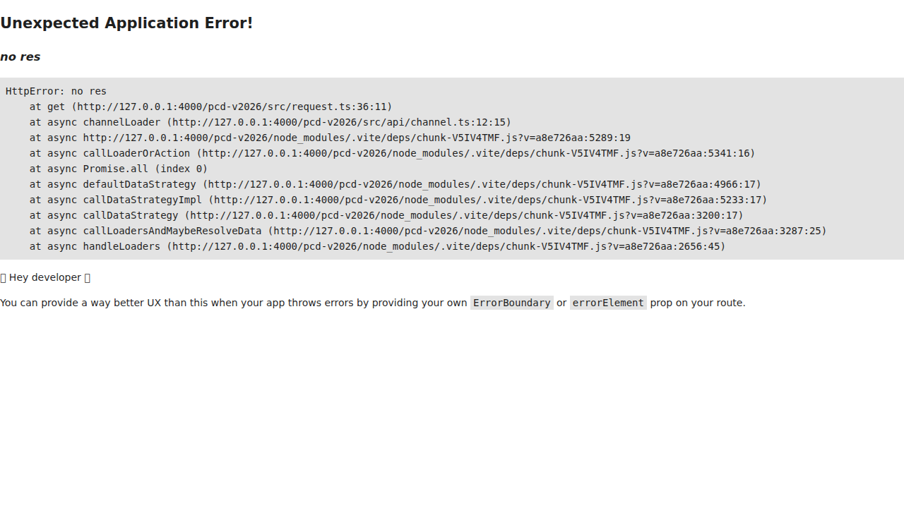

**修复方向**：给 channel 路由加 `errorElement`，展示「频道不存在」而非堆栈。

---

### - [ ] BUG-5 🟡 删除后工具栏徽标计数不刷新

删除频道后列表已刷新为空，但左上角徽标仍显示「此工作室 **4**」，实际只剩 3 条；
需整页刷新才恢复正确。

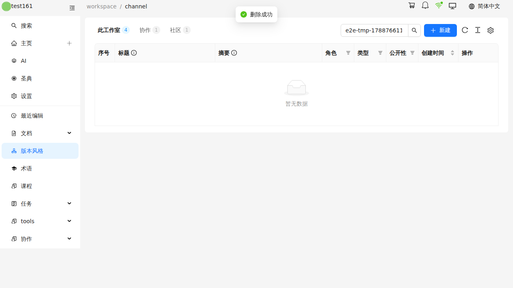

**原因**：`src/components/channel/ChannelTable.tsx` 中拉取
`/api/v2/channel-my-number` 的 `useEffect` 依赖数组只有 `[studioName]`，
新建 / 删除后不会重新请求。

**修复方向**：把计数请求抽成函数，在 `showDeleteConfirm` 成功回调和
`ChannelCreate` 的 `onSuccess` 里与 `ref.current?.reload()` 一起调用。

同样问题在**新建**后也存在（rows 变 4 但徽标仍为 3）。

---

### - [ ] BUG-6 🟢 社区页签头像 404

```
[HTTP 404] /storage/attachments-staging/2062811b-....jpg
[HTTP 404] /storage/attachments-staging/44f57bab-....jpg
```

可能仅为本地环境缺少附件文件，需在其他环境复核。

---

### - [ ] BUG-7 🟢 React 开发态告警

| 告警                                                                      | 位置                     |
| ------------------------------------------------------------------------- | ------------------------ |
| `Cannot update a component (ProTable) while rendering a different component (HeaderMenu)` | 切换工具栏页签时 setState in render |
| `Form already set 'initialValues' with path 'type' / 'source_type'`        | 设置页 `channel/Edit`，initialValues 与字段 initialValue 冲突 |
| `No HydrateFallback element provided to render during initial hydration`   | 路由配置                 |

---

## 三、未覆盖 / 待确认

| 项 | 说明 |
| --- | --- |
| 转让频道提交 | 需要接收方账号，仅验证到弹窗渲染。补测需准备第二个测试账号 |
| 分享弹窗授权提交 | 同上，需要目标用户 |
| Webhooks 增删改 | 被 BUG-1 阻塞，路由修复后再测 |
| 删除成功提示 | 删除后 1.2s 未捕获到 `message.success("删除成功")`，创建/保存的提示均能捕获。存疑，待人工确认是否真的没弹 |

### 测试数据

破坏性测试使用临时频道 `e2e-tmp-<timestamp>`，**测试结束已删除，未留残留数据**。
脚本可用 `E2E_DESTRUCTIVE=0` 跳过这部分。

### 回归断言

BUG-1、BUG-4 已写成 `src/tests/channel.spec.ts` 里的断言，修复前 `npm test`
会稳定报这两个失败（4 通过 / 2 失败），修复后自动转绿。
