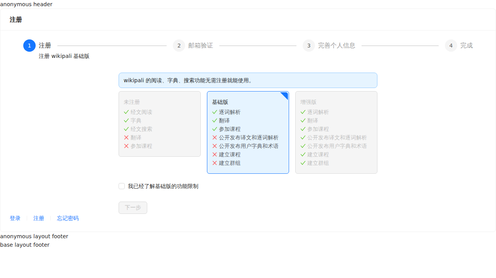
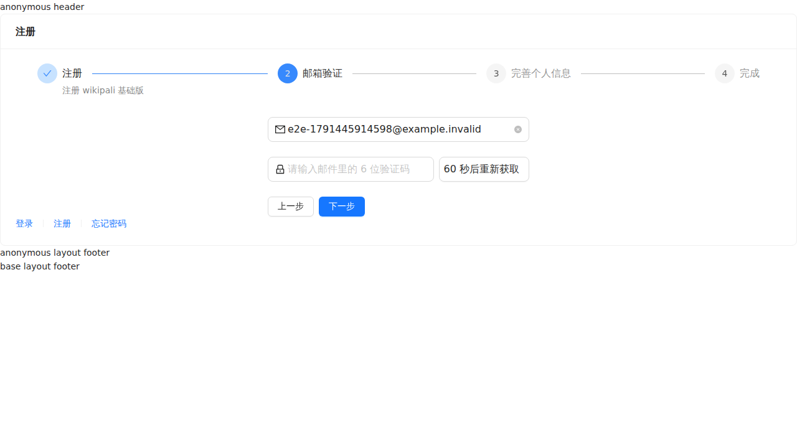
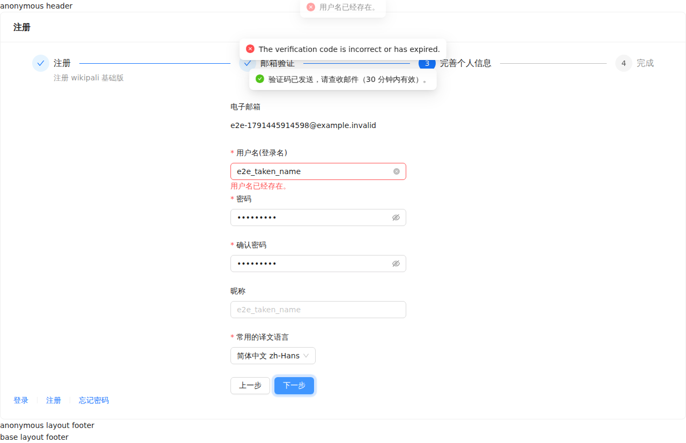
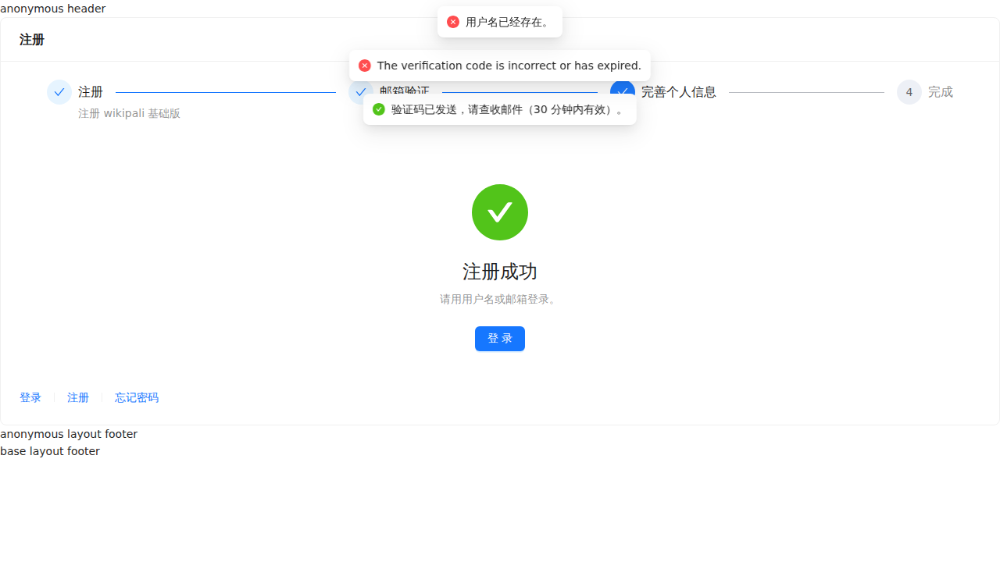
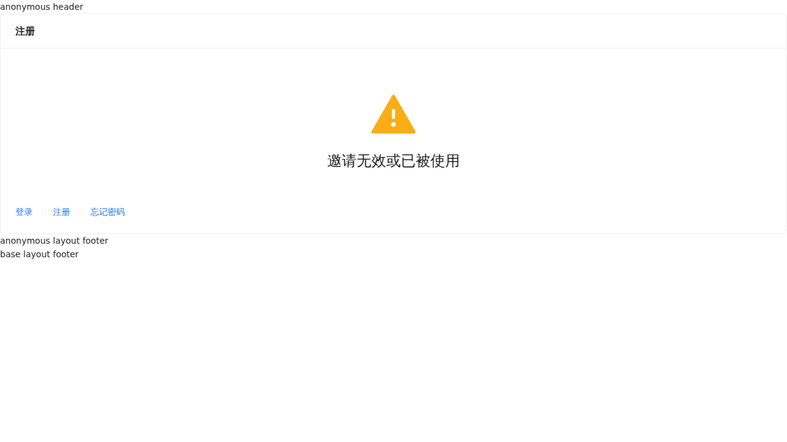
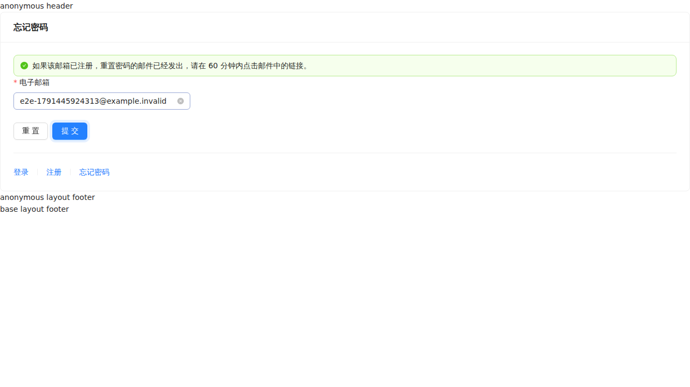
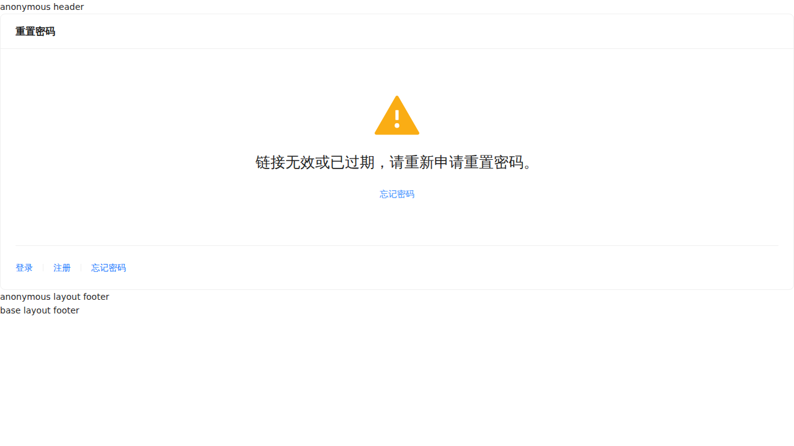
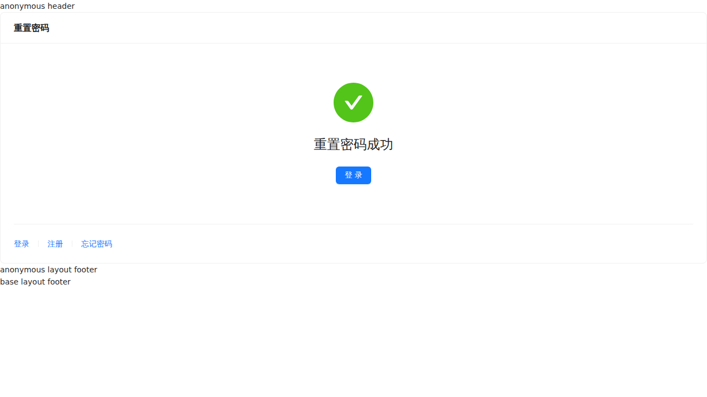
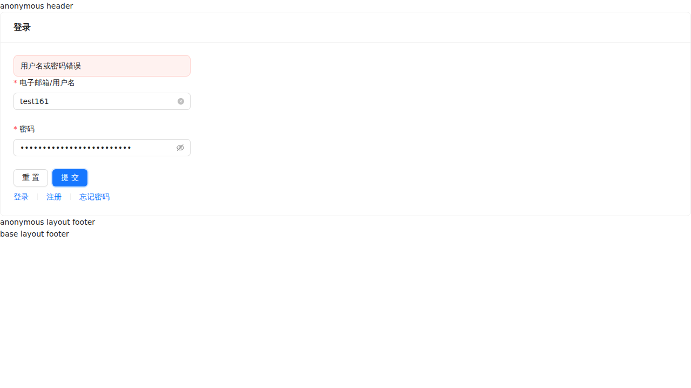
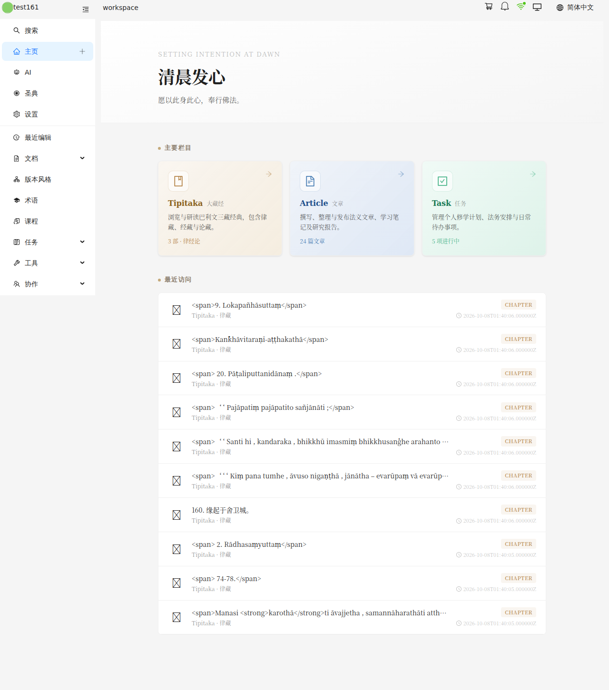

# 测试日志 · /anonymous 账号页面

| 项目     | 内容                                                                                  |
| -------- | ------------------------------------------------------------------------------------- |
| 路由     | `/anonymous/sign-in`、`/anonymous/sign-up`、`/anonymous/sign-up/:token`、`/anonymous/forgot-password`、`/anonymous/reset-password/:token` |
| 时间     | 2026-10-08 07:25                                                                      |
| 账号     | 匿名（不复用登录态）                                                                  |
| 环境     | dashboard-v6 `:4000` · api-v13 `:8000` · 本地容器                                     |
| 脚本     | [`src/tests/users.spec.ts`](../../src/tests/users.spec.ts)                            |
| 截图     | `assets/users_20261008_072502/`                                                       |
| 复跑     | `E2E_SHOT=documents/testlog/assets/users_20261008_072502 npm run test:users`          |

---

## 结论

登录、注册、找回密码迁到 v3（`sessions` / `me` / `email-certifications` / `invites` / `users` /
`password-resets`）后的首次 e2e。21 个步骤 + 1 条已知缺陷断言：**6 个用例通过，1 个按设计保持红灯（BUG-5）**。

会发邮件或建账号的请求（发验证码、换 invite、建号、设新密码）用 `page.route` 拦截，
验证的是前端流程、错误展示与**前端发出的请求体**；没有副作用的请求走真实后端。
本次无数据残留：真实后端只收到了查询、校验失败与测试账号 `test161` 的登录请求，
未建任何账号、未发任何邮件。

---

## 一、通过的功能

| #  | 功能                                        | 后端   | 结果 |
| -- | ------------------------------------------- | ------ | ---- |
| 1  | 注册第一步：未勾选「已了解」时下一步禁用    | —      | 正常；功能清单图标不依赖 emoji 字体 |
| 2  | 获取验证码                                  | 拦截   | 请求体 `{email, lang:"zh-Hans"}`；提示「验证码已发送」，按钮进入倒计时 |
| 3  | 错误验证码                                  | 真实 422 | 错误挂在验证码输入框下（文案为英文，见 BUG-5） |
| 4  | 正确验证码 → 账号信息，邮箱只读展示         | 拦截   | 请求体 `{email, code}` |
| 5  | 前端校验：用户名非法字符、两次密码不一致    | —      | 两条错误各自挂在对应字段下 |
| 6  | 后端 422 字段错误                           | 拦截   | `errors.username` 挂到用户名输入框下 |
| 7  | 建号成功 → 完成页 → 去登录                  | 拦截   | 请求体含 `invite`、**不含 `email`**；跳到 `/anonymous/sign-in` |
| 8  | 无效邀请                                    | 真实 404 | 「邀请无效或已被使用」 |
| 9  | v2 邀请邮件旧路径 `/anonymous/users/sign-up/:token` | 真实 404 | 重定向到 `/anonymous/sign-up/:token` |
| 10 | 有效邀请 → 显示邮箱 → 建号成功              | 拦截   | 请求体含 `invite`、`nickname` |
| 11 | 找回密码：邮箱格式错                        | —      | 前端拦下，未发请求 |
| 12 | 找回密码：未注册邮箱                        | 真实 204 | 「如果该邮箱已注册……60 分钟内」——不泄露是否注册 |
| 13 | 无效重置链接 → 「忘记密码」入口             | 真实 404 | 跳回 `/anonymous/forgot-password` |
| 14 | 重置页：两次密码不一致                      | 拦截 GET | 显示账号名；错误挂在确认密码下 |
| 15 | 设新密码 → 成功页 → 去登录                  | 拦截 PATCH 204 | 请求体 `{password, password_confirmation}` |
| 16 | 登录：密码错误                              | 真实 422 | 表单上方「用户名或密码错误」 |
| 17 | 登录：只发一次请求                          | 真实 201 | 只有 `POST /api/v3/sessions`，不再调 `/v2/sign-in`、`/v2/auth/current` |
| 18 | 刷新页面恢复登录态                          | 真实 200 | `GET /api/v3/me`，停留在 `/workspace` |
| 19 | `?url=` 同源地址                            | 回放真实登录结果 | 登录后跳回该地址 |
| 20 | `?url=` 外站地址                            | 回放真实登录结果 | 不跳，进 `/workspace`（原先是开放重定向） |
| 21 | `?url=` `javascript:`                       | 回放真实登录结果 | 不执行，进 `/workspace`（原先是 XSS） |












---

## 二、待修复

- [ ] **BUG-5 v3 接口的错误文案没有本地化，中文界面里显示英文**

  ```text
  Expected: "验证码不正确或已过期。"
  Received: "The verification code is incorrect or has expired."
  ```

  

  原因：`api-v13/bootstrap/app.php` 只把 `SetLocale` 挂在 web 组，api 组没有语言协商，
  `__()` 永远取 `en`（v3-resource skill 第 11 条已记录）；`dashboard-v6/src/api/client.ts`
  也没有把界面语言告诉后端。翻译文件本身是齐的（`resources/lang/zh-Hans/messages.php`）。

  修复方向：v3 路由组挂一个只认 `Accept-Language` 的语言协商中间件（不要动 v2 的 api 组）；
  `client.ts` 的中间件按 `locales.get()` 设置 `Accept-Language`。两边同一个 commit。

---

## 三、未覆盖 / 待确认

- **真实收信的端到端流程未覆盖**：发验证码、设新密码的成功路径会真的发邮件（开发机是真实 SMTP），
  建号没有删除接口。这部分由 api-v13 的 Pest 测试覆盖（`SignUpV3Test` 22 条、
  `PasswordResetV3Test` 14 条，Mail 是 fake 的）。要做真实端到端，需要一个能收信的测试邮箱
  或把开发机的 `MAIL_MAILER` 换成 `log`。
- **同一条错误显示两次**：字段级 422 时，`unwrap()` 先弹一条全局提示，表单再把同一条错误挂到字段下
  （见截图 06 顶部）。是 `src/api/client.ts` 的既定行为；表单场景要不要只挂字段、不弹提示，待定。
- **204 响应被记成 `[REQFAIL] net::ERR_ABORTED`**：`password-resets`、`email-certifications`
  返回 204 时 Chromium 报请求中止，但页面行为正确（测试通过）。疑为 openapi-fetch 对空响应体的处理，
  不影响功能；暂不加进 `collect.ts` 的噪音过滤，以免掩盖真正的中止。
- **开发态重复请求**：邀请页、重置页的 GET 各发了两次，是 React StrictMode 在开发态双调 effect，生产构建不会。
- **限流会让测试互相干扰**：登录按「账号 + IP」每分钟 5 次，`password-resets` /
  `email-certifications` 按 IP 每分钟 10 次。本 spec 一次用 test161 登录 4 次
  （setup 1 + 16、17 + 用例二开头 1，19–21 回放这份结果、不再真登），api-test 一次 2 次。
  两套测试连着跑要隔一分钟，否则表现为「Too Many Attempts.」。
- **mobile 仍走 v2 登录**：wikipali-mobile 的 `src/api/auth.ts` 还在调 `/v2/sign-in`、
  `/v2/auth/current`，不在本测试范围。
- **`AnonymousLayout` 仍是占位**：页面顶部是 `anonymous header`、底部是 `anonymous layout footer`，
  没有 v4 的语言切换和样式。
