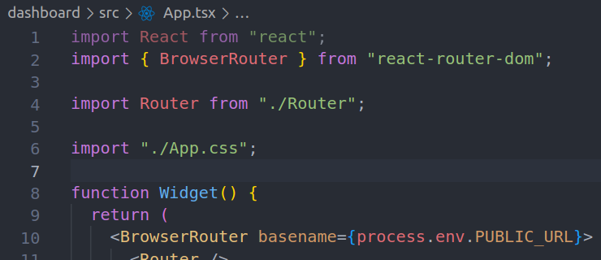
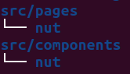
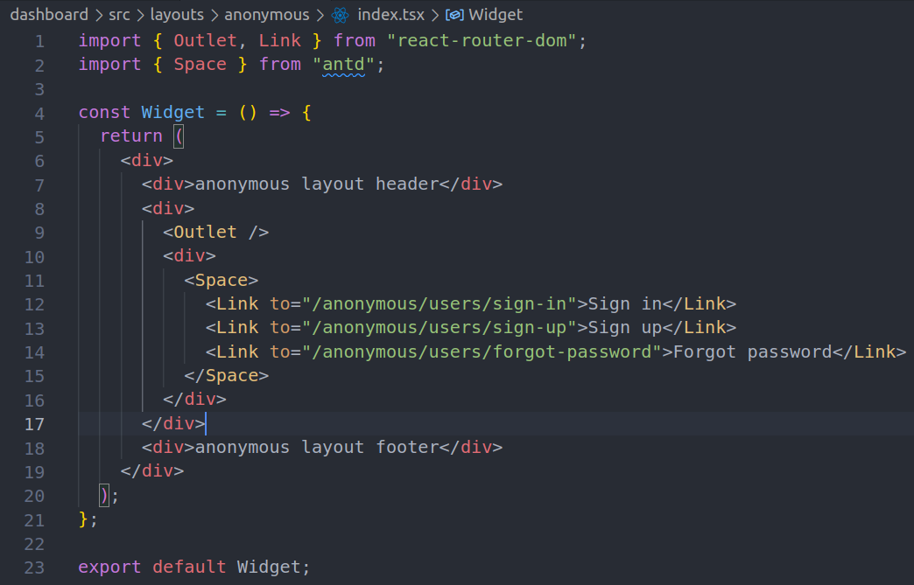
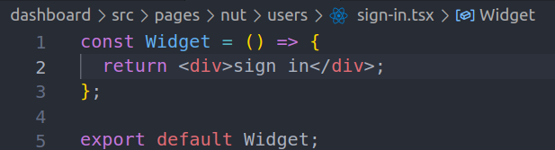
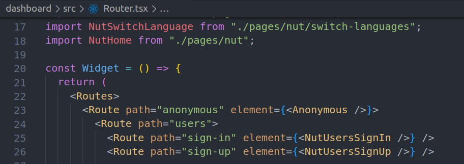
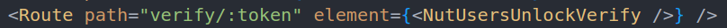
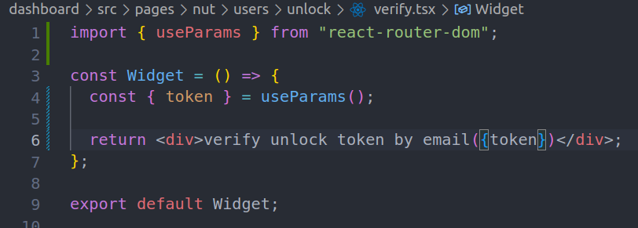

# router, link and layout

## 开发规范

- **禁止**私自引入第三方的 css
- 所有第三方的 css 放进**App.css**
- 所有的本地 css 采用 **css in js** 的写法

  

- import 按照`第三方js`, `本地js`顺序

  

- 组件放**components**下, 页面放**pages**下，以**project id**区分

  

## 练习参考

### layout

- layout 例子(layouts/anonymous/index.tsx)

  

- 页面例子(nut/users/sign-in.tsx)

  

- 绑定页面和 layout(Router.tsx)

  

## route

- 从 path 拿参数

  - route 绑定
    
  - page 中获取

    

### 页面跳转 参见(layouts/anonymous/index.tsx)

## 作业

- 每人把自己负责的子项目的所有 pages, components 规划一下 并写出 demo（`
 bla 
`即可）
  - 参见`pages/nut/users/sign-in.tsx`创建`PROJECT_ID/blaA/blaB.tsx`页面 对应页面路径`/my/PROJECT_ID/blaA/blaB`
  - 参见`components/nut/users/change-password.tsx`创建`PROJECT_ID/blaX/blaY.tsx`组件
  - 参见`Routes.tsx` 绑定路径和页面
- 需要从 http url 中取参数的页面，要写好 params 并验证
