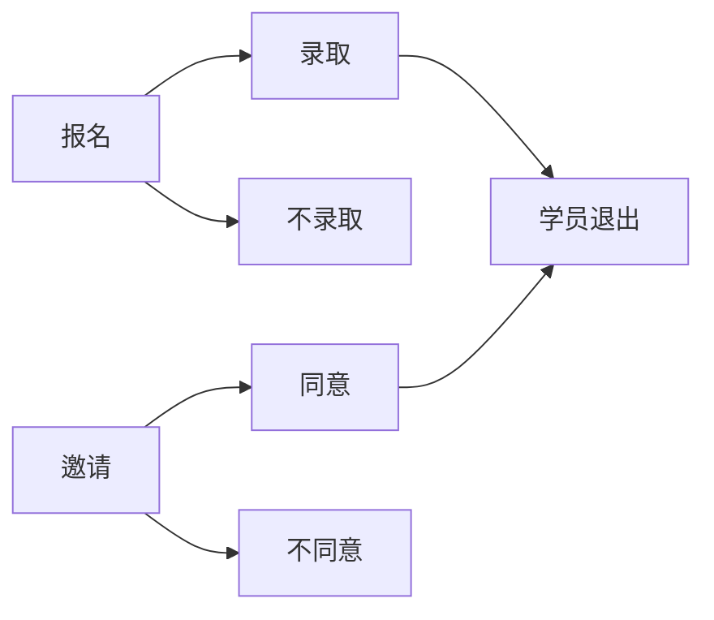

# 公开性

| 报名方式 | 公开性          |
| -------- | --------------- |
| 自学     | 公开            |
| 需审核   | 公开/不公开列出 |
| 仅邀请   | 不公开          |

# 可能的操作和状态

| 学员               | 状态           | 管理员           | 状态          |
| ------------------ | -------------- | ---------------- | ------------- |
| 加入自学课程(join) | joined         | ---              | ---           |
| 报名(apply)        | applied        | 邀请(invite)     | invited       |
| 取消报名(cancel)   | **_canceled_** | 撤销邀请(revoke) | **_revoked_** |
| 参加(agree)        | agreed         | 录取(accept)     | accepted      |
| 拒绝(disagree)     | disagreed      | 不录取(reject)   | rejected      |
| 退出(leave)        | left           | 清退(block)      | blocked       |

> canceled , revoked 与无记录等效
> 提问不公开

# 角色权限

| 角色   | 修改课程信息 | 增删管理员 | 增删助教 | 学员录取 | 学员清退 | 查看作业 | 回答问题 |
| ------ | ------------ | ---------- | -------- | -------- | -------- | -------- | -------- |
| 拥有者 | √            | √          | √        | √        | √        | √        | √        |
| 管理员 | ----         | √          | √        | √        | √        | √        | √        |
| 助教   | ----         | ----       | ----     | ---      | √        | √        | √        |

# 管理员操作

| 报名方式 | 学生状态   | 开始前      | 课程中   | 结束后 |
| -------- | ---------- | ----------- | -------- | ------ |
| 自学     | 未报名     | ---         | ---      | ---    |
| 自学     | 已报名     | ---         | ---      | ---    |
| 自学     | 未注册     | ---         | ---      | ---    |
| 需审核   | 未注册     | ---         | ---      | ---    |
| 需审核   | 未报名     | 邀请        | 邀请助教 | ---    |
| 需审核   | 已邀请     | undo        | ---      | ---    |
| 需审核   | 已撤销邀请 | undo        | ---      | ---    |
| 需审核   | 已录取     | undo        | 清退     | ---    |
| 需审核   | 不录取     | undo        | undo     | ---    |
| 需审核   | 已清退     | ---         | undo     | ---    |
| ---      | ---        | ---         | ---      | ---    |
| 需审核   | 已报名     | 录取/不录取 | ---      | ---    |
| 需审核   | 取消报名   | ---         | ---      | ---    |
| 需审核   | 用户已接受 | ---         | 清退     | ---    |
| 需审核   | 用户已拒绝 | ---         | ---      | ---    |
| 需审核   | 已退出     | ---         | ---      | ---    |
| 仅邀请   | 同上       | ---         | ---      | ---    |

> 仅邀请与需审核相同，但是无已经报名状态
> 所有需审核的操作均可撤销
> 横线上为管理员设置的状态，一下为用户设置的状态

# 助教-管理员 操作

| 报名方式 | 学生状态   | 开始前    | 课程中    | 结束后 |
| -------- | ---------- | --------- | --------- | ------ |
| 自学     | 未报名     | ---       | 参加      | ---    |
| 自学     | 已报名     | ---       | 退出      | ---    |
| 自学     | 已退出     | ---       | 参加      | ---    |
| 自学     | 未注册     | ---       | ---       | ---    |
| 需审核   | 未注册     | ---       | ---       | ---    |
| 需审核   | 已邀请     | 参加/拒绝 | 参加/拒绝 | ---    |
| 需审核   | 已撤销邀请 | ---       | ---       | ---    |
| 需审核   | 已录取     | 退出      | 退出      | ---    |
| 需审核   | 不录取     | ---       | ---       | ---    |
| 需审核   | 已清退     | ---       | 留言      | ---    |
| ---      | ---        | ---       | ---       | ---    |
| 需审核   | 已报名     | 取消      | ---       | ---    |
| 需审核   | 取消报名   | ---       | ---       | ---    |
| 需审核   | 用户已接受 | 退出      | 退出      | ---    |
| 需审核   | 用户已拒绝 | ---       | ---       | ---    |
| 需审核   | 已退出     | ---       | ---       | ---    |
| 仅邀请   | 同上       | ---       | ---       | ---    |

# 学生操作

| 报名方式 | 学生状态   | 开始前    | 课程中 | 结束后 |
| -------- | ---------- | --------- | ------ | ------ |
| 自学     | 未报名     | ---       | 参加   | ---    |
| 自学     | 已报名     | ---       | 退出   | ---    |
| 自学     | 已退出     | ---       | 参加   | ---    |
| 自学     | 未注册     | ---       | ---    | ---    |
| 需审核   | 未注册     | ---       | ---    | ---    |
| 需审核   | 未报名     | 报名      | ---    | ---    |
| 需审核   | 已邀请     | 参加/拒绝 | ---    | ---    |
| 需审核   | 已撤销邀请 | 报名      | ---    | ---    |
| 需审核   | 已录取     | 退出      | 退出   | ---    |
| 需审核   | 不录取     | ---       | ---    | ---    |
| 需审核   | 已清退     | ---       | 留言   | ---    |
| ---      | ---        | ---       | ---    | ---    |
| 需审核   | 已报名     | 取消      | ---    | ---    |
| 需审核   | 取消报名   | ---       | ---    | ---    |
| 需审核   | 用户已接受 | 退出      | 退出   | ---    |
| 需审核   | 用户已拒绝 | ---       | ---    | ---    |
| 需审核   | 已退出     | ---       | ---    | ---    |
| 仅邀请   | 同上       | ---       | ---    | ---    |

> 仅邀请与需审核相同，但是无已经报名状态
> 横线上为管理员设置的状态，一下为用户设置的状态

# 课程状态显示-学生

| 报名方式 | 学生状态 | 开始前   | 课程中     | 结束后   |
| -------- | -------- | -------- | ---------- | -------- |
| 自学     | 未报名   | 尚未开始 | 可报名     | 已经结束 |
| 自学     | 已报名   | 尚未开始 | 已报名     | 已经结束 |
| 需审核   | 未报名   | 可以报名 | 录取已结束 | 已经结束 |
| 需审核   | 已经报名 | 审核中   | 未通过     | 已经结束 |
| 需审核   | 已被邀请 | 已被邀请 | 邀请过期   | 已经结束 |
| 需审核   | 已被录取 | 已被录取 | 进行中     | 已经结束 |
| 需审核   | 已被拒绝 | 未被录取 | 未被录取   | 已经结束 |
| 仅邀请   | 同上     |

> 仅邀请与需审核相同，但是无已经报名状态

# 测试帐号权限

课程报名及向相关权限

# 流程

