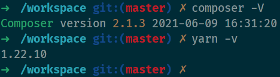

# Usage for Ubuntu 20.10 and newer

## Podman

- Install

```bash
sudo apt -y install podman runc buildah skopeo
```

- Setup `/etc/containers/registries.conf`

```text
[registries.search]
registries = ['quay.io', 'docker.io']
```

- Build(`cd docker && sh build.sh`) **OR** Import(`podman load -q -i mint-TIMESTAMP.tar`) image
- Enjoy it!

  
