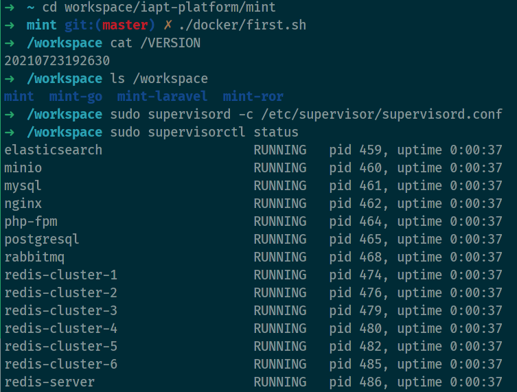

# Usage for Ubuntu 20.10 and newer

- Install podman: `sudo apt -y install podman runc buildah skopeo`.
- Setup `/etc/containers/registries.conf`.

  ```text
  [registries.search]
  registries = ['quay.io', 'docker.io']
  ```

- Clear outdated images: `podman rmi -a -f`
- Import podman image: `podman load -q -i mint-TIMESTAMP.tar`.

- Enjoy it!
  
  ```bash
  # for the first time start
  ./docker/ubuntu/first.sh
  # fot the next time start
  ./docker/ubuntu/next.sh
  # start servers
  > sudo supervisord -c /etc/supervisor/supervisord.conf
  # connect to redis
  > redis-cli
  # connect to postgresql
  > psql -U postgres -h 127.0.0.1 -p 5433 
  ```

  
