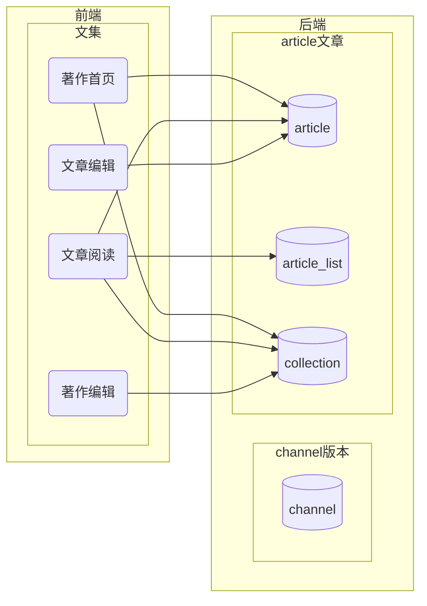

# 注意

- 该文档尚未完善，内容仅供参考
- 该文档中的技术方案尚未敲定，如涉及具体开发，需先行商议

# 后端开发文档

## 开发环境（待商议）

-   golang
-   PostgreSQL
-   Redis
-   ES

给 vscode 用的 go

```
sudo apt install yarnpkg golang-go
```

## 文档资源

## 依赖

https://github.com/go-redis/redis

## 目录

-   [用户](user.md)
-   [版本](channel.md)
-   [术语](term.md)
-   [字典](dict.md)
-   [课程](course.md)
-   [工作组](group.md)
-   [语料库](palicanon.md)
-   [译文](translation.md)
-   [文章文集](article.md)
-   [逐词解析](wbw.md)
-   全文搜索
-   其他工具表



[全文搜索]: 

## 数据表设计

数据表应包含如下字段

```
    id SERIAL PRIMARY KEY,
    version     INTEGER NOT NULL DEFAULT (1),
    created_at  TIMESTAMP NOT NULL DEFAULT CURRENT_TIMESTAMP,
    updated_at  TIMESTAMP NOT NULL DEFAULT CURRENT_TIMESTAMP,
    deleted_at  TIMESTAMP //可选
```
