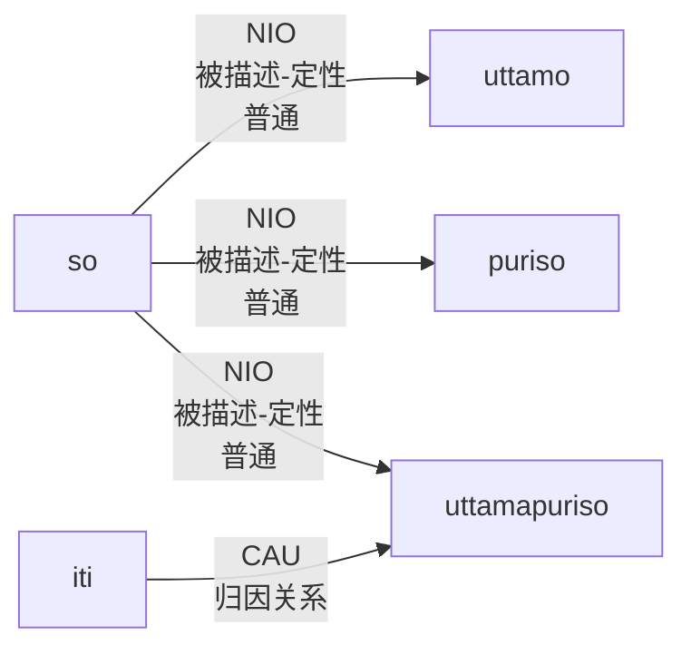
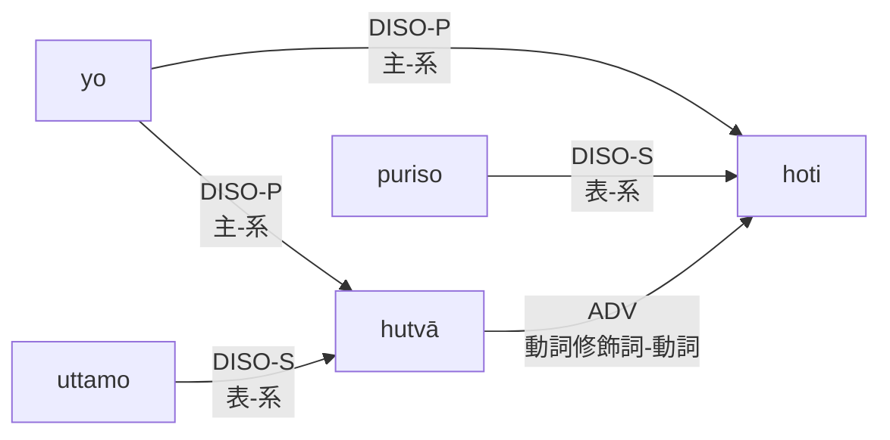
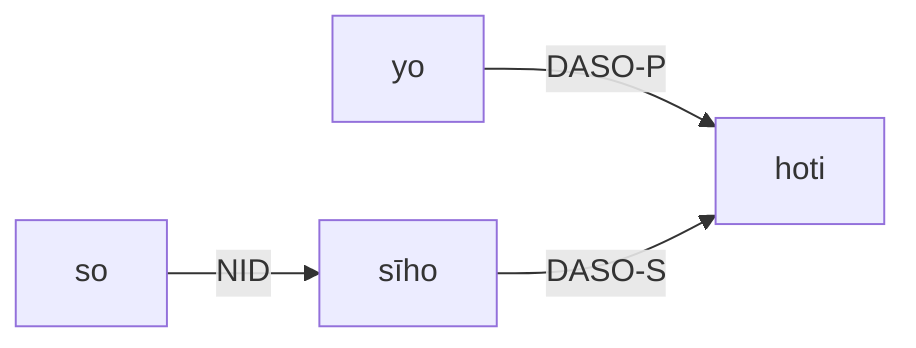
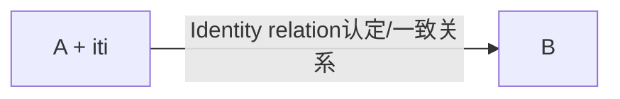
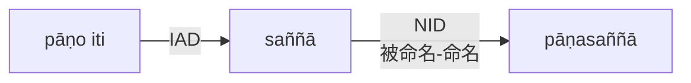
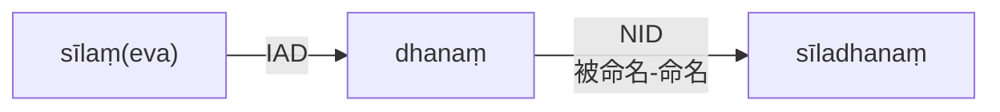
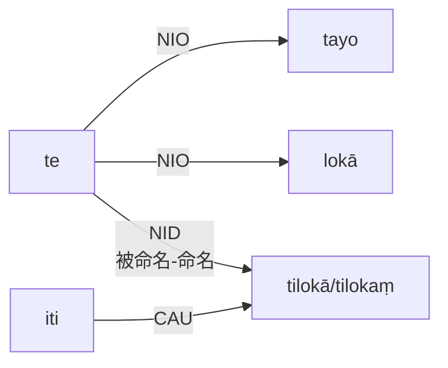
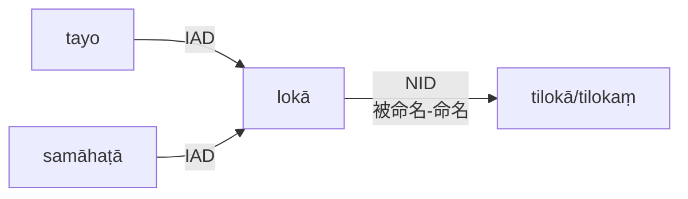
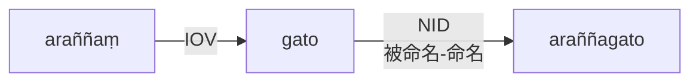
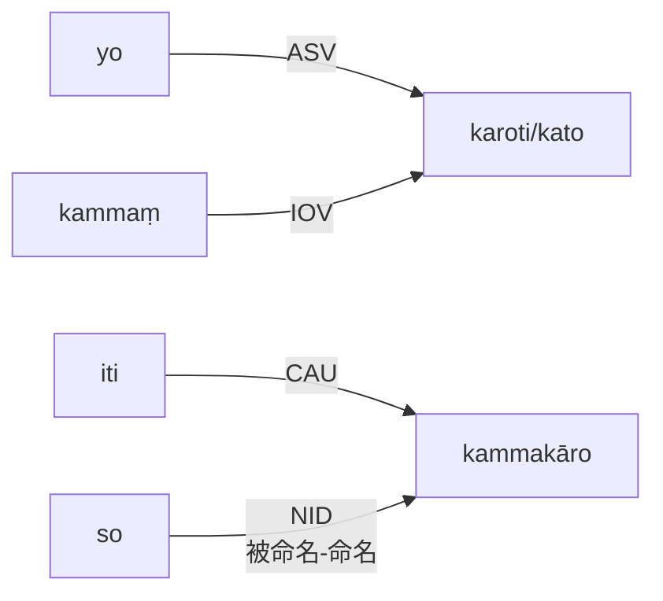

# Compound Definitions 复合定义

### **Note** **注意**(1):

- Some compound members, such as **prefixes** and certain **primary derivatives**, cannot stand alone as separate words; in this case, their synonyms having the status of an independent expression should be used in the definition.
- 一些复合成员，如**前缀**和某些**初级派生词**，不能作为单独的词独立存在；在这种情况下，应在定义中使用具有独立表达式地位的同义词。


### A. **Kammadhāraya (Adjectival Compounds形容词复合词，持业释)**

A definition for this type:
此类型的定义：

- a. has both members in nominative case, both singular or both plural and

  两个组分都是主格，都是单数或复数

- b. the whole compound follows the last member in case, gender and number.

  整个复合词跟随最后一个成员的格、性和数。


#### A.1visesana-pubbapada 定语前置

[uttama](# "noble 高尚") = A<sub title="modifier定语/修饰语">mod</sub>

[purisa](# "man 人") = A<sub title="substantive中心语">sub</sub>

sense中心語, gender性 & number数

- A<sub title="modifier定语/修饰语">mod</sub> + A<sub title="substantive中心语">sub</sub> [→](# "") A<sub title="substantive中心语">sub</sub>

Relation關係
- A<sub title="modifier定语/修饰语">mod</sub>  [→](# "Identity认定/一致性")  A<sub title="substantive中心语">sub</sub>

**Def. 定义**
***
uttamo **ca so** puriso **cāti (ca + iti)** uttamapuriso
***
note注:

- When two members are different in gender, the inserted pronoun **ta** must agree with the first one.

  当两个成员的性别不同时，插入的代词**ta**必须与第一个成员一致。


trs.译文
- "He (is) noble and a man too, therefore, (he is) uttamapurisa by name."
- “他(是)高贵，也是一个人，因此，他名叫是贵人。”
##### or或
```
uttamo puriso uttamapuriso
```

trs.译文
- " (The / A) noble man (is) uttamapurisa by name."
- “高尚的人叫uttamapurisa。”

or或
```
 (yo) uttamo hutvā puriso (hoti). (so ) uttamapuriso.
```


trs.译文
-  " (The one who is) noble and (who is) a man, (he is) uttamapurisa by name."
- “变得高尚(的)男人，(他)以uttamapurisa为名。”

#### A.2 visesana-uttarapada 定语后置

sāriputta (name of a monk僧名) = A<sub title="substantive中心语">sub</sub>

thera (senior monk高僧) = A<sub title="modifier定语/修饰语">mod</sub>

sense中心語
- A<sub title="substantive中心语">sub</sub> + A<sub title="modifier定语/修饰语">mod</sub>---->A<sub title="substantive中心语">sub</sub>

gender & number 性&数
- A<sub title="substantive中心语">sub</sub> + A<sub title="modifier定语/修饰语">mod</sub>---->A<sub title="modifier定语/修饰语">mod</sub> 

Relation關係
- A<sub title="modifier定语/修饰语">mod</sub> [→](# "Identity relation认定/一致关系") A<sub title="substantive中心语">sub</sub>

Definitions are the same as the first format.
定义与第一种格式相同。
```
sāriputto ca so thero cāti sāriputtatthero
```
- "He (is ) Sāriputta (by name) and a senior monk too, therefore, (he is) sāriputtatthera by name."
- “他(名为)Sāriputta且是一位高年资僧侣，因此，(他)以sāriputtatthera(为)名。“。

```
sāriputto thero sāriputtatthero
```
- "The senior monk Sāriputta (is) sāriputtatthera by name."
- “The资深和尚Sāriputta 以 sāriputtathera为名。“。

```
(yo) sāriputto hutvā thero sāriputtatthero
```
- " (The one who is) Sāriputta and (who is) a senior monk, (he is) sāriputtatthera by name."
- “(谁是)Sāriputta和(谁)，他是一位高级僧侣，他的名字叫āriputtalthera。“。

#### A.3 visesana-ubhayapada
[ kata (the (work) finished已做) = A<sub title="modifier定语/修饰语">mod</sub>1] + [ akata = (the (work) not yet finished未做) = A<sub title="modifier定语/修饰语">mod</sub>2]

A<sub title="modifier定语/修饰语">mod</sub>1 + A<sub title="modifier定语/修饰语">mod</sub>2---->A<sub title="substantive中心语">sub</sub> (sense, gender & number中心語、性与数)

A<sub title="modifier定语/修饰语">mod</sub>1---->A<sub title="substantive中心语">sub</sub> (Identity relation认定/一致关系)

A<sub title="modifier定语/修饰语">mod</sub>2---->A<sub title="substantive中心语">sub</sub> (Identity relation认定/一致关系)

Definitions are the same as the first format except the second:
定义与第一种格式相同，但第二种格式除外：
```
kataṃ ca taṃ akataṃ cāti katākataṃ
```
- "It (is ) finished and not yet finished too, therefore, (it is) katākata by name."
- “它(已经)完成，也尚未完成，因此，(它就是)katākata的名字。“。

```
(yaṃ) kataṃ hutvā akataṃ katākataṃ
```
- " (The one which is) finished and (which is) not finished, (it is) katākata by name.
- “(已完成的那个)和没有完成(的)，(它是)katākata的名字。


#### A.4 upamāna-uttarapada 后比喻
[ muni (the monk僧) = A<sub title="substantive中心语/本体">sub</sub> ] + [ sīha (lion狮子) = A<sub title="standard of comparison喻体/喻依">com</sub>]

A<sub title="standard of comparison喻体/喻依">com</sub>---->A<sub title="substantive中心语/本体">sub</sub> (Figurative identity relation 比喻身份关系)
```
(yo) sīho viya / iva (hoti) iti (so) sīho.
```
[sīha + a (sec. derivative of comparison sense二次派生的譬喻)]

trs译文：
- The one who is like a lion, he is sīha by name.
- 就是那个像狮子一样的人，他的名字叫sīha。
```
muni ca so sīho cāti munisīho.
```
trs译文：
- "He (is) a monk and lion-like too, therefore, (he is) munisīha by name."
- “他也是一个和尚和狮子一样的人，因此，他的名字是市政ī哈。”

#### A.5 sambhāvanā-pubbapada 混合组分前置
[pāṇa (living being生物) =A + iti + saññā (perception认定/想) = B]


```
pāṇo iti saññā pāṇasaññā.
```


trs译文：
- " The perception (forming) as 'living being' is saññā by name."
- “认定为‘生物’。”

#### A.6 avadhāraṇa-pubbapada 强调部分前置
[sīla (morality品德) = A + eva + dhana (property财产) = B]

```
sīlaṃ eva dhanaṃ sīladhanaṃ.
```


trs译文：
- "The property that is only morality (is) sīladhana by name.
- “只有道德的财产才是sīladhana的名字。

#### A.7 pādi-pubbapada / kunipātapubbapada 前缀
[ pa (praiseworthy值得表扬) = A<sub>ind</sub> + vacana (discourse话语) = A<sub title="substantive中心语">sub</sub>]

Aind A<sub title="substantive中心语">sub</sub> (identity relation认定/一致性关系)
```
pasaṭṭhaṃ ca taṃ vacanaṃ cāti pāvacanaṃ
```
- " It (is) praiseworthy and a discourse too, therefore, (it is) pāvacana by name.
- “它(是)值得称赞，也是一种论述，因此，(它是)pāVacana的名字。

```
pasaṭṭhaṃ vacanaṃ pāvacanaṃ
```
- The praiseworthy discourse (is) pāvacana by name.
- The 值得称赞的以pāvacana(为)名。
```
(yaṃ) pasaṭṭhaṃ hutvā vacanaṃ pāvacanaṃ
```
- (The one which is) praiseworthy and (which is) a discourse, (it is) pāvacana by name.
- (值得称赞的人)。(这是)一个话语，(它是)pāvacana的名字。

Note注：
- The first member Pa is a prefix; it cannot stand alone as a separate word.
  第一个成员Pa是一个前缀；它不能单独作为一个单独的单词。
- Accordingly, its synonym pasaṭṭha, an ordinary noun, is used in the definition.
  因此，在定义中使用了它的同义词pasaṭṭha，这是一个普通的名词。

# B. Digu (Numeral Compounds数词复合词/代数释)

A definition for this type has:
此类型的定义有：

- a. the first member as a numeral and both members singular or plural number,
  
  第一个成员为数字，并且两个成员都是单数或复数，

- b. both members in **nominative** case for *asamāhāra* type
B.Asamāhāra类型的两个成员均为**主格**。

- c. both members in **nominative** case (with or without the inserted word *samāhaṭa*)
C.两个成员均为**主格**(带或不带插入单词Samāhaṭa)。

  - OR in genitive case (with the inserted word samāhāra) for samāhāra type.

    或者在所有格中(插入单词samāhāra)表示samāhāra类型。

- e. the whole compound having the nominative case (AND) {following the last member in gender and number for asamāhāra type (or) having neutral gender, singular number for samāhāra type}.

  即具有主格的整个复合词(和){在最后一个后面。具有中性性别的ASAMāhāRa类型(或)的性别和号码成员，Samāhāra类型的单数。

E.g.例如：
- [ti (three) = Anum + loka (world) = Asub ]
- Anum Asub (Identity relation认定/一致性关系)
```
tayo ca te lokā cāti tilokā (asamāhāra type型) / tilokaṃ (samāhāra type型)
```


trs译文：
- " They (are) three and worlds too, therefore, (they are) tiloka by name."
- “他们也是三个世界，因此，他们的名字叫三界。”
```
tayo lokā tilokā (asamāhāra type型)
OR或
tayo lokā tilokaṃ (samāhāra type型)
```


trs.译文：
- " Three worlds (are) tiloka by name."
- “三个世界叫三界。”
```
 tayo lokā samāhaṭā tilokaṃ 
```
This format for samāhāra type only此格式仅适用于Samāhāra类型


trs.译文
- " Three worlds combined (are) tiloka by name."
- “三个世界按名字合并在一起是蒂洛卡。”
```
tiṇṇaṃ lokānaṃ samāhāro tilokaṃ 
```
(This format also for samāhāra type only 此格式也仅适用于Samāhāra类型)


trs.译文
- " The collection of three worlds (is) tiloka by name."
- “三个世界的集合(是)Tiloka的名字。”


## C. Tappurisa (Dependent Determinative Compounds 根据限定词的复合词/依主释)

### A definition for this type has 此类型的定义有：


- a. the first member in one of six cases, namely, accusative, instrumental, dative, ablative, genitive and locative cases,

  六种情况之一的第一成员，即宾格、工具格、与格、来源格，所有格和方位格，

- b. the second member and the whole compound in nominative case.

  第二个成员和整个复合词的主格。

### A. With Accusative relation 带有宾语关系

[(arañña (forest) = A + gata (the one who goes) = B ]
[(Arañña(森林)=A+Gata(去的那个人)=B]。


```
araññaṃ gato araññagato.
```


trs.译文
- " The one who goes (to) forest (is) araññagata by name."
- “那个去森林的人被称为araññagata。”

[(kamma (work) = A + kāra (the one who does) = B ]
[(卡玛(工作)=A+kāra(做工作的人)=B]。


```
(yo) kammaṃ karoti / kato iti (so) kammakāro.
```



trs.译文
- " The one who does the work, he (is) kammakāra by name."
- “做这项工作的人，他叫Kammakāra。”

Note: In the second example, the second member kāra is a primary derivative
注：在第二个例子中，第二个成员kāra是一阶导数。

derived from (kar + a- subjective case) but it cannot stand alone as a separate word.
派生自(kar+a-主观格)，但它不能作为一个单独的词独立存在。
Consequently, an active verb of the same root is used instead in the definition.
因此，在定义中使用相同词根的主动动词。

### B. With relations Instrumental, etc. 带有工具格等关系

[(buddha (the lord Buddha佛主) = A + bhāsita (the one which is said) = B ]

```
buddhena bhāsito buddhabhāsito.
```


trs.译文
- " The one which is said by the Buddha (is) buddhabhāsita by name."
- “佛陀所说的被称为佛说。”

[(saṅgha (the Order of Bhikkhus僧团) = A + bhatta (meal餐) = B ]


```
saṅghassa bhattaṃ saṅghabhattaṃ.
```
```mermaid
graph LR;
A["saṅghassa"]--PUR-->B["bhattaṃ"]
B--NID<br>被命名-命名-->E["saṅghabhattaṃ"]
```

trs.译文
- " The meal for the Order of Bhikkhus (is) saṅghabhatta by name."
- “比丘修会(Is)saṅghabhatta的餐点点名。”

[(nagara (town镇) = A + niggata (the one who went out外出的那个人) = B ]

```mermaid
graph LR;
A--Abl-->B
```
```
nagarasmā niggato nagaraniggato.
```
```mermaid
graph LR;
A["nagarasmā"]--DET-->B["niggato"]
B--NID<br>被命名-命名-->E["nagaraniggato"]
```


trs.译文
- " The one who went out from the town (is) nagaraniggata by name."
- “那个从镇上出来的人叫那嘎拉尼加塔。”

[(buddha (the lord Buddha) = A + sāvaka (the disciple) = B ]
[(佛(主佛)=A+sāVaka(弟子)=B]。

```mermaid
graph LR;
A--Gen-->B
```
```
buddhassa sāvako buddhasāvako.
```
```mermaid
graph LR;
A["buddhassa"]--POS-->B["sāvako"]
B--NID<br>被命名-命名-->E["buddhasāvako"]
```


trs.
TRS。
- " The disciple of the Lord Buddha (is) buddhasāvaka by name."128
- “佛主的弟子名为佛弟子。”

[(arañña (forest) = A + vāsa (living, residence) = B ]
[(Arañña(森林)=A+vāSa(居住、居住)=B]。

```mermaid
graph LR;
A--Loc-->B
```
```
araññe vāso araññavāso.
```
```mermaid
graph LR;
A["araññe"]--LOV-->B["vāso"]
B--NID<br>被命名-命名-->E["araññavāso"]
```

trs.译文
- " Living / Residence in the forest (is) araññavāsa by name.
- “生活/居住在森林中(IS)Arañavāsa的名字。