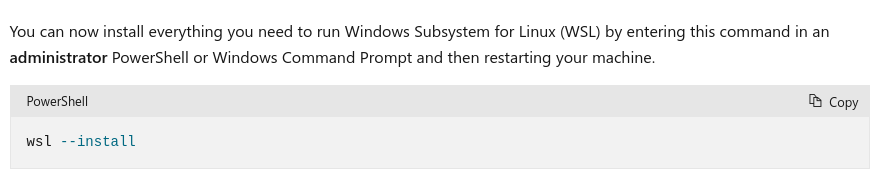

# 部署工具

## 操作系统准备

### 在 Windows 上安装 ubuntu **仅 Windows 10+ 用户**

- 先决条件

  

- 安装 wsl

  

- 从[Windows Store](https://apps.microsoft.com/store/detail/ubuntu/9PDXGNCFSCZV)安装 ubuntu（版本不小于 22.04）

### 安装容器工具 `sudo apt install crun podman buildah`

## 镜像准备

```bash
# 解压镜像
tar xf palm-alpine.tar.xz
# 导入镜像
podman load -i palm-alpine-TIMESTAMP.tar
# 启动镜像
cd ~/workspace
./PROJECT/scripts/docker/alpine.sh
```

## 部署

- 设置 client key

  ```bash
  cd PROJECT/deploy
  mkdir -p clients/CLIENT_ID/.ssh
  cd clients/CLIENT_ID
  # 创建 ssh key
  ssh-keygen -t ed25519 -f .ssh/id_ed25519 -C "your_email@example.com"
  ```

- 上传 `.ssh/id_ed25519.pub` 到服务器`/tmp`目录， 然后 `cat /tmp/id_ed25519.pub >> ~/.ssh/authorized_keys`
- 测试 ssh 连接 `ssh -i .ssh/id_ed25519 deploy@HOST`
- 复制`cp ../../staging/hosts ./`并调整配置

- 命令

  ```bash
  cd PROJECT/deploy
  # 测试服务器状态
  peony -i clients/CLIENT_ID ping.yml
  # 全量部署
  peony -i clients/CLIENT_ID mint.yml -l GROUP
  # 按组部署
  peony -i clients/CLIENT_ID mint.yml -l GROUP
  ```

## 常用容器命令

```bash
# 清理
podman system reset
# 列出所有镜像
podman images
# 列出所有容器
podman ps -a
```

## 参考文档

- [Install Linux on Windows with WSL](https://learn.microsoft.com/en-us/windows/wsl/install)
