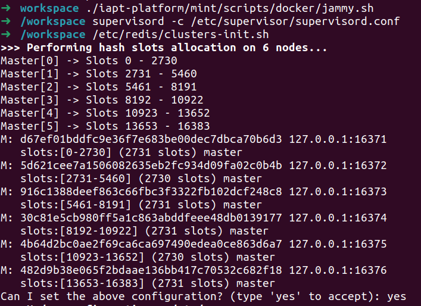
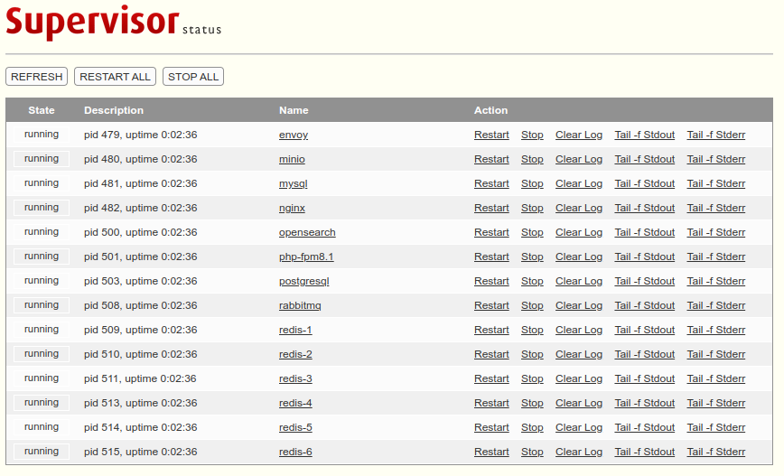

# 本地开发环境搭建

## [操作系统准备](../deployment/)

- 添加如下到 `/etc/sysctl.d/60-my.conf`，然后 `sudo reboot` 或 `sudo sysctl -p`

  ```text
  vm.overcommit_memory = 1
  vm.max_map_count = 262144
  ```

## 镜像准备

```bash
# 合并镜像分卷
cat palm-spring-TIMESTAMP.tar.?? > palm-spring-TIMESTAMP.tar
# 导入镜像
podman load -i palm-spring-TIMESTAMP.tar
# 启动容器
cd ~/workspace
./YOUR_PROJECT/docker/spring/start.sh
```

## 容器准备

- 启动 [dashboard](http://localhost:10001)

  ```bash
  $ cd ~/workspace
  $ ./mint/docker/spring/start.sh
  > supervisord -c /etc/supervisor/supervisord.conf # 启动服务
  > /etc/redis/clusters-init.sh # 初始化redis集群
  ```

  

  

## 常见连接和测试

- PostgreSql

  - 连接

    ```bash
    psql -h 127.0.0.1 -p 5432 -U postgres
    ```

  - 创建数据库和用户

    ```sql
    CREATE DATABASE db-name WITH ENCODING = 'UTF8';
    CREATE USER user-name WITH PASSWORD 'change-me';
    GRANT ALL PRIVILEGES ON DATABASE db-name TO user-name;
    ```

- MySql

  ```bash
  # reset root's password
  mysql_secure_installation
  ```

- Redis

  ```bash
  # connect to redis node-1
  redis-cli -c -h 127.0.0.1 -p 16371
  ```

- Minio [dashboard](http://localhost:9001) (`admin:12345678`)

- RabbitMQ [dashboard](http://localhost:15672) (`guest:guest`)

  ```bash
  # enable rabbitmq management plugin
  rabbitmq-plugins enable rabbitmq_management
  ```

- Php [info.php](http://localhost:8080/info.php)

- OpenSearch

  ```bash
  # show info
  curl -X GET http://localhost:9200
  curl -X GET http://localhost:9200/_cat/plugins?v
  ```
