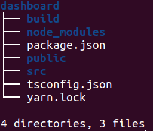
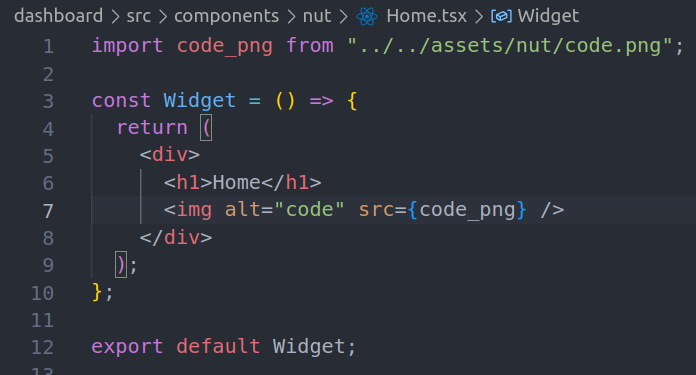
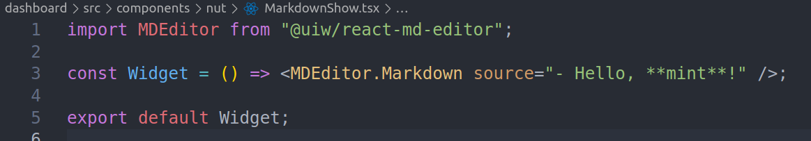
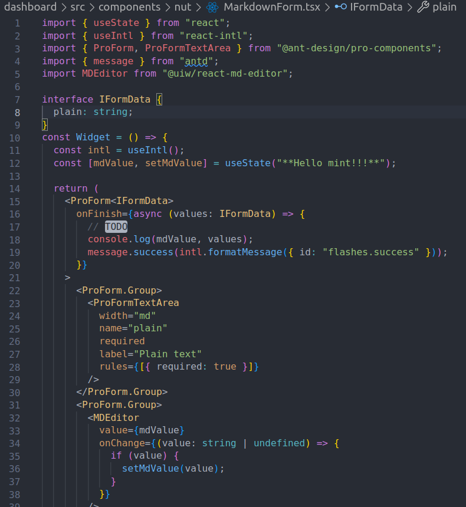
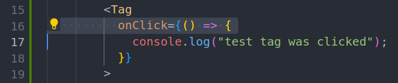

# 前端培训文档

## 安装依赖包

- [Windows 用户](./WINDOWS.md)

### For linux 用户

- offline

```bash
# offline
tar xf node_modules.tar.xz
```

- online

```bash
cd dashboard
yarn install
```

## 修改配置文件

```bash
cd dashboard
cp .env.orig .env # 修改PORT 和 REACT_APP_API_HOST
```



## 开发模式启动

```bash
cd dashboard
yarn start
```

- For Local: `http://localhost:YOUR_PORT/my`
- For Spring: `http://YOUR_ID.spring.wikipali.org:YOUR_PORT/my`

## Typescript

- [Typescript 第一天](ts-day-1/)

## React

- [React 第一天： router & layout](react-day-1/)
- [React 第二天： i18n & form](react-day-2/)
- [React 第三天： table](react-day-3/)
- [React 第四天： http request](react-day-4/)
- [React 第五天： page & component & redux](react-day-5/)

### 其它例子

- 常见组件

  - img

    

  - Markdown

    - Viewer

      

    - Editor

      

  - on click event

    
