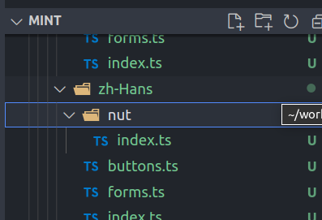
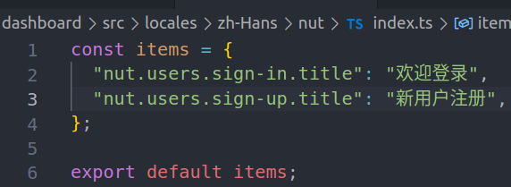
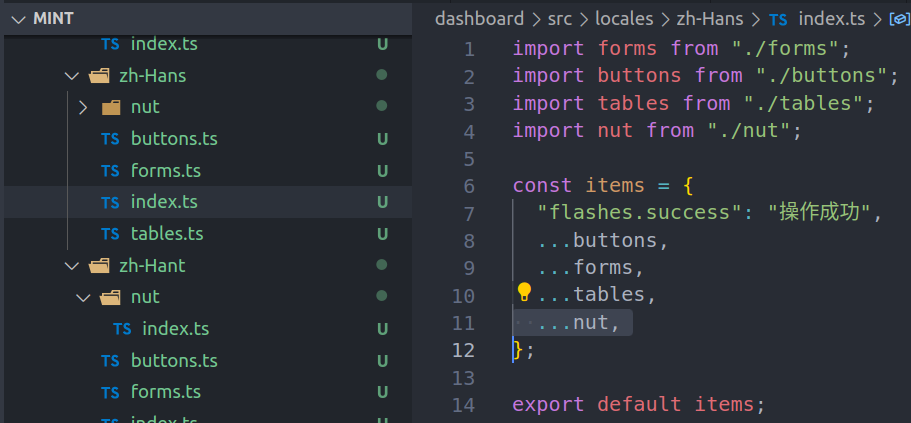
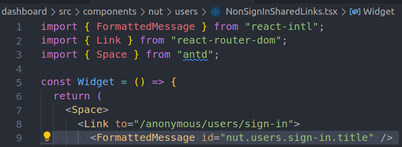
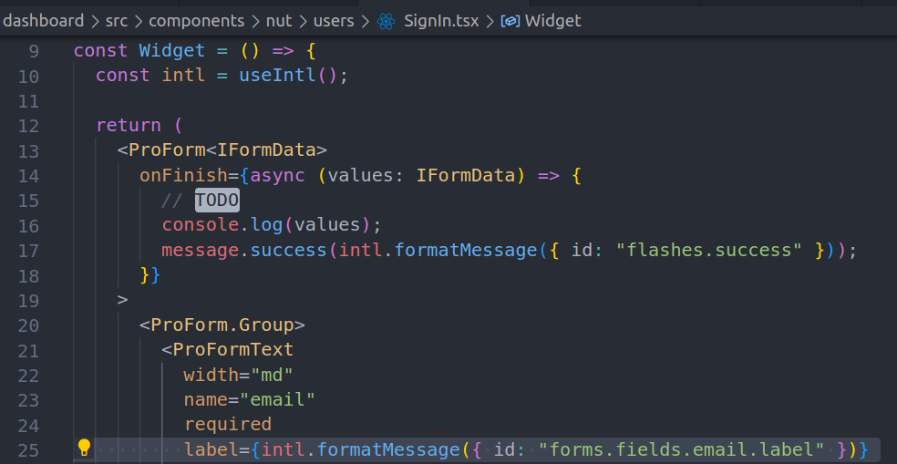
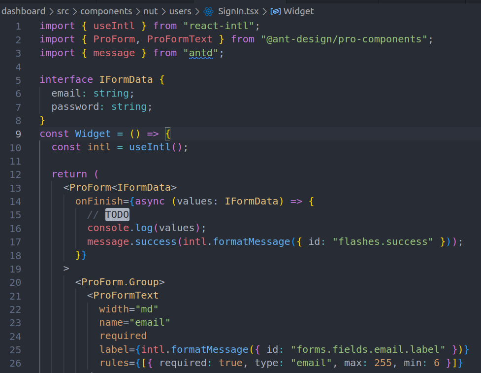

# i18n & form

## i18n

### 添加翻译条目

- 按照**project id**分门别类

  

- 内容就是简单的 KV

  

- project id 引入方法参见

  

### 使用方法

- 组件式

  

- 函数式

  

## 表单例子

## 练习内容

- 表单
  - 从简单的 case 开始
  - 不考虑表单布局 全部用默认样式(**ProForm**)
  - 随便找个自己的页面 表单放进去 能够显示出来即可
  - 所有自定义的字符串都要放入国际化目录(比如中文在：locales/zh-Hans)
  - onFinish 里**打印**出表单值即可，标记为 TODO
  - 重点练习下 DatePicker, DateRangePicker, Select 组件

## 参考文档

- [ProForm](https://procomponents.ant.design/components/form/)
