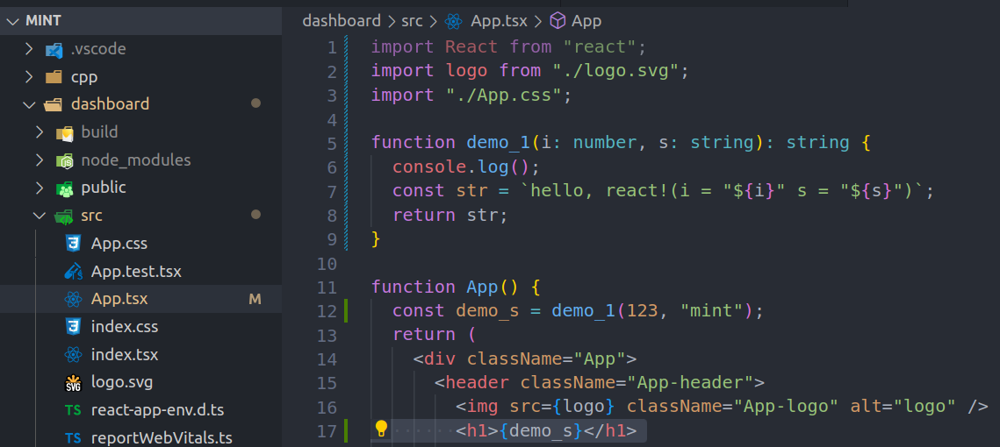

# 素材

## 零基础

- 基础了解 [Get started with TypeScript](https://learn.microsoft.com/en-us/training/modules/typescript-get-started/1-introduction) **Unit 1~3**

## 有其它语言基础(5 分钟上手)

- [for JavaScript Programmers
  ](https://www.typescriptlang.org/docs/handbook/typescript-in-5-minutes.html)
- [for Java/C# Programmers](https://www.typescriptlang.org/docs/handbook/typescript-in-5-minutes-oop.html)

## 练习(写几个 function, interface)

## 教材

- [基本数据类型](https://www.typescriptlang.org/docs/handbook/2/everyday-types.html)

### 工具

- [在 palyground 练习](https://www.typescriptlang.org/play)
- 在`App.tsx`里练习
  
