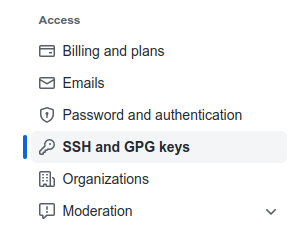
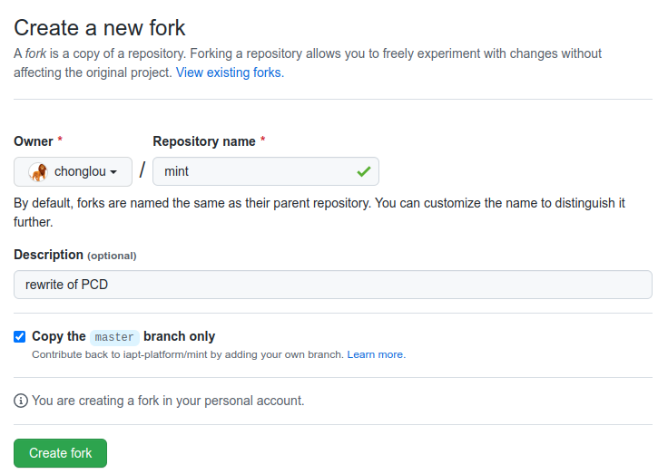
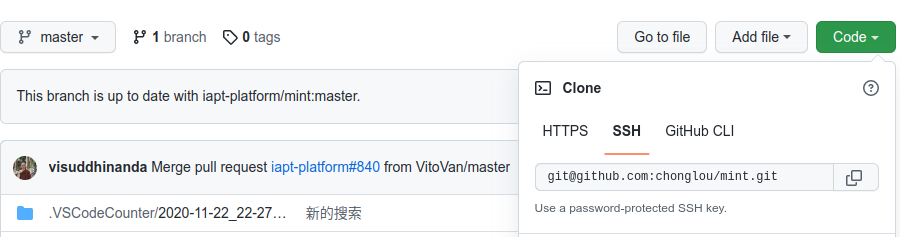
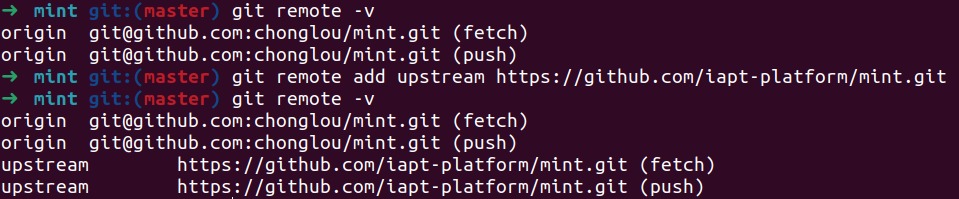
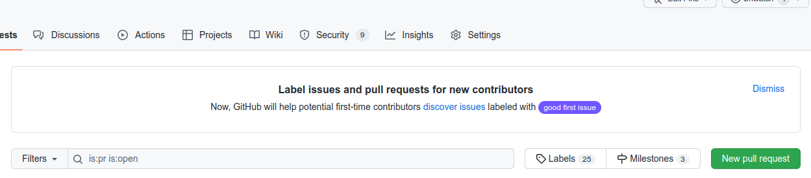
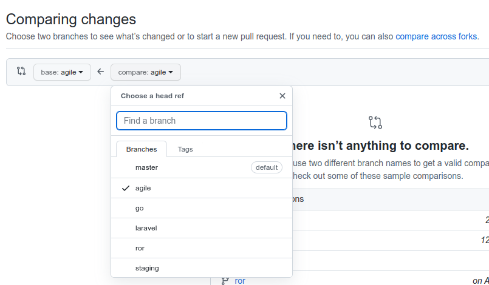

# GIT PR 流程

## SSH KEY 设置（可选）

- 创建 ssh key `ssh-keygen -t ed25519 -C "your_email@example.com"`
- 打开 github settings 页面 放置 `~/.ssh/id_ed25519.pub`

  

## 常见 git 设置

```bash
git config --global user.name "Who am I"
git config --global user.email "who-am-i@change-me.com"

git config --global core.quotepath false
git config --global http.version HTTP/1.1
git config --global pull.rebase false
```

## Fork & Clone 项目

- fork 项目

  - 点击 fork 按钮

    

  - 输入项目信息

    

- Clone 项目 `git clone git@github.com:YOUR_ID/mint.git ~/workspace/mint`

  

- 设置 upstream

  

## 日常工作流程

- 从自己的 repo 更新代码 `git pull` (可选，仅用于不同机器或目录间同步代码)
- 从 upstream repo 更新代码 `git fetch upstream` （**必选** 每次开始工作前都要进行 以尽早发现冲突）
- 提交代码

  ```bash
  git add FILE1 FILE2 FILE3
  git commit -m "说明信息" FILE1 FILE2 FILE3
  ```

- 查看日志 `git log`
- 推送到自己的 repo `git push`

## 给主 repo 发 pr

- 点击[pull requests](https://github.com/iapt-platform/mint/pulls)中的"New pull request"

  

- 选择主 repo 的 branch(agile)和自己的 branch

  
