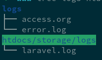

# SPRING 开发环境

## 注意事项

- A: 在 Domain name 中， **如果 YOUR_ID 含'\_'，需要替换成'-'**

## ssh 登录

```bash
ssh -i YOUR_KEY YOUR_ID@YOUR_ID.spring.wikipali.org
```

## 数据库设置


```bash
cd /workspace/shared/db-TIMASTAMP/
psql -q -h 127.0.0.1 -p 5432 -U YOUR_ID YOUR_ID_mint < schema.sql
pg_restore -Fc -h 127.0.0.1 -p 5432 -U YOUR_ID -d YOUR_ID_mint < data.dump
```


## PHP 开发（以用户 xxx 为例）

- `~/www/htdocs/public/info.php` => `https://YOUR_ID.spring.wikipali.org/info.php`
- 日志文件在

  

- 其余参见[常见 PHP 设置](../php/)

## 服务设置

- PostgreSql 连接 `psql -h 127.0.0.1 -U YOUR_ID YOUR_ID_mint`
- RabbitMQ 的 `virtual-host` 是`YOUR_ID-mint`
- redis 的 namespace`YOUR_ID://KEY`

## VsCode 设置

- [Remote Development using SSH](https://code.visualstudio.com/docs/remote/ssh)
