# VSCode

## 全局配置文件地址

- Windows `%APPDATA%\Code\User\settings.json`
- macOS `$HOME/Library/Application Support/Code/User/settings.json`
- Linux `$HOME/.config/Code/User/settings.json`

## 远程 SSH 主机

- 按下 F1，选择 `Add New SSH Host`

  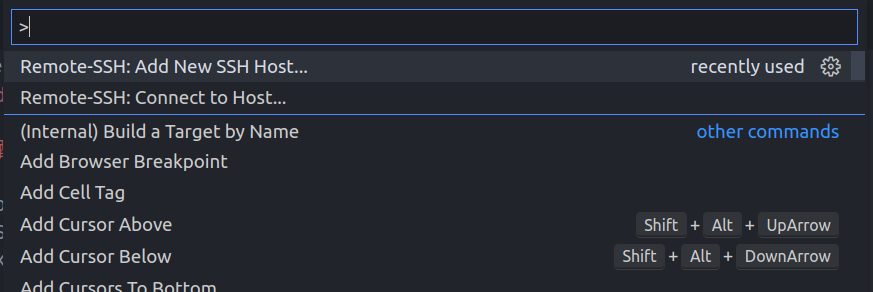

- 在这里输入自己的 ssh 地址（**ssh 默认去~/.ssh 下找 private key**）

  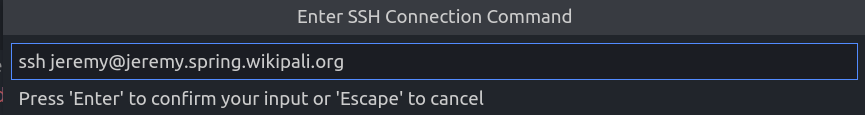

- 上一部选择回车后，提示选择要保存的配置文件

  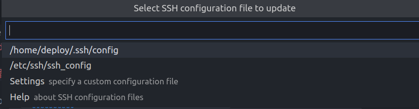

- 重新按 F1 然后这次选择 `Connect to Host`

  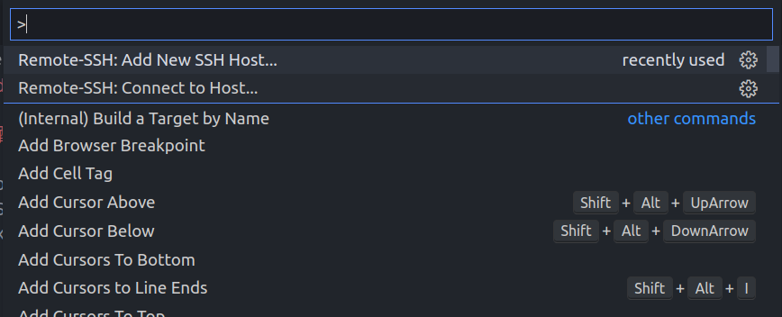

- 选择自己刚才添加的主机

  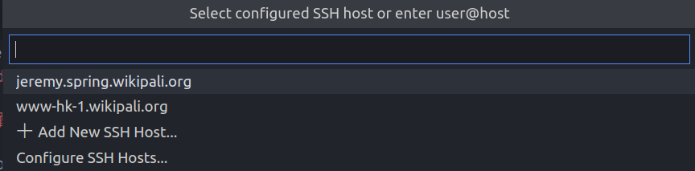

- 然后 vscode 会打开新窗口，选择 `Open Folder`

  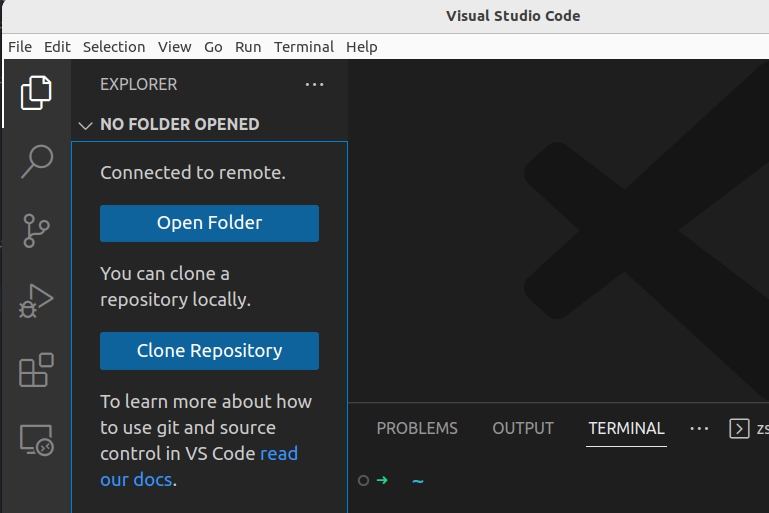

- 在文件框内输入目录 然后点击 `OK`

  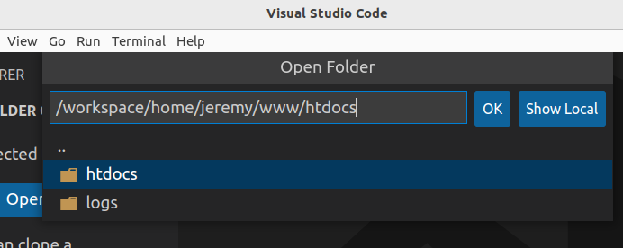

- 还是选择 `Trust` 比较好，不愿意也行

  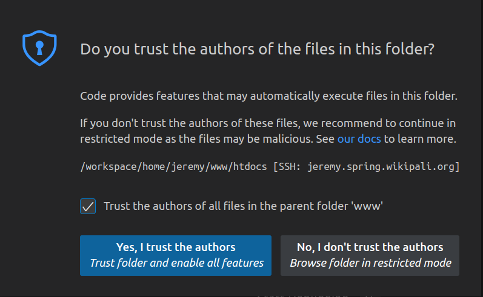

- 安装推荐插件(点击那个 Cloud 图表)

  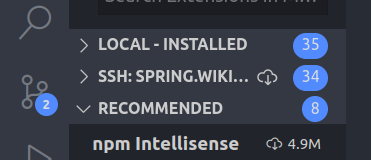

- 然后就可以欢快地写代码了 与 local 基本无差

  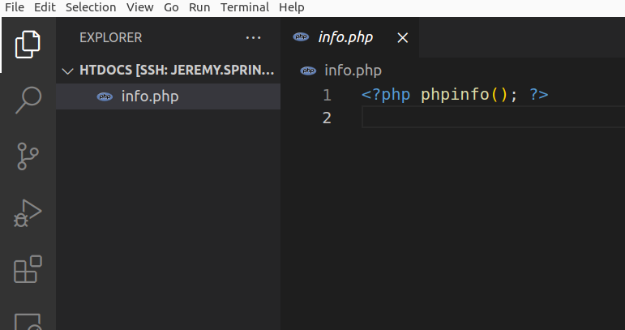

## ISSUES

- Permissions for XXX are too open().

  - For linux/macos user

    ```bash
    chmod 400 YOUR_PRIVATE_KEY_FILE
    ```

  - For windows user

    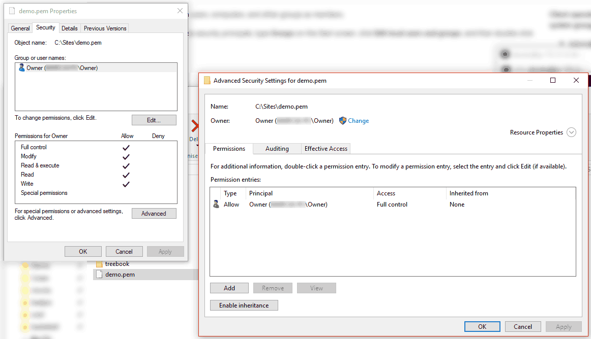
