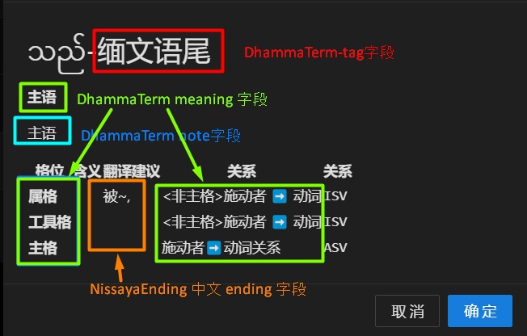

# nissaya 语尾气泡内容维护

## 总共涉及三张表

1. Relation-箭头左-relation-箭头右
2. NissayaEnding - 语尾和 relation 对应关系
3. DhammaTerm 术语本地化

## 业务逻辑

1. 从 NissayaEnding 查出需要显示的缅文语尾的所有对应的 relation
2. 在 DhammaTerm 查出 该缅文语尾对应的 ui 语言的记录，并显示在卡片开始处
3. 使用 1 中查出的 relation， 在 Relation 中查出 这些 relation 的所有记录（包含 case）
4. 步骤 3 返回的记录条数就是卡片表格的行数
5. 从 NissayaEnding 查到与 case+relation 对应的用户语言（如:中文）,放到翻译建议中。

## 注意：

NissayaEnding 中 relation 如果为空。仅显示 DhammaTerm 对应的部分。就是说。在上述业务逻辑无法满足的情况下。可以用 DhammaTerm 数据手工维护卡片。

## 管理入口

1. NissayaEnding : [http://127.0.0.1:3000/my/admin/nissaya-ending/list](http://127.0.0.1:3000/my/admin/nissaya-ending/list)
2. Relation : [http://127.0.0.1:3000/my/admin/relation/list](http://127.0.0.1:3000/my/admin/relation/list)
3. DhammaTerm: 自己的管理后台/channel/_System_Grammar_Term_zh-hans_/term

注意：

- http://127.0.0.1:3000/my 换成实际的服务器地址。如：http://visuddhinanda.spring.wikipali.org:60080/my/
- \_System_Grammar_Term\_**zh-hans**\_ 维护其他语言选择其他 channel 名称。
- 表格数据可以导入导出
- 如果没有看到上述名称的 channel，请向管理员申请 channel 编辑权限。
