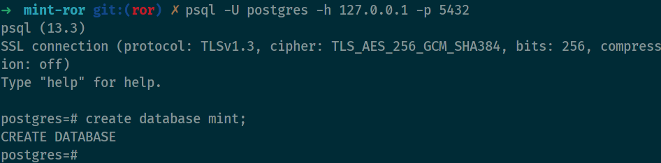
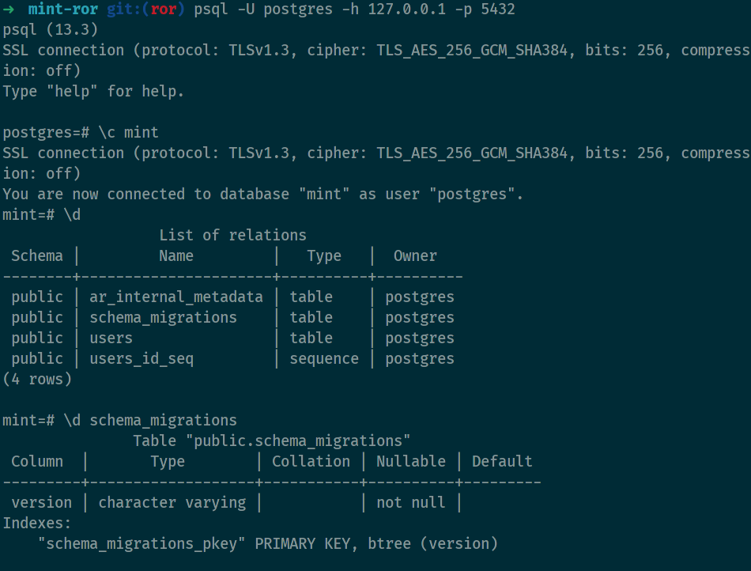

# PostgreSql

- Create database


- Rails command

    ```bash
    # migrate the database to latest
    rake db:migrate    
    # rolls the schema back to the previous version
    rake db:rollback
    # loads the seed data
    rake db:seed
    ```

- Show database
  
    

- [Free universal database tool and SQL client](https://dbeaver.io/download/)
