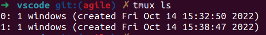

# TMUX 常见命令

- 启动 `tmux`
  - 退出 `Ctrl+d` 或 `exit`
- 横向切屏 `Ctrl+b` 然后 `"`
- 竖向切屏 `Ctrl+b` 然后 `%`
- 切换分屏 `Ctrl+b` 然后 `箭头键`
- 滚动分屏 `Ctrl+b` 然后 `[`
  - 按`方向键` 或 `Page up/down`滚动
  - 按`Esc` 或 `q` 可以退出滚屏
- 隐藏窗口 `Ctrl+b` 然后 `d`
- 查看所有窗口 `tmux ls`

  

- 前置窗口 `tmux at ID`
