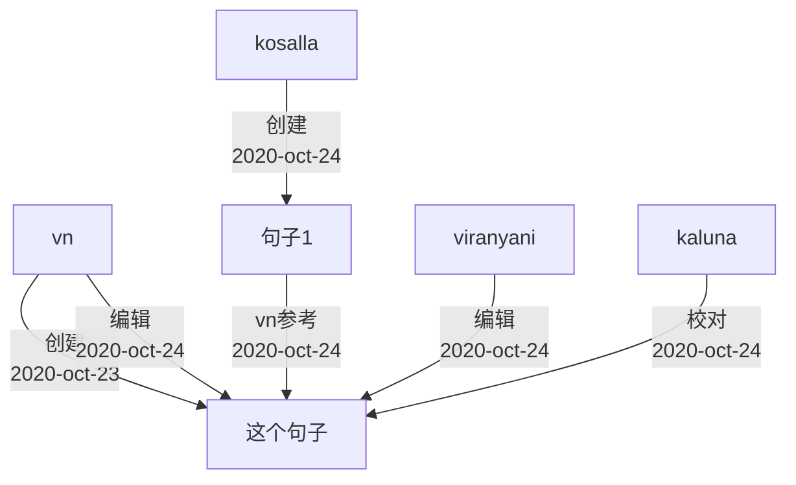
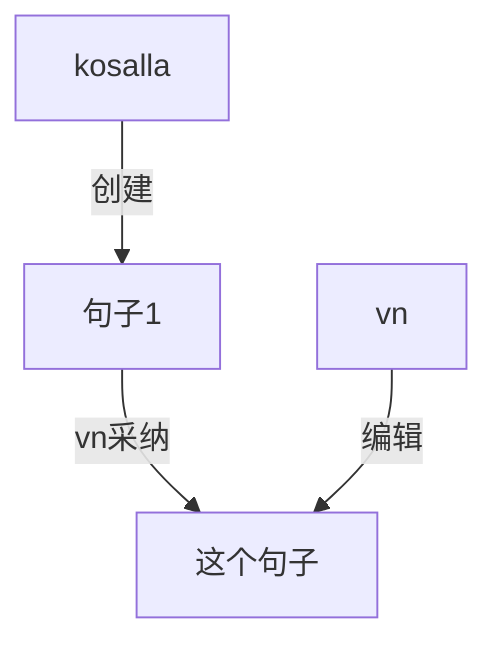
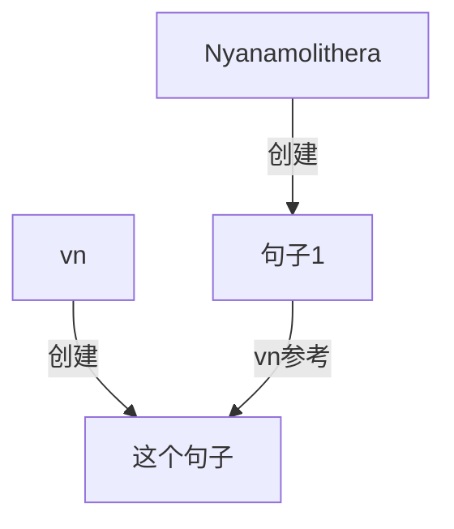
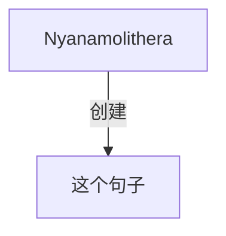

# 句子 author 字段数据格式

json 数据

```
[
    {
        people:"people",
        action:"create",
        date:time,
        sentence_id:"uuid",
    },
    {
        people:"people",
        action:"create",
        date:time,
        sentence_id:"uuid",
    }
]
```

## 创建



## 采纳 pr

点击采纳，复制被采纳句子到本句。 清空原来的 author， 替换成被采纳者的 author 信息，再加入一行采纳者信息。



## 参考

点击某句子的参考按钮，并不复制任何字符。复制被参考句子的 author 资料，并添加‘参考’信息。



## 添加已有的参考译文


