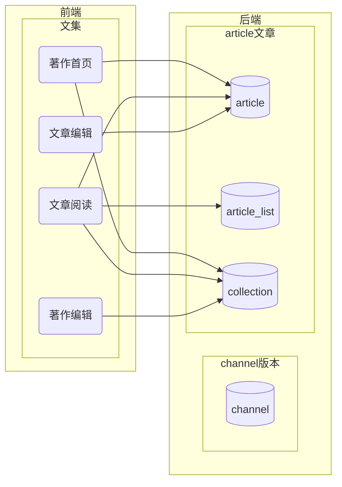

# 后端开发文档
## 开发环境
- golang
- PostgreSQL
- Redis
- ES

给vscode用的go
```
sudo apt install yarnpkg golang-go
```
## 文档资源


## 依赖
https://github.com/go-redis/redis


## 目录
* [版本](channel.md)
* [课程](course.md)
* [字典](dict.md)
* [工作组](group.md)
* [语料库](palicanon.md)
* [术语](term.md)
* [译文](translation.md)
* [文章文集](article.md)
* [用户](user.md)
* [逐词解析](wbw.md)
* [全文搜索](search.md)
* [其他工具表](others.md)



