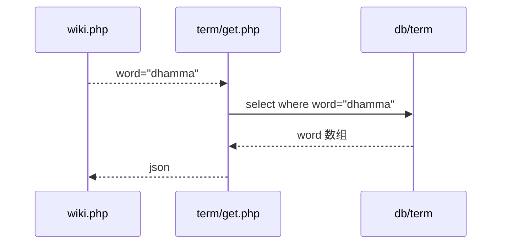

# 术语

## 前端url

- wiki/wiki.php?word=dhamma
- wiki/wiki.php?id=11
- wiki/wiki.php?word=dhamma&author=visuddhinanda
- wiki/wiki.php?word=dhamma&active=new&channel=1
- wiki/wiki.php?word=&active=new&channel=1
- wiki/wiki.php?id=11&active=edit

