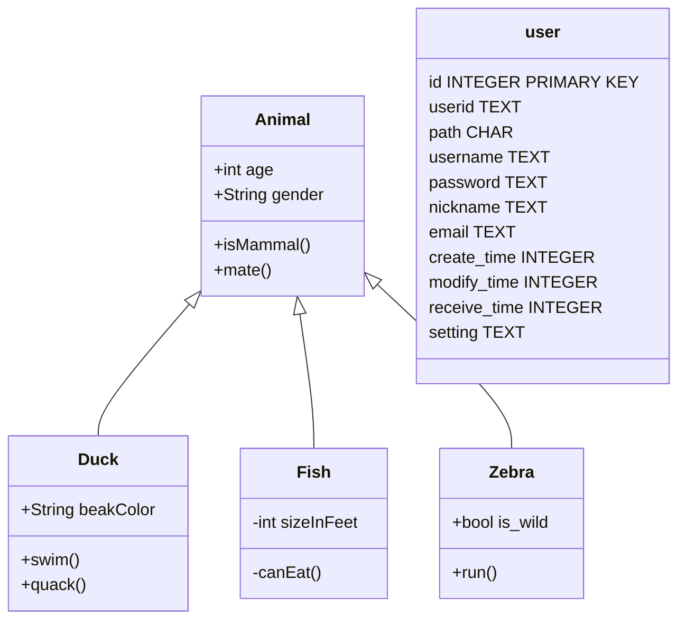

# 数据库



## 语料库

## 字典


## 用户认证
### user
用户信息
```
CREATE TABLE user (
    id           INTEGER    PRIMARY KEY AUTOINCREMENT,
    userid       TEXT       UNIQUE,
    path         CHAR (36),
    username     TEXT (64)  NOT NULL,
    password     TEXT       NOT NULL,
    nickname     TEXT (64)  NOT NULL,
    email        TEXT (256),
    create_time  INTEGER,
    modify_time  INTEGER,
    receive_time INTEGER,
    setting      TEXT
);
```
#### `id`
INTEGER 唯一自增id 
#### `userid`
CHAR (36)  uuid
#### `path`
CHAR (36) 用户在服务器上私有文件的路径
#### `username`
TEXT (64) 用户登录名
#### `password`
TEXT 密码 md5加密
#### `nickname`
TEXT (64) 昵称
#### `email`
TEXT (256) 电邮地址
#### create_time
INTEGER 账户建立时间
#### `modify_time`
INTEGER 数据修改时间
#### `receive_time`
INTEGER 服务器收到此数据时间
#### `setting`
TEXT 用户设置 json 数据

### profile
用户简历
```
CREATE TABLE profile (
    id        INTEGER   PRIMARY KEY AUTOINCREMENT,
    user_id   CHAR (36),
    bio       TEXT,
    lang      CHAR (8),
    isdefault INTEGER,
    email     TEXT
);
```
#### `id`
INTEGER 唯一自增id 
#### `user_id`
CHAR (36)  uuid
#### `bio`
TEXT 
#### `lang`
简介语言，一个用户可以建立多个语言版本的简历。用户的显示与用户的语言设置有关。不能匹配到相同语言时，匹配相同语族，还是不行，就显示默认记录。
#### `isdefault`
是否是默认记录。
#### `email`
电邮地址


## Channel

## 用户字典

## 逐词解析
### wbw_block
```
CREATE TABLE wbw_block (
    id             CHAR (36)    PRIMARY KEY,
    parent_id      CHAR (36),
    channal        CHAR (36),
    parent_channel VARCHAR (36),
    owner          CHAR (36),
    book           INTEGER,
    paragraph      INTEGER,
    style          CHAR (16),
    lang           CHAR (8),
    status         INTEGER,
    modify_time    INTEGER,
    receive_time   INTEGER,
    create_time    INTEGER
);
```
#### `parent_id`
上游id
#### `channal`
channel
#### `parent_channel`
从哪个channel 复制的
#### `owner`
最初拥有者
#### `book`
书号
#### 'paragraph'
段落号

### wbw
```
CREATE TABLE wbw (
    id           CHAR (36) PRIMARY KEY,
    block_id     CHAR (36),
    book         INTEGER,
    paragraph    INTEGER,
    wid          INTEGER,
    word         TEXT,
    data         TEXT,
    status       INTEGER,
    owner        CHAR (36),
    modify_time  INTEGER,
    receive_time INTEGER,	
    create_time  INTEGER
);

```
#### `block_id`
与wbw_block表关联的字段
#### `data`
单词数据 xml格式

## 译文


## 工作组


## 文章


## 权限管理


