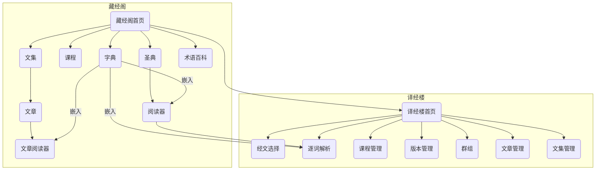

# 网站结构

```mermaid
graph TB;

subgraph 藏经阁
home(藏经阁首页) --> palicanon(圣典)
palicanon --> reader(阅读器)
home --> course(课程)
home --> dict(字典)
home --> collection(文集)
home --> term(术语百科)
collection --> article(文章)
article --> article-reader(文章阅读器)
dict -->|嵌入| reader
dict -->|嵌入| article-reader
end

subgraph 译经楼
studio --> pali(经文选择)
studio --> wbw(逐词解析)
studio(译经楼首页) --> course1(课程管理)
studio --> channel(版本管理)
studio --> group(群组)
studio --> article1(文章管理)
studio --> collection1(文集管理)
end

home -->studio
dict -->|嵌入| wbw
reader -->wbw

```