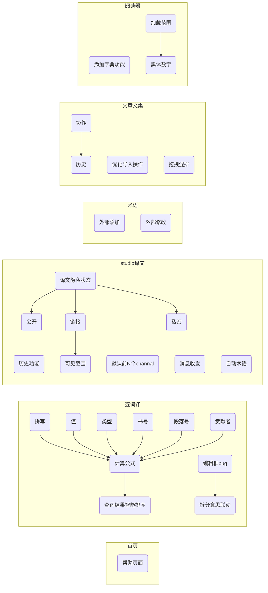

# 功能列表

```mermaid
graph LR;
subgraph 首页
A(帮助页面);
end
subgraph 逐词译
B1(查词结果智能排序)
B2(计算公式)-->B1
B3(拼写)-->B2
B4(值)-->B2
B5(类型)-->B2
B6(书号)-->B2
B7(段落号)-->B2
B8(贡献者)-->B2

B11(编辑框bug)
B11(编辑框bug)-->B12(拆分意思联动)
end
subgraph studio译文
C1(历史功能)
C2(译文隐私状态)-->C3
C3(公开)
C2-->C4(链接)
C2-->C5(私密)
C4-->C6(可见范围)
C7(默认前N个channal)
C8(消息收发)
C9(自动术语)
end
subgraph 术语
D1(外部添加)
D2(外部修改)
end
subgraph 文章文集
F1(协作)-->F2(历史)
F3(优化导入操作)
F4(拖拽混排)
end
subgraph 阅读器
E1(添加字典功能)
E2(加载范围)
E2-->E3(黑体数字)
end

```
