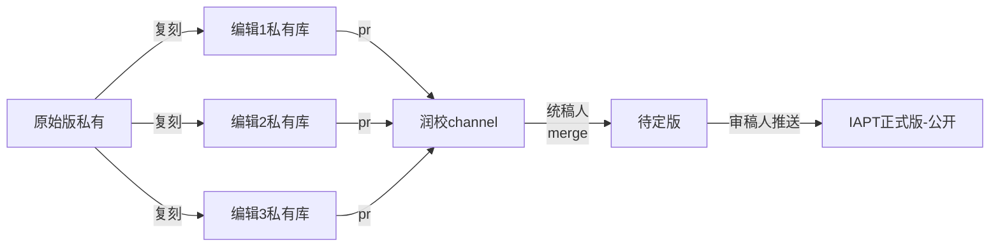

# 审校流程

```mermaid
graph LR;

原始版私有--复刻-->编辑1私有库
原始版私有--复刻-->编辑2私有库
原始版私有--复刻-->编辑3私有库

编辑1私有库 -- pr --> 润校channel
编辑2私有库 -- pr --> 润校channel
编辑3私有库 -- pr --> 润校channel

润校channel -- 统稿人<br>merge --> 待定版

待定版 -- 审稿人推送 --> IAPT正式版-公开

```
