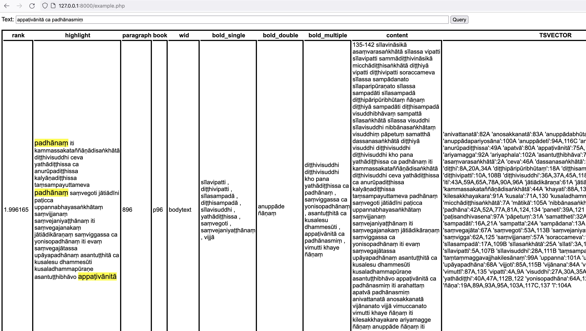

# 基于 PostgreSQL 的巴利语全文检索方案

## 概述

当前方案支持词形转换，但不支持单词拆分。

相对于当前的检索方案，可实现以下优化:

- 优化多个单词搜索效率
- 即使被搜索词在目标段落中不连续也能搜索到
- 支持搜索目标的变形词的搜索
- 支持黑体字增加权重

暂未能解决的问题:

- 巴利语分词，如:akusaladhammo → akusala + dhamma
- 多级衍生词的终极形态决定，如:arahantam → arahant → arahati

## 前置条件

### 部署条件:

PostgreSQL >= 9.6

推荐使用 PostgreSQL 14，有以下优势:

1. 可以使用 websearch_to_tsquery (PostgreSQL 11+)， 更丰富、灵活的检索语法
2. 可以使用 Generated Columns (PostgreSQL 12+)，动态更新索引

### 准备条件:

基础数据：

- [词形转换字典](../../dicttext/system/) (sys_irregular.csv + sys_regular[1-10].csv)
- [巴利语停用词列表](pali.stop
) (类似于英文:the, this, that, to, from, as, for, ...以及标点符号，待整理)
- [三藏语料 CSV 数据](../../tmp/palicsv/) (开发环境下通过[安装向导](http://127.0.0.1:8000/mint/app/install/step5.php)可找到[生成页面](http://127.0.0.1:8000/mint/app/install/xmlmaker.php))

最终数据：

- pali.syn 词形转换词典
- pali.stop 停用词词典
- fts.sql 数据表结构
- *.sql (如：abh01a.att.sql) 数据插入语句

### 数据准备：

#### pali.syn 词形转换词典

执行下面脚本：

```bash
cd mint/app/fts/
php -d memory_limit=1024M pali.syn.php
```

将会在当前目录下生成 pali.syn 文件

**注意 01**

变更 pali.syn 词形转换词典后，有两种方式使其生效（任选其一）：

1. 在当前会话 (session) 内执行下面语句：

关于使用下面语句的原因，请参见：[PostgreSQL / Dictionaries / Simple Dictionary - Caution ("dummy" update)](https://www.postgresql.org/docs/14/textsearch-dictionaries.html#TEXTSEARCH-SIMPLE-DICTIONARY)

```sql
-- dummy update
ALTER TEXT SEARCH DICTIONARY pali_stem (
    SYNONYMS = pali
);
```

2. 断开当前会话 (session)，重新连接。

**注意 02**

在 pali.syn 内添加词形转换时，请向文件末尾添加，实际测试发现在文件头部添加并未生效。

**注意 03**

更新 pali.syn 这个变更涉及到所有三藏文本中的词形转换，所以需要手动重建全文检索索引。

两种方式（任选其一）：

1. 你知道改变更会影响哪些记录（比如先进行搜索得出结果）

```sql
-- dummy update
UPDATE fts_texts SET content = content,
               bold_single = bold_single,
               bold_double = bold_double,
               bold_multiple = bold_multiple
               WHERE paragraph = 37 AND book = 'p180';
```

请将 paragraph 和 book 替换为目标值。

2. 这是一个普遍的变更，会影响到很多记录

```sql
-- dummy update
UPDATE fts_texts SET content = content,
               bold_single = bold_single,
               bold_double = bold_double,
               bold_multiple = bold_multiple;
```

移除掉 WHERE 条件，将会触发所有记录重新建立索引，会花上很长时间，执行之前请三思。

#### pali.stop 停用词词典

请熟悉巴利语的贤者依据巴利文法编辑 [pali.stop](./pali.stop) 文件，
可参考 [PostgreSQL - Dictionaries - Stop Words](https://www.postgresql.org/docs/14/textsearch-dictionaries.html#TEXTSEARCH-STOPWORDS)

#### fts.sql 全文检索配置

在执行该文件之前，请确保服务器上已存在 postgresql-contrib 依赖包，
安装方法：

Debian/Ubuntu

```bash
sudo apt-get install postgresql-contrib
```

Fedora

```bash
sudo dnf install postgresql-contrib
```

其余请参见 [fts.sql](fts.sql) 文件，注释里有详细解释。

一句话解释：

参照 *.csv (如：tmp/palicsv/abh01m.mul/abh01a.att.csv) 的结构，
将单词组合成为段落，作为最小检索单位。

执行 SQL 文件之前，请确保：

1. cp pali.syn /usr/share/pgsql/tsearch_data/pali.syn
2. cp pali.stop /usr/share/pgsql/tsearch_data/pali.stop

其中 `/usr/share/pgsql/tsearch_data/` 路径可通过 `pg_config --sharedir` 获得。

或者，直接执行下面语句，PSQL 会报错，告诉您应该放在哪里：

```sql
CREATE TEXT SEARCH DICTIONARY pali_stem (
    TEMPLATE = synonym,
    SYNONYMS = pali
);
```

请注意：如果在这里执行成功了的话，SQL 文件里再次执行就会提示字典已经创建。

如果目标文件夹不存在，请手动创建。

#### *.sql (如：abh01a.att.sql) 数据插入语句

执行下面脚本生成 SQL 文件：

```bash
cd mint/app/fts/
php -d memory_limit=1024M sql.php
```

在执行之前，请保证三藏语料 CSV 数据已经存在。

在 SQL 文件生成之后，可以将数据导入 PostgreSQL 服务器。

可以参考执行下面脚本（执行前请调整 psql 参数），插入数据到数据库：

```bash
cd mint/app/fts/sql
count=0
total=$(ls -1q *.sql | wc -l)
for f in *.sql;
do
   count=$(( $count + 1 ))
   echo Processing: "$f , $count of $total"
   psql --quiet <database-name> -f "$f"
done
```

在执行之前，请保证 sql 目录以及 SQL 文件对于 PostgreSQL 用户的可读权限。

数据插入时会同步创建索引，耗时较久，请耐心等待。

### 使用 SQL 查询数据：

权重设置：

`{0.1, 0.2, 0.4, 1}` 对应 `D, C, B, A`，也就是：

- D: 2 个以上的连续黑体字权重
- C: 2 个连续黑体字权重
- B: 单个出现的黑体字权重
- A: 内容匹配权重

有标音符号查询：

```sql
SELECT
    ts_rank('{0.1, 0.2, 0.4, 1}',
        full_text_search_weighted,
        websearch_to_tsquery('pali', 'appaṭivānitā ca padhānasmiṃ'))
    AS rank,
    * FROM fts
    WHERE full_text_search_weighted @@ websearch_to_tsquery('pali', 'appaṭivānitā ca padhānasmiṃ')
    ORDER BY rank DESC
    LIMIT 20;
```

执行耗时： **17 ms**

匹配结果：

<details>
  <summary>点击展开结果</summary>
<table>
	<tr>
		<th>rank</th>
		<th>paragraph</th>
		<th>book</th>
		<th>wid</th>
		<th>bold_single</th>
		<th>bold_double</th>
		<th>bold_multiple</th>
		<th>content</th>
		<th>full_text_search_weighted</th>
		<th>full_text_search_weighted_unaccent</th>
	</tr>
	<tr>
		<td>0.9989252</td>
		<td>37</td>
		<td>p180</td>
		<td>bodytext</td>
		<td></td>
		<td></td>
		<td></td>
		<td>vijjābhāgino dhammā avijjābhāgino dhammā vijjūpamā dhammā vajirūpamā dhammā bālā dhammā paṇḍitā dhammā kaṇhā dhammā sukkā dhammā tapanīyā dhammā atapanīyā dhammā adhivacanā dhammā adhivacanapathā dhammā nirutti dhammā niruttipathā dhammā paññatti dhammā paññattipathā dhammā nāmañca rūpañca avijjā ca bhavataṇhā ca bhavadiṭṭhi ca vibhavadiṭṭhi ca sassatadiṭṭhi ca ucchedadiṭṭhi ca antavā diṭṭhi ca anantavā diṭṭhi ca pubbantānudiṭṭhi ca aparantānudiṭṭhi ca ahirikañca anottappañca hirī ca ottappañca dovacassatā ca pāpamittatā ca sovacassatā ca kalyāṇamittatā ca āpattikusalatā ca āpattivuṭṭhānakusalatā ca samāpattikusalatā ca samāpattivuṭṭhānakusalatā ca dhātukusalatā ca manasikārakusalatā ca āyatanakusalatā ca paṭiccasamuppādakusalatā ca ṭhānakusalatā ca aṭṭhānakusalatā ca ajjavo ca maddavo ca khanti ca soraccañca sākhalyañca paṭisanthāro ca indriyesu aguttadvāratā ca bhojane amattaññutā ca indriyesu guttadvāratā ca bhojane mattaññutā ca muṭṭhassaccañca asampajaññañca sati ca sampajaññañca paṭisaṅkhānabalañca bhāvanābalañca samatho ca vipassanā ca samathanimittañca paggāhanimittañca paggāho ca avikkhepo ca sīlavipatti ca diṭṭhivipatti ca sīlasampadā ca diṭṭhisampadā ca sīlavisuddhi ca diṭṭhivisuddhi ca diṭṭhivisuddhi kho pana yathādiṭṭhissa ca padhānaṃ saṃvego ca saṃvejaniyesu ṭhānesu saṃviggassa ca yoniso padhānaṃ asantuṭṭhitā ca kusalesu dhammesu appaṭivānitā ca padhānasmiṃ vijjā ca vimutti ca khaye ñāṇaṃ anuppāde ñāṇanti</td>
		<td>'adhivacana':21A 'adhivacanapatha':23A 'aguttadvāratā':101A 'ahirikañca':57A 'ajjava':90A 'amattaññutā':104A 'anantavā':50A 'anottappañca':58A 'antavanta':47A 'anuppādeti':168A 'aparantānudiṭṭhi':55A 'appaṭivānitā':159A 'asampajaññañca':113A 'asantuṭṭhitā':155A 'atapanīya':19A 'avijjā':35A 'avijjābhāgī':3A 'avikkhepa':127A 'aṭṭhānakusalatā':88A 'bhavadiṭṭhi':39A 'bhavataṇhā':37A 'bhojana':103A,109A 'bhāvanābalañca':118A 'bāla':9A 'dhamma':2A,4A,6A,8A,10A,12A,14A,16A,18A,20A,22A,24A,26A,28A,30A,32A,158A 'dhātukusalatā':78A 'diṭṭhisampadā':135A 'diṭṭhivipatti':131A 'diṭṭhivisuddhi':139A,141A 'diṭṭhī':48A,51A 'dovacassatā':62A 'guttadvāratā':107A 'hiri':59A 'indriya':100A,106A 'kalyāṇamittatā':68A 'kaṇha':13A 'khanti':94A 'khayati':166A 'khāti':142A 'kusala':157A 'maddu':92A 'manasikārakusalatā':80A 'mattaññutā':110A 'muṭṭhassaccañca':112A 'nirutti':25A 'niruttipatha':27A 'nāmañca':33A 'ottappañca':61A 'padhāna':146A,154A,161A 'paggāha':125A 'paggāhanimittañca':124A 'paneti':143A 'paññatti':29A 'paññattipatha':31A 'paṇḍita':11A 'paṭiccasamuppādakusalatā':84A 'paṭisanthāra':98A 'paṭisaṅkhānabalañca':117A 'pubbantānudiṭṭhi':53A 'pāpamittatā':64A 'rūpañca':34A 'samatha':119A 'samathanimittañca':123A 'sampajaññañca':116A 'samāpattikusalatā':74A 'samāpattivuṭṭhānakusalatā':76A 'sassatadiṭṭhi':43A 'sata':114A 'saṃvega':147A 'saṃvejaniya':149A 'saṃvigga':151A 'soraccañca':96A 'sovacassatā':66A 'sukka':15A 'sākhalyañca':97A 'sīlasampadā':133A 'sīlavipatti':129A 'sīlavisuddhi':137A 'tapanīya':17A 'ucchedadiṭṭhi':45A 'vajirūpama':7A 'vibhavadiṭṭhi':41A 'vijjoti':162A 'vijjābhāgī':1A 'vijjūpama':5A 'vimuttī':164A 'vipassana':121A 'yathādiṭṭhi':144A 'yoniso':153A 'ñāṇa':167A 'ñāṇanti':169A 'āpattikusalatā':70A 'āpattivuṭṭhānakusalatā':72A 'āyatanakusalatā':82A 'ṭhāna':150A 'ṭhānakusalatā':86A</td>
		<td>'adhivacana':21A 'adhivacanapatha':23A 'aguttadvarata':101A 'ahirikanca':57A 'ajjava':90A 'amattannuta':104A 'anantava':50A 'anottappanca':58A 'antava':47A 'anuppade':168A 'aparantanuditthi':55A 'apattikusalata':70A 'apattivutthanakusalata':72A 'appativanita':159A 'asampajannanca':113A 'asantutthita':155A 'atapaniya':19A 'atthanakusalata':88A 'avijja':35A 'avijjabhagino':3A 'avikkhepa':127A 'ayatanakusalata':82A 'baleti':9A 'bhavaditthi':39A 'bhavanabalanca':118A 'bhavatanha':37A 'bhojana':103A,109A 'dhamma':2A,4A,6A,8A,10A,12A,14A,16A,18A,20A,22A,24A,26A,28A,30A,32A,158A 'dhatukusalata':78A 'ditthi':48A,51A 'ditthisampada':135A 'ditthivipatti':131A 'ditthivisuddhi':139A,141A 'dovacassata':62A 'guttadvarata':107A 'hiri':59A 'indriya':100A,106A 'kalyanamittata':68A 'kanha':13A 'khanti':94A 'khayati':166A 'khāti':142A 'kusala':157A 'maddu':92A 'manasikarakusalata':80A 'mattannuta':110A 'mutthassaccanca':112A 'namanca':33A 'nanam':167A 'nananti':169A 'nirutti':25A 'niruttipatha':27A 'ottappanca':61A 'padhanam':146A,154A 'padhanasmim':161A 'paggahanimittanca':124A 'paggaheti':125A 'pandita':11A 'paneti':143A 'pannatti':29A 'pannattipatha':31A 'papamittata':64A 'paticcasamuppadakusalata':84A 'patisankhanabalanca':117A 'patisantharo':98A 'pubbantanuditthi':53A 'rupanca':34A 'sakhalyanca':97A 'samapattikusalata':74A 'samapattivutthanakusalata':76A 'samatha':119A 'samathanimittanca':123A 'sampajannanca':116A 'samvego':147A 'samvejaniyesu':149A 'samviggassa':151A 'sassataditthi':43A 'sata':114A 'silasampada':133A 'silavipatti':129A 'silavisuddhi':137A 'soraccanca':96A 'sovacassata':66A 'sukka':15A 'tapaniya':17A 'thanakusalata':86A 'thananta':150A 'ucchedaditthi':45A 'vajirupama':7A 'vibhavaditthi':41A 'vijjabhagino':1A 'vijjoti':162A 'vijjupama':5A 'vimuttī':164A 'vipassana':121A 'yathaditthissa':144A 'yoniso':153A</td>
	</tr>
	<tr>
		<td>0.998152</td>
		<td>896</td>
		<td>p96</td>
		<td>bodytext</td>
		<td>sīlavipatti , diṭṭhivipatti , sīlasampadā , diṭṭhisampadā , sīlavisuddhi , yathādiṭṭhissa , saṃvegoti , saṃvejaniyaṭṭhānaṃ , vijjā</td>
		<td>anuppāde ñāṇaṃ</td>
		<td>diṭṭhivisuddhi diṭṭhivisuddhi kho pana yathādiṭṭhissa ca padhānaṃ , saṃviggassa ca yonisopadhānaṃ , asantuṭṭhitā ca kusalesu dhammesūti , appaṭivānitā ca padhānasmiṃ , vimutti khaye ñāṇaṃ</td>
		<td>135-142 sīlavināsikā asaṃvarasaṅkhātā sīlassa vipatti sīlavipatti sammādiṭṭhivināsikā micchādiṭṭhisaṅkhātā diṭṭhiyā vipatti diṭṭhivipatti soraccameva sīlassa sampādanato sīlaparipūraṇato sīlassa sampadāti sīlasampadā diṭṭhipāripūribhūtaṃ ñāṇaṃ diṭṭhiyā sampadāti diṭṭhisampadā visuddhibhāvaṃ sampattā sīlasaṅkhātā sīlassa visuddhi sīlavisuddhi nibbānasaṅkhātaṃ visuddhiṃ pāpetuṃ samatthā dassanasaṅkhātā diṭṭhiyā visuddhi diṭṭhivisuddhi diṭṭhivisuddhi kho pana yathādiṭṭhissa ca padhānaṃ iti kammassakataññāṇādisaṅkhātā diṭṭhivisuddhi ceva yathādiṭṭhissa ca anurūpadiṭṭhissa kalyāṇadiṭṭhissa taṃsampayuttameva padhānaṃ saṃvegoti jātiādīni paṭicca uppannabhayasaṅkhātaṃ saṃvijjanaṃ saṃvejaniyaṭṭhānaṃ iti saṃvegajanakaṃ jātiādikāraṇaṃ saṃviggassa ca yonisopadhānaṃ iti evaṃ saṃvegajātassa upāyapadhānaṃ asantuṭṭhitā ca kusalesu dhammesūti kusaladhammapūraṇe asantuṭṭhibhāvo appaṭivānitā ca padhānasmiṃ iti arahattaṃ apatvā padhānasmiṃ anivattanatā anosakkanatā vijānanato vijjā vimuccanato vimutti khaye ñāṇaṃ iti kilesakkhayakare ariyamagge ñāṇaṃ anuppāde ñāṇaṃ iti paṭisandhivasena anuppādabhūte taṃtaṃmaggavajjhakilesānaṃ anuppādapariyosāne uppanne ariyaphale ñāṇaṃ ayaṃ mātikāya anupubbapadavaṇṇanā</td>
		<td>'anivattanatā':82A 'anosakkanatā':83A 'anuppādabhūta':98A 'anuppādapariyosāna':100A 'anuppādeti':94A,116C 'anupubbapadavaṇṇanā':106A 'anurūpadiṭṭhissa':49A 'apatvā':80A 'appaṭivānitā':75A,132 'arahatta':79A 'ariyamagga':92A 'ariyaphala':102A 'asantuṭṭhibhāva':74A 'asantuṭṭhitā':69A,128 'asaṃvarasaṅkhātā':2A 'ceva':46A 'dassanasaṅkhātā':33A 'dhammesūti':72A,131 'diṭṭhi':8A,20A,34A 'diṭṭhipāripūribhūtaṃ':18A 'diṭṭhisampadā':22A,110B 'diṭṭhivipatti':10A,108B 'diṭṭhivisuddhi':36A,37A,45A,118,119 'evaṃ':66A 'iti':43A,59A,65A,78A,90A,96A 'jātiādikāraṇa':61A 'jātiādīni':54A 'kalyāṇadiṭṭhi':50A 'kammassakataññāṇādisaṅkhātā':44A 'khayati':88A,136 'khāti':38A,120 'kilesakkhayakara':91A 'kusala':71A,130 'kusaladhammapūraṇa':73A 'micchādiṭṭhisaṅkhātā':7A 'mātikā':105A 'nibbānasaṅkhātaṃ':29A 'padhāna':42A,52A,77A,81A,124,134 'paneti':39A,121 'paṭicca':55A 'paṭisandhivasena':97A 'pāpetuṃ':31A 'samattheti':32A 'sammādiṭṭhivināsikā':6A 'sampadāti':16A,21A 'sampatta':24A 'sampādana':13A 'saṃvegajanakaṃ':60A 'saṃvegajāta':67A 'saṃvegoti':53A,113B 'saṃvejaniyaṭṭhānaṃ':58A,114B 'saṃvigga':62A,125 'saṃvijjanaṃ':57A 'soraccameva':11A 'sīlaparipūraṇato':14A 'sīlasampadā':17A,109B 'sīlasaṅkhātā':25A 'sīlati':3A,12A,15A,26A 'sīlavināsikā':1A 'sīlavipatti':5A,107B 'sīlavisuddhi':28A,111B 'taṃsampayuttameva':51A 'taṃtaṃmaggavajjhakilesānaṃ':99A 'uppanna':101A 'uppannabhayasaṅkhātaṃ':56A 'upāyapadhāna':68A 'vijjoti':85A,115B 'vijānana':84A 'vimuccana':86A 'vimuttī':87A,135 'vipatti':4A,9A 'visuddhi':27A,30A,35A 'visuddhibhāvaṃ':23A 'yathādiṭṭhi':40A,47A,112B,122 'yonisopadhāna':64A,127 'ñāṇa':19A,89A,93A,95A,103A,117C,137 'ī':104A</td>
		<td>'anivattanata':82A 'anosakkanata':83A 'anuppadabhute':98A 'anuppadapariyosane':100A 'anuppade':94A,116C 'anupubbapadavannana':106A 'anurupaditthissa':49A 'apatva':80A 'appativanita':75A,132 'arahattam':79A 'ariyamagga':92A 'ariyaphala':102A 'asamvarasankhata':2A 'asantutthibhavo':74A 'asantutthita':69A,128 'ayam':104A 'ceva':46A 'dassanasankhata':33A 'dhammesuti':72A,131 'ditthiparipuribhutam':18A 'ditthisampada':22A,110B 'ditthivipatti':10A,108B 'ditthivisuddhi':36A,37A,45A,118,119 'ditthiya':8A,20A,34A 'evam':66A 'iti':43A,59A,65A,78A,90A,96A 'jatiadikaranam':61A 'jatiadini':54A 'kalyanaditthissa':50A 'kammassakatannanadisankhata':44A 'khayati':88A,136 'khāti':38A,120 'kilesakkhayakara':91A 'kusala':71A,130 'kusaladhammapurane':73A 'matikaya':105A 'micchaditthisankhata':7A 'nanam':19A,89A,93A,95A,103A,117C,137 'nibbanasankhatam':29A 'padhanam':42A,52A,124 'padhanasmim':77A,81A,134 'paneti':39A,121 'papetum':31A 'paticca':55A 'patisandhivasena':97A 'samattheti':32A 'sammaditthivinasika':6A 'sampadanato':13A 'sampadati':16A,21A 'sampatta':24A 'samvegajanakam':60A 'samvegajatassa':67A 'samvegoti':53A,113B 'samvejaniyatthanam':58A,114B 'samviggassa':62A,125 'samvijjanam':57A 'sila':3A,12A,15A,26A 'silaparipuranato':14A 'silasampada':17A,109B 'silasankhata':25A 'silavinasika':1A 'silavipatti':5A,107B 'silavisuddhi':28A,111B 'soraccameva':11A 'tamsampayuttameva':51A 'tamtammaggavajjhakilesanam':99A 'upayapadhanam':68A 'uppanna':101A 'uppannabhayasankhatam':56A 'vijananato':84A 'vijjoti':85A,115B 'vimuccana':86A 'vimuttī':87A,135 'vipatti':4A,9A 'visuddhi':27A,35A 'visuddhibhavam':23A 'visuddhim':30A 'yathaditthissa':40A,47A,112B,122 'yonisopadhanam':64A,127</td>
	</tr>
	<tr>
		<td>0.9942415</td>
		<td>1735</td>
		<td>p180</td>
		<td>bodytext</td>
		<td>appaṭivānitā</td>
		<td></td>
		<td>asantuṭṭhitā kusalesu dhammesu</td>
		<td>kusaladhammapūraṇe asantuṭṭhibhāvo asantuṭṭhitā yo pana dānaṃ datvā tato tena asantuṭṭho hutvā saraṇagamanaṃ ākaṅkhati tato pañcasīlādiṃ pabbajjaṃ buddhavacanānaṃ uggaṇhanaṃ samathavipassanaṃ tato tenāpi asantuṭṭho anukkamena arahattaṃ gaṇhāti ayaṃ asantuṭṭhitā kusalesu dhammesu adhikusaladhammānaṃ bhāvanāya ukkaṇṭhamāno padhānaṃ paṭivāpeti nivattāpetīti paṭivāni na paṭivāni appaṭivāni tassa bhavo appaṭivānitā arahattaṃ appatvā padhānasmiṃ anivattanatā anosakkanatā tathāpavattalokiyalokuttarakusalā dhammā cattālīsatimaṃ</td>
		<td>'adhikusaladhamma':30A 'anivattanatā':46A 'anosakkanatā':47A 'anukkama':23A 'appatvā':44A 'appaṭivānitā':42A,51B 'appaṭivānī':39A 'arahatta':24A,43A 'asantuṭṭha':10A,22A 'asantuṭṭhibhāva':2A 'asantuṭṭhitā':3A,27A,52 'bhāvanā':31A 'bhū':41A 'buddhavacana':17A 'cattālīsatima':50A 'datvā':7A 'dhamma':29A,49A,54 'dānati':6A 'gaṇhāti':25A 'hoti':11A 'kusala':28A,53 'kusaladhammapūraṇa':1A 'nata':37A 'nivattāpetīti':35A 'pabbajjā':16A 'padhāna':33A,45A 'paneti':5A 'pañcasīlādiṃ':15A 'paṭivānī':36A,38A 'paṭivāpeti':34A 'samathavipassanaṃ':19A 'saraṇagamana':12A 'ta':9A 'tata':8A,14A,20A 'tathāpavattalokiyalokuttarakusalā':48A 'tenāpi':21A 'ti':40A 'uggaṇhana':18A 'ukkaṇṭhamāna':32A 'ākaṅkhanta':13A 'ī':4A,26A</td>
		<td>'adhikusaladhammanam':30A 'akankhati':13A 'anivattanata':46A 'anosakkanata':47A 'anukkama':23A 'appativani':39A 'appativanita':42A,51B 'appatva':44A 'arahattam':24A,43A 'asantutthibhavo':2A 'asantutthita':3A,27A,52 'asantuttho':10A,22A 'ayam':26A 'bhavanaya':31A 'bhū':41A 'buddhavacananam':17A 'cattalisatimam':50A 'danam':6A 'datva':7A 'dhamma':29A,49A,54 'ganhati':25A 'hutva':11A 'kusala':28A,53 'kusaladhammapurane':1A 'nata':37A 'nivattapetiti':35A 'pabbajjam':16A 'padhanam':33A 'padhanasmim':45A 'pancasiladim':15A 'paneti':5A 'pativani':36A,38A 'pativapeti':34A 'samathavipassanam':19A 'saranagamanam':12A 'ta':9A 'tata':8A,14A,20A 'tathapavattalokiyalokuttarakusala':48A 'tenapi':21A 'ti':40A 'ugganhanam':18A 'ukkanthamano':32A 'ī':4A</td>
	</tr>
	<tr>
		<td>0.9910322</td>
		<td>216</td>
		<td>p120</td>
		<td>unindented</td>
		<td>attāti</td>
		<td></td>
		<td></td>
		<td>kāye ca jīvite ca anapekkhatāya pahito pesito vissaṭṭho attā etenāti pahitatto attāti attabhāvo yathāha yā pana bhikkhunī attānaṃ vadhitvā vadhitvā rodeyyā itiādi pāci asallīnatto ca so pahitatto cāti asallīnattapahitatto sahajātadhamme paggaṇhāti upatthambhetīti paggaho paggaho eva attho paggahaṭṭho paggahasabhāvoti attho asallīnattapahitattassa paggahaṭṭho asallīnattapahitattapaggahaṭṭho tasmiṃ asallīnattapahitattapaggahaṭṭhe tasmātiha bhikkhave tumhepi appaṭivānaṃ padaheyyātha kāmaṃ taco ca nhāru ca aṭṭhi ca avasissatu upasussatu sarīre maṃsalohitaṃ yaṃ taṃ purisathāmena purisavīriyena purisaparakkamena pattabbaṃ na taṃ apāpuṇitvā vīriyassa saṇṭhānaṃ bhavissatī iti a ni vuttattā asallīnattapahitattavacanena padhānasmiṃ appaṭivānitā anivattanatā vuttā paggahaṭṭhavacanena pana kosajjuddhaccavimuttaṃ samappavattaṃ vīriyaṃ vuttaṃ</td>
		<td>'anapekkhatāya':5A 'anivattanatā':80A 'anta':74A 'appaṭivāna':48A 'appaṭivānitā':79A 'apāpuṇitvā':69A 'asallīnatta':24A 'asallīnattapahitattapaggahaṭṭha':42A,44A 'asallīnattapahitattassa':40A 'asallīnattapahitattavacanena':77A 'asallīnattapahitatto':29A 'atta':9A,18A 'attabhāva':13A 'attha':36A,39A 'attāti':12A,88B 'avasissati':57A 'aṭṭhi':55A 'bhavissati':72A 'bhikkhu':46A 'bhikkhunī':17A 'cāti':28A 'etenāti':10A 'eva':35A 'iti':73A 'itiādi':22A 'jīvita':3A 'kosajjuddhaccavimutta':84A 'kāmeti':50A 'kāyati':1A 'maṃsalohita':60A 'nata':67A 'nhāru':53A 'ni':75A 'padahati':49A 'padhāna':78A 'paggahasabhāvoti':38A 'paggahaṭṭhavacanena':82A 'paggahaṭṭho':37A,41A 'paggaheti':33A,34A 'paggaṇhāti':31A 'pahita':6A 'pahitatta':11A,27A 'paneti':16A,83A 'pattabba':66A 'pesita':7A 'purisaparakkama':65A 'purisathāma':63A 'purisavīriyena':64A 'pāceti':23A 'rodeyyā':21A 'sahajātadhamme':30A 'samappavatta':85A 'sarīra':59A 'saṇṭhāna':71A 'ta':26A,43A 'tacati':51A 'tasmātiha':45A 'tumha':62A,68A 'tumhepi':47A 'upasussati':58A 'upatthambhetīti':32A 'vadhitvā':19A,20A 'vissaṭṭha':8A 'vutta':81A,87A 'vuttatta':76A 'vīriya':70A,86A 'yathāha':14A 'ī':15A,61A</td>
		<td>'anapekkhataya':5A 'anivattanata':80A 'anta':74A 'apapunitva':69A 'appativanam':48A 'appativanita':79A 'asallinattapahitattapaggahatthe':44A 'asallinattapahitattapaggahattho':42A 'asallinattapahitattassa':40A 'asallinattapahitattavacanena':77A 'asallinattapahitatto':29A 'asallinatto':24A 'atta':9A 'attabhavo':13A 'attanam':18A 'attati':12A,88B 'attha':36A,39A 'atthī':55A 'avasissati':57A 'bhavissanta':72A 'bhikkhu':46A 'bhikkhuni':17A 'cati':28A 'etenati':10A 'eva':35A 'iti':73A 'itiadi':22A 'jivite':3A 'kamam':50A 'kaye':1A 'kosajjuddhaccavimuttam':84A 'mamsalohitam':60A 'nata':67A 'nharu':53A 'ni':75A 'pacati':23A 'padaheyyatha':49A 'padhanasmim':78A 'paggahasabhavoti':38A 'paggahatthavacanena':82A 'paggahattho':37A,41A 'paggaheti':33A,34A 'pagganhati':31A 'pahita':6A 'pahitatta':11A,27A 'paneti':16A,83A 'pattabbam':66A 'pesita':7A 'purisaparakkama':65A 'purisathamena':63A 'purisaviriyena':64A 'rodeti':21A 'sahajatadhamme':30A 'samappavattam':85A 'santhanam':71A 'sarire':59A 'ta':26A 'tacati':51A 'tam':62A,68A 'tasmatiha':45A 'tasmim':43A 'tumhepi':47A 'upasussati':58A 'upatthambhetiti':32A 'vadhitva':19A,20A 'viriya':70A 'viriyam':86A 'vissattha':8A 'vutta':81A 'vuttam':87A 'vuttatta':76A 'yam':61A 'yata':15A 'yathaha':14A</td>
	</tr>
	<tr>
		<td>0.9910322</td>
		<td>221</td>
		<td>p42</td>
		<td>bodytext</td>
		<td>vissajjanā</td>
		<td></td>
		<td></td>
		<td>vissajjanā pañcamaṃ bhante upaññātasuttaṃ dvinnāhaṃ bhikkhave dhammānaṃ upaññāsiṃ yā ca asantuṭṭhitā kusalesu dhammesu yā ca appaṭivānitā padhānasmiṃ appaṭivāni sudāhaṃ bhikkhave padahāmi kāmaṃtaco ca nhāru ca aṭṭhi ca avasissatu upasussatu sarīre maṃsalohitaṃ yaṃ taṃ purisathāmena purisavīriyena purisaparakkamena pattabbaṃ na taṃ apāpuṇitvā vīriyassa saṇṭhānaṃ bhavissatī iti evamādinā bhante bhagavatā bhāsitaṃ</td>
		<td>'appaṭivānitā':16A 'appaṭivānī':18A 'apāpuṇitvā':40A 'asantuṭṭhitā':11A 'avasissati':28A 'aṭṭhi':26A 'bhagavā':47A 'bhata':3A,46A 'bhavissati':43A 'bhikkhu':6A,20A 'bhāsita':48A 'dhamma':13A 'dhammā':7A 'dvinnāhaṃ':5A 'evamādi':45A 'iti':44A 'kusala':12A 'kāmaṃtaco':22A 'maṃsalohita':31A 'nata':38A 'nhāru':24A 'padahāmi':21A 'padhāna':17A 'pattabba':37A 'pañcama':2A 'purisaparakkama':36A 'purisathāma':34A 'purisavīriyena':35A 'sarīra':30A 'saṇṭhāna':42A 'sudāhaṃ':19A 'tumha':33A,39A 'upasussati':29A 'upaññāsiṃ':8A 'upaññātasutta':4A 'vissajjana':1A,49B 'vīriya':41A 'ī':9A,14A,32A</td>
		<td>'apapunitva':40A 'appativani':18A 'appativanita':16A 'asantutthita':11A 'atthī':26A 'avasissati':28A 'bhagavata':47A 'bhasitam':48A 'bhata':3A,46A 'bhavissanta':43A 'bhikkhu':6A,20A 'dhamma':13A 'dhammanam':7A 'dvinnaham':5A 'evamadina':45A 'iti':44A 'kamamtaco':22A 'kusala':12A 'mamsalohitam':31A 'nata':38A 'nharu':24A 'padahami':21A 'padhanasmim':17A 'pancamam':2A 'pattabbam':37A 'purisaparakkama':36A 'purisathamena':34A 'purisaviriyena':35A 'santhanam':42A 'sarire':30A 'sudaham':19A 'tam':33A,39A 'upannasim':8A 'upannatasuttam':4A 'upasussati':29A 'viriya':41A 'vissajjana':1A,49B 'yam':32A 'yata':9A,14A</td>
	</tr>
	<tr>
		<td>0.9910322</td>
		<td>19</td>
		<td>p85</td>
		<td>bodytext</td>
		<td></td>
		<td></td>
		<td></td>
		<td>5 dvinnāhaṃ bhikkhave dhammānaṃ upaññāsiṃ yā ca asantuṭṭhitā kusalesu dhammesu yā ca appaṭivānitā padhānasmiṃ appaṭivānī sudāhaṃ bhikkhave padahāmi kāmaṃ taco ca nhāru nahāru sī syā kaṃ pī ca aṭṭhi ca avasissatu sarīre upasussatu maṃsalohitaṃ yaṃ taṃ purisathāmena purisavīriyena purisaparakkamena pattabbaṃ na taṃ apāpuṇitvā vīriyassa saṇṭhānaṃ bhavissatī iti tassa mayhaṃ bhikkhave appamādādhigatā sambodhi appamādādhigato anuttaro yogakkhemo tumhe cepi bhikkhave appaṭivānaṃ padaheyyātha kāmaṃ taco ca nhāru ca aṭṭhi ca avasissatu sarīre upasussatu maṃsalohitaṃ yaṃ taṃ purisathāmena purisavīriyena purisaparakkamena pattabbaṃ na taṃ apāpuṇitvā vīriyassa saṇṭhānaṃ bhavissatī iti tumhepi bhikkhave nacirasseva yassatthāya kulaputtā sammadeva agārasmā anagāriyaṃ pabbajanti tadanuttaraṃ brahmacariyapariyosānaṃ diṭṭheva dhamme sayaṃ abhiññā sacchikatvā upasampajja viharissatha tasmātiha bhikkhave evaṃ sikkhitabbaṃ appaṭivānaṃ padahissāma kāmaṃ taco ca nhāru ca aṭṭhi ca avasissatu sarīre upasussatu maṃsalohitaṃ yaṃ taṃ purisathāmena purisavīriyena purisaparakkamena pattabbaṃ na taṃ apāpuṇitvā vīriyassa saṇṭhānaṃ bhavissatī iti evañhi vo bhikkhave sikkhitabbaṃ iti pañcamaṃ</td>
		<td>'abhiñña':98A 'agāra':90A 'amha':48A 'anagāriya':91A 'anuttara':53A 'appamādādhigata':50A,52A 'appaṭivāna':58A,106A 'appaṭivānitā':12A 'appaṭivānī':14A 'apāpuṇitvā':42A,79A,127A 'asantuṭṭhitā':7A 'avasissati':30A,67A,115A 'aṭṭhi':28A,65A,113A 'bhavissati':45A,82A,130A 'bhikkhu':2A,16A,49A,57A,85A,103A,134A 'brahmacariyapariyosāna':94A 'cepi':56A 'dhamma':9A 'dhammā':3A,96A 'diṭṭheva':95A 'dvinnāhaṃ':1A 'evañhi':132A 'evaṃ':104A 'iti':46A,83A,131A,136A 'kulaputta':88A 'kusala':8A 'kā':25A 'kāmeti':18A,60A,108A 'maṃsalohita':33A,70A,118A 'nacirasseva':86A 'nahāru':22A 'nata':40A,77A,125A 'nhāru':21A,63A,111A 'pabbajati':92A 'padahati':59A,107A 'padahāmi':17A 'padhāna':13A 'pattabba':39A,76A,124A 'pañcama':137A 'purisaparakkama':38A,75A,123A 'purisathāma':36A,73A,121A 'purisavīriyena':37A,74A,122A 'pī':26A 'sacchikatvā':99A 'sambodheti':51A 'sammadeva':89A 'sarīra':31A,68A,116A 'sayati':97A 'saṇṭhāna':44A,81A,129A 'sikkhitabba':105A,135A 'sudāhaṃ':15A 'syā':24A 'sīha':23A 'tacati':19A,61A,109A 'tadanuttaraṃ':93A 'tasmātiha':102A 'ti':47A 'tumha':35A,41A,55A,72A,78A,120A,126A 'tumhepi':84A 'upasampajjati':100A 'upasussati':32A,69A,117A 'upaññāsiṃ':4A 'va':133A 'viharati':101A 'vīriya':43A,80A,128A 'yassatthāya':87A 'yogakkhema':54A 'ī':5A,10A,34A,71A,119A</td>
		<td>'abhinna':98A 'agarasma':90A 'anagariyam':91A 'anuttara':53A 'apapunitva':42A,79A,127A 'appamadadhigata':50A 'appamadadhigato':52A 'appativanam':58A,106A 'appativani':14A 'appativanita':12A 'asantutthita':7A 'atthī':28A,65A,113A 'avasissati':30A,67A,115A 'bhavissanta':45A,82A,130A 'bhikkhu':2A,16A,49A,57A,85A,103A,134A 'brahmacariyapariyosanam':94A 'cepi':56A 'dhamma':9A 'dhammanam':3A 'dhammā':96A 'dittheva':95A 'dvinnaham':1A 'evam':104A 'evanhi':132A 'iti':46A,83A,131A,136A 'kam':25A 'kamam':18A,60A,108A 'kulaputta':88A 'kusala':8A 'mamsalohitam':33A,70A,118A 'mayham':48A 'nacirasseva':86A 'naharu':22A 'nata':40A,77A,125A 'nharu':21A,63A,111A 'pabbajati':92A 'padahami':17A 'padaheyyatha':59A 'padahissama':107A 'padhanasmim':13A 'pancamam':137A 'pattabbam':39A,76A,124A 'pi':26A 'purisaparakkama':38A,75A,123A 'purisathamena':36A,73A,121A 'purisaviriyena':37A,74A,122A 'sacchikatva':99A 'sambodheti':51A 'sammadeva':89A 'santhanam':44A,81A,129A 'sarire':31A,68A,116A 'sayam':97A 'si':23A 'sikkhitabbam':105A,135A 'sudaham':15A 'sya':24A 'tacati':19A,61A,109A 'tadanuttaram':93A 'tam':35A,41A,72A,78A,120A,126A 'tasmatiha':102A 'ti':47A 'tumha':55A 'tumhepi':84A 'upannasim':4A 'upasampajjati':100A 'upasussati':32A,69A,117A 'va':133A 'viharati':101A 'viriya':43A,80A,128A 'yam':34A,71A,119A 'yassatthaya':87A 'yata':5A,10A 'yogakkhema':54A</td>
	</tr>
	<tr>
		<td>0.9894221</td>
		<td>2403</td>
		<td>p96</td>
		<td>bodytext</td>
		<td>sakkaccakiriyatāti , sātaccakiriyatāti , aṭṭhitakiriyatāti , anolīnavuttitāti , anikkhittachandatāti , anikkhittadhuratāti</td>
		<td></td>
		<td>appaṭivānitā ca padhānasmiṃ , yā kusalānaṃ dhammānaṃ</td>
		<td>1379 appaṭivānitā ca padhānasmiṃ iti padassa niddese yasmā pantasenāsanesu adhikusalānaṃ dhammānaṃ bhāvanāya ukkaṇṭhamāno padhānaṃ paṭivāseti nāma anukkaṇṭhamāno no paṭivāseti nāma tasmā taṃ nayaṃ dassetuṃ yā kusalānaṃ dhammānaṃ itiādi vuttaṃ tattha sakkaccakiriyatāti kusalānaṃ karaṇe sakkaccakāritā sātaccakiriyatāti satatameva karaṇaṃ aṭṭhitakiriyatāti khaṇḍaṃ akatvā aṭṭhapetvā karaṇaṃ anolīnavuttitāti alīnajīvitā alīnapavattitā vā anikkhittachandatāti kusalacchandassa anikkhipanaṃ anikkhittadhuratāti kusalakaraṇe vīriyadhurassa anikkhipanaṃ</td>
		<td>'adhikusala':9A 'akatvā':39A 'alīnajīvitā':43A 'alīnapavattitā':44A 'anikkhipana':48A,52A 'anikkhittachandatāti':46A,57B 'anikkhittadhuratāti':49A,58B 'anolīnavuttitāti':42A,56B 'anukkaṇṭhamāna':16A 'appaṭivānitā':1A,59 'aṭṭhapetvā':40A 'aṭṭhitakiriyatāti':37A,55B 'bhāvanā':11A 'dassetu':23A 'dhammā':10A,26A,64 'iti':4A 'itiādi':27A 'karaṇa':32A,36A,41A 'khaṇḍeti':38A 'kusala':25A,31A,63 'kusalacchanda':47A 'kusalakaraṇa':50A 'na':17A 'nayati':22A 'niddesa':6A 'nāmeti':15A,19A 'padasseti':5A 'padhāna':3A,13A,61 'pantasenāsana':8A 'paṭivāseti':14A,18A 'sakkaccakiriyatāti':30A,53B 'sakkaccakāritā':33A 'satatameva':35A 'sātaccakiriyatāti':34A,54B 'ta':20A 'tattha':29A 'tumha':21A 'ukkaṇṭhamāna':12A 'vanta':45A 'vutta':28A 'vīriyadhurassa':51A 'ya':7A 'ī':24A,62</td>
		<td>'adhikusalanam':9A 'akatva':39A 'alinajivita':43A 'alinapavattita':44A 'anikkhipanam':48A,52A 'anikkhittachandatati':46A,57B 'anikkhittadhuratati':49A,58B 'anolinavuttitati':42A,56B 'anukkanthamano':16A 'appativanita':1A,59 'atthapetva':40A 'atthitakiriyatati':37A,55B 'bhavanaya':11A 'dassetum':23A 'dhammanam':10A,26A,64 'iti':4A 'itiadi':27A 'karanam':36A,41A 'karane':32A 'khandam':38A 'kusalacchanda':47A 'kusalakarane':50A 'kusalanam':25A,31A,63 'na':17A 'namo':15A,19A 'nayam':22A 'niddesa':6A 'padasseti':5A 'padhanam':13A 'padhanasmim':3A,61 'pantasenasanesu':8A 'pativaseti':14A,18A 'sakkaccakarita':33A 'sakkaccakiriyatati':30A,53B 'sataccakiriyatati':34A,54B 'satatameva':35A 'tam':21A 'tasma':20A 'tattha':29A 'ukkanthamano':12A 'viriyadhurassa':51A 'vuttam':28A 'vā':45A 'yasma':7A 'yata':24A,62</td>
	</tr>
	<tr>
		<td>0.9892733</td>
		<td>677</td>
		<td>p105</td>
		<td>bodytext</td>
		<td></td>
		<td></td>
		<td>asantuṭṭhitā ca kusalesu dhammesūti , appaṭivānitā ca padhānasmiṃ</td>
		<td>asantuṭṭhitā ca kusalesu dhammesūti yā kusalānaṃ dhammānaṃ bhāvanāya asantuṭṭhassa bhiyyokamyatā tāya hi samaṅgībhūto puggalo sīlaṃ pūretvā jhānaṃ uppādeti jhānaṃ labhitvā vipassanaṃ ārabhati āraddhavipassako arahattaṃ agahetvā antarā vosānaṃ nāpajjati appaṭivānitā ca padhānasmiṃ iti kusalānaṃ dhammānaṃ bhāvanāya sakkaccakiriyatā sātaccakiriyatā aṭṭhitakiriyatā anolīnavuttitā anikkhittachandatā anikkhittadhuratā āsevanā bhāvanā bahulīkammaṃ iti evaṃ vuttā rattindivaṃ cha koṭṭhāse katvā jāgariyānuyogavasena āraddhe padhānasmiṃ arahattaṃ apatvā anivattanatā</td>
		<td>'agahetvā':25A 'anikkhittachandatā':40A 'anikkhittadhuratā':41A 'anivattanatā':57A 'anolīnavuttitā':39A 'antara':26A 'apatvā':56A 'appaṭivānitā':29A,62 'arahatta':24A,55A 'asantuṭṭha':9A 'asantuṭṭhitā':1A,58 'aṭṭhitakiriyatā':38A 'bahulīkamma':44A 'bhiyyokamyatā':10A 'bhāvana':43A 'bhāvanā':8A,35A 'cha':49A 'dhammesūti':4A,61 'dhammā':7A,34A 'evaṃ':46A 'hi':12A 'iti':32A,45A 'jhāna':17A,19A 'jāgariyānuyogavasena':52A 'karoti':51A 'koṭṭhāsa':50A 'kusala':3A,6A,33A,60 'labhitvā':20A 'nāpajjati':28A 'padhāna':31A,54A,64 'puggala':14A 'pūretvā':16A 'rattindiva':48A 'sakkaccakiriyatā':36A 'samaṅgībhūta':13A 'sātaccakiriyatā':37A 'sīlati':15A 'tāyati':11A 'uppādeti':18A 'vipassanā':21A 'vosāna':27A 'vutta':47A 'ārabhanta':22A 'āraddha':53A 'āraddhavipassaka':23A 'āsevana':42A 'ī':5A</td>
		<td>'agahetva':25A 'anikkhittachandata':40A 'anikkhittadhurata':41A 'anivattanata':57A 'anolinavuttita':39A 'antara':26A 'apatva':56A 'appativanita':29A,62 'arabhati':22A 'araddhavipassako':23A 'araddhe':53A 'arahattam':24A,55A 'asantutthassa':9A 'asantutthita':1A,58 'asevana':42A 'atthitakiriyata':38A 'bahulikammam':44A 'bhavana':43A 'bhavanaya':8A,35A 'bhiyyokamyata':10A 'cha':49A 'dhammanam':7A,34A 'dhammesuti':4A,61 'evam':46A 'hi':12A 'iti':32A,45A 'jagariyanuyogavasena':52A 'jhanam':17A,19A 'katva':51A 'kotthase':50A 'kusala':3A,60 'kusalanam':6A,33A 'labhitva':20A 'napajjati':28A 'padhanasmim':31A,54A,64 'puggala':14A 'puretva':16A 'rattindivam':48A 'sakkaccakiriyata':36A 'samangibhuto':13A 'sataccakiriyata':37A 'silam':15A 'tayo':11A 'uppadeti':18A 'vipassanam':21A 'vosanam':27A 'vutta':47A 'yata':5A</td>
	</tr>
	<tr>
		<td>0.986924</td>
		<td>2176</td>
		<td>p73</td>
		<td>bodytext</td>
		<td></td>
		<td></td>
		<td>appaṭivānitā ca padhānasmiṃ</td>
		<td>1379 appaṭivānitā ca padhānasmiṃ iti yā kusalānaṃ dhammānaṃ bhāvanāya sakkaccakiriyatā sātaccakiriyatā aṭṭhitakiriyatā anolīnavuttitā anikkhittachandatā anikkhittadhuratā āsevanā bhāvanā bahulīkammaṃ</td>
		<td>'anikkhittachandatā':13A 'anikkhittadhuratā':14A 'anolīnavuttitā':12A 'appaṭivānitā':1A,18 'aṭṭhitakiriyatā':11A 'bahulīkamma':17A 'bhāvana':16A 'bhāvanā':8A 'dhammā':7A 'iti':4A 'kusala':6A 'padhāna':3A,20 'sakkaccakiriyatā':9A 'sātaccakiriyatā':10A 'āsevana':15A 'ī':5A</td>
		<td>'anikkhittachandata':13A 'anikkhittadhurata':14A 'anolinavuttita':12A 'appativanita':1A,18 'asevana':15A 'atthitakiriyata':11A 'bahulikammam':17A 'bhavana':16A 'bhavanaya':8A 'dhammanam':7A 'iti':4A 'kusalanam':6A 'padhanasmim':3A,20 'sakkaccakiriyata':9A 'sataccakiriyata':10A 'yata':5A</td>
	</tr>
	<tr>
		<td>0.9850085</td>
		<td>277</td>
		<td>p182</td>
		<td>bodytext</td>
		<td>asantuṭṭhitā</td>
		<td>aññatra arahattamaggāti</td>
		<td>aññatra arahattamaggā kusalesu dhammesu asantuṭṭhibhāvo</td>
		<td>178 pannarasame samattaṃ tussanaṃ titti santuṭṭhi natthi etassa santuṭṭhīti asantuṭṭhi asantuṭṭhissa bhāvo asantuṭṭhitā yā kusalānaṃ dhammānaṃ bhāvanāya asantuṭṭhassa bhiyyokamyatā tassā etaṃ adhivacanaṃ tāya hi samaṅgibhūto puggalo sīlaṃ pūretvā jhānaṃ uppādeti jhānaṃ labhitvā vipassanaṃ ārabhati āraddhavipassako arahattaṃ aggahetvā antarā vosānaṃ nāpajjati alamettāvatā katamettāvatā iti saṅkocaṃ na pāpuṇāti tenāha aññatra arahattamaggā kusalesu dhammesu asantuṭṭhibhāvo iti tatra aññatra arahattamaggāti arahattamaggasampattaṃ vināti attho appaṭivānitā ca padhānasmiṃ iti idaṃ heṭṭhā vuttanayattā uttānatthamevāti na vibhattaṃ</td>
		<td>'adhivacana':21A 'aggahetvā':36A 'alamettāvatā':40A 'antara':37A 'appaṭivānitā':59A 'arahatta':35A 'arahattamagga':48A,73 'arahattamaggasampattaṃ':56A 'arahattamaggāti':55A,71C 'asantuṭṭha':17A 'asantuṭṭhi':9A 'asantuṭṭhibhāva':51A,76 'asantuṭṭhissa':10A 'asantuṭṭhitā':12A,69B 'attha':58A 'aññatra':47A,54A,70C,72 'bhiyyokamyatā':18A 'bhāvanā':16A 'bhāveti':11A 'dhamma':50A,75 'dhammā':15A 'eta':7A,20A 'heṭṭhā':64A 'hi':23A 'ima':63A 'iti':42A,52A,62A 'jhāna':28A,30A 'katamettāvatā':41A 'kusala':14A,49A,74 'labhitvā':31A 'nata':44A,67A 'natthi':6A 'nāpajjati':39A 'padhāna':61A 'pannarasama':1A 'puggala':25A 'pāpuṇāti':45A 'pūretvā':27A 'samatta':2A 'samaṅgibhūto':24A 'santuṭṭhi':5A 'santuṭṭhīti':8A 'saṅkoceti':43A 'sīlati':26A 'tassati':19A 'tatra':53A 'tenāha':46A 'titti':4A 'tussanā':3A 'tāyati':22A 'uppādeti':29A 'uttānatthamevāti':66A 'vibhatta':68A 'vināti':57A 'vipassanā':32A 'vosāna':38A 'vuttanayattā':65A 'ārabhanta':33A 'āraddhavipassaka':34A 'ī':13A</td>
		<td>'adhivacanam':21A 'aggahetva':36A 'alamettavata':40A 'annatra':47A,54A,70C,72 'antara':37A 'appativanita':59A 'arabhati':33A 'araddhavipassako':34A 'arahattam':35A 'arahattamagga':48A,73 'arahattamaggasampattam':56A 'arahattamaggati':55A,71C 'asantutthassa':17A 'asantutthi':9A 'asantutthibhavo':51A,76 'asantutthissa':10A 'asantutthita':12A,69B 'attha':58A 'bhavanaya':16A 'bhiyyokamyata':18A 'bhū':11A 'dhamma':50A,75 'dhammanam':15A 'eta':7A 'etam':20A 'hettha':64A 'hi':23A 'idam':63A 'iti':42A,52A,62A 'jhanam':28A,30A 'katamettavata':41A 'kusala':49A,74 'kusalanam':14A 'labhitva':31A 'napajjati':39A 'nata':44A,67A 'natthi':6A 'padhanasmim':61A 'pannarasama':1A 'papunati':45A 'puggala':25A 'puretva':27A 'samangibhuto':24A 'samattam':2A 'sankocam':43A 'santutthi':5A 'santutthiti':8A 'silam':26A 'tatra':53A 'tayo':22A 'tenaha':46A 'ti':19A 'titti':4A 'tussanam':3A 'uppadeti':29A 'uttanatthamevati':66A 'vibhattam':68A 'vinata':57A 'vipassanam':32A 'vosanam':38A 'vuttanayatta':65A 'yata':13A</td>
	</tr>
	<tr>
		<td>0.9850085</td>
		<td>381</td>
		<td>p73</td>
		<td>bodytext</td>
		<td></td>
		<td></td>
		<td></td>
		<td>kha appaṭivānitā ca padhānasmiṃ</td>
		<td>'appaṭivānitā':2A 'khāti':1A 'padhāna':4A</td>
		<td>'appativanita':2A 'khāti':1A 'padhanasmim':4A</td>
	</tr>
	<tr>
		<td>0.9850085</td>
		<td>1337</td>
		<td>p95</td>
		<td>bodytext</td>
		<td></td>
		<td></td>
		<td></td>
		<td>asantuṭṭhitā ca kusalesu dhammesu appaṭivānitā ca padhānasmiṃ</td>
		<td>'appaṭivānitā':5A 'asantuṭṭhitā':1A 'dhamma':4A 'kusala':3A 'padhāna':7A</td>
		<td>'appativanita':5A 'asantutthita':1A 'dhamma':4A 'kusala':3A 'padhanasmim':7A</td>
	</tr>
	<tr>
		<td>0.9850085</td>
		<td>288</td>
		<td>p85</td>
		<td>bodytext</td>
		<td></td>
		<td></td>
		<td></td>
		<td>178 dveme bhikkhave dhammā katame dve asantuṭṭhitā ca kusalesu dhammesu appaṭivānitā ca padhānasmiṃ ime kho bhikkhave dve dhammā</td>
		<td>'appaṭivānitā':10A 'asantuṭṭhitā':6A 'bhikkhu':2A,15A 'dhamma':3A,9A,17A 'dveme':1A 'dvi':5A,16A 'ima':13A 'katama':4A 'khāti':14A 'kusala':8A 'padhāna':12A</td>
		<td>'appativanita':10A 'asantutthita':6A 'bhikkhu':2A,15A 'dhamma':3A,9A,17A 'dveme':1A 'dvi':5A,16A 'ima':13A 'katama':4A 'khāti':14A 'kusala':8A 'padhanasmim':12A</td>
	</tr>
	<tr>
		<td>0.5105357</td>
		<td>20</td>
		<td>p182</td>
		<td>bodytext</td>
		<td>imināti , padhānasmiṃ , imamatthaṃ , appaṭivānitā , anosakkanāti</td>
		<td>imañhi dhammadvayaṃ , imaṃ dīpetīti</td>
		<td>appaṭivānitāti appaṭikkamanā anosakkanā</td>
		<td>5 pañcame imañhi dhammadvayaṃ iti kusalesu dhammesu asantuṭṭhitā padhānasmiṃ anosakkanasaṅkhātaṃ dhammadvayaṃ imināti asantuṭṭhitā kusalesu dhammesū iti vacanena imaṃ dīpetīti yāva so uppajjati na tāvāhaṃ santuṭṭho ahosiṃ iti etaṃ pariyantaṃ katvā vakkhamānatthaṃ dīpeti padhānasmiṃ iti vīriyārambhe imamatthaṃ iti padhānasmiñcā itiādinā vuttamatthaṃ vīriyappavāhe vattamāne antarā eva paṭigamanaṃ nivattanaṃ paṭivānaṃ tadassa atthīti paṭivānī na paṭivānī appaṭivānī tassa bhāvo appaṭivānitā anosakkanāti āha appaṭivānitāti appaṭikkamanā anosakkanā iti tattha anosakkanāti appaṭinivatti</td>
		<td>'anosakkana':60A,76 'anosakkanasaṅkhātaṃ':9A 'anosakkanāti':56A,63A,69B 'antara':42A 'appaṭikkamana':59A,75 'appaṭinivatti':64A 'appaṭivānitā':55A,68B 'appaṭivānitāti':58A,74 'appaṭivānī':52A 'asantuṭṭhitā':7A,12A 'atthīti':48A 'bhāveti':54A 'dhamma':6A 'dhammadvaya':3A,10A,71C 'dhammesū':14A 'dīpeti':31A 'dīpetīti':18A,73C 'eta':27A 'eva':43A 'hoti':25A 'ima':17A,72C 'imamatthaṃ':35A,67B 'imañhi':2A,70C 'imināti':11A,65B 'iti':4A,15A,26A,33A,36A,61A 'itiādinā':38A 'karoti':29A 'kusala':5A,13A 'nata':22A,50A 'nivattana':45A 'padhāna':8A,32A,66B 'padhānasmiñcā':37A 'pariyanta':28A 'pañcama':1A 'paṭigamana':44A 'paṭivāna':46A 'paṭivānī':49A,51A 'santuṭṭha':24A 'ta':20A 'tadassa':47A 'tattha':62A 'ti':53A 'tāvāhaṃ':23A 'uppajjanta':21A 'vacana':16A 'vakkhamānattha':30A 'vattamānā':41A 'vuttamatthaṃ':39A 'vīriyappavāhe':40A 'vīriyārambhe':34A 'yāva':19A 'āhata':57A</td>
		<td>'aho':57A 'ahosim':25A 'anosakkana':60A,76 'anosakkanasankhatam':9A 'anosakkanati':56A,63A,69B 'antara':42A 'appatikkamana':59A,75 'appatinivatti':64A 'appativani':52A 'appativanita':55A,68B 'appativanitati':58A,74 'asantutthita':7A,12A 'atthiti':48A 'bhū':54A 'dhamma':6A,14A 'dhammadvayam':3A,10A,71C 'dipeti':31A 'dipetiti':18A,73C 'etam':27A 'eva':43A 'imam':17A,72C 'imamattham':35A,67B 'imanhi':2A,70C 'iminati':11A,65B 'iti':4A,15A,26A,33A,36A,61A 'itiadina':38A 'katva':29A 'kusala':5A,13A 'nata':22A,50A 'nivattanam':45A 'padhanasmim':8A,32A,66B 'padhanasminca':37A 'pancame':1A 'pariyantam':28A 'patigamanam':44A 'pativanam':46A 'pativani':49A,51A 'santuttho':24A 'ta':20A 'tadassa':47A 'tattha':62A 'tavaham':23A 'ti':53A 'uppajjanta':21A 'vacana':16A 'vakkhamanattham':30A 'vattamane':41A 'viriyappavahe':40A 'viriyarambhe':34A 'vuttamattham':39A 'yavati':19A</td>
	</tr>
</table>
</details>

无标音符号查询：

```sql
SELECT
    ts_rank('{0.1, 0.2, 0.4, 1}',
        full_text_search_weighted_unaccent,
        websearch_to_tsquery('pali_unaccent', 'appativanita ca padhanasmim'))
    AS rank,
    * FROM fts
    WHERE full_text_search_weighted_unaccent @@ websearch_to_tsquery('pali_unaccent', 'appativanita ca padhanasmim')
    ORDER BY rank DESC;
```

执行耗时： **233 ms**

<details>
  <summary>点击展开结果</summary>
<table>
	<tr>
		<th>rank</th>
		<th>paragraph</th>
		<th>book</th>
		<th>wid</th>
		<th>bold_single</th>
		<th>bold_double</th>
		<th>bold_multiple</th>
		<th>content</th>
		<th>full_text_search_weighted</th>
		<th>full_text_search_weighted_unaccent</th>
	</tr>
	<tr>
		<td>0.998013</td>
		<td>896</td>
		<td>p96</td>
		<td>bodytext</td>
		<td>sīlavipatti , diṭṭhivipatti , sīlasampadā , diṭṭhisampadā , sīlavisuddhi , yathādiṭṭhissa , saṃvegoti , saṃvejaniyaṭṭhānaṃ , vijjā</td>
		<td>anuppāde ñāṇaṃ</td>
		<td>diṭṭhivisuddhi diṭṭhivisuddhi kho pana yathādiṭṭhissa ca padhānaṃ , saṃviggassa ca yonisopadhānaṃ , asantuṭṭhitā ca kusalesu dhammesūti , appaṭivānitā ca padhānasmiṃ , vimutti khaye ñāṇaṃ</td>
		<td>135-142 sīlavināsikā asaṃvarasaṅkhātā sīlassa vipatti sīlavipatti sammādiṭṭhivināsikā micchādiṭṭhisaṅkhātā diṭṭhiyā vipatti diṭṭhivipatti soraccameva sīlassa sampādanato sīlaparipūraṇato sīlassa sampadāti sīlasampadā diṭṭhipāripūribhūtaṃ ñāṇaṃ diṭṭhiyā sampadāti diṭṭhisampadā visuddhibhāvaṃ sampattā sīlasaṅkhātā sīlassa visuddhi sīlavisuddhi nibbānasaṅkhātaṃ visuddhiṃ pāpetuṃ samatthā dassanasaṅkhātā diṭṭhiyā visuddhi diṭṭhivisuddhi diṭṭhivisuddhi kho pana yathādiṭṭhissa ca padhānaṃ iti kammassakataññāṇādisaṅkhātā diṭṭhivisuddhi ceva yathādiṭṭhissa ca anurūpadiṭṭhissa kalyāṇadiṭṭhissa taṃsampayuttameva padhānaṃ saṃvegoti jātiādīni paṭicca uppannabhayasaṅkhātaṃ saṃvijjanaṃ saṃvejaniyaṭṭhānaṃ iti saṃvegajanakaṃ jātiādikāraṇaṃ saṃviggassa ca yonisopadhānaṃ iti evaṃ saṃvegajātassa upāyapadhānaṃ asantuṭṭhitā ca kusalesu dhammesūti kusaladhammapūraṇe asantuṭṭhibhāvo appaṭivānitā ca padhānasmiṃ iti arahattaṃ apatvā padhānasmiṃ anivattanatā anosakkanatā vijānanato vijjā vimuccanato vimutti khaye ñāṇaṃ iti kilesakkhayakare ariyamagge ñāṇaṃ anuppāde ñāṇaṃ iti paṭisandhivasena anuppādabhūte taṃtaṃmaggavajjhakilesānaṃ anuppādapariyosāne uppanne ariyaphale ñāṇaṃ ayaṃ mātikāya anupubbapadavaṇṇanā</td>
		<td>'anivattanatā':82A 'anosakkanatā':83A 'anuppādabhūta':98A 'anuppādapariyosāna':100A 'anuppādeti':94A,116C 'anupubbapadavaṇṇanā':106A 'anurūpadiṭṭhissa':49A 'apatvā':80A 'appaṭivānitā':75A,132 'arahatta':79A 'ariyamagga':92A 'ariyaphala':102A 'asantuṭṭhibhāva':74A 'asantuṭṭhitā':69A,128 'asaṃvarasaṅkhātā':2A 'ceva':46A 'dassanasaṅkhātā':33A 'dhammesūti':72A,131 'diṭṭhi':8A,20A,34A 'diṭṭhipāripūribhūtaṃ':18A 'diṭṭhisampadā':22A,110B 'diṭṭhivipatti':10A,108B 'diṭṭhivisuddhi':36A,37A,45A,118,119 'evaṃ':66A 'iti':43A,59A,65A,78A,90A,96A 'jātiādikāraṇa':61A 'jātiādīni':54A 'kalyāṇadiṭṭhi':50A 'kammassakataññāṇādisaṅkhātā':44A 'khayati':88A,136 'khāti':38A,120 'kilesakkhayakara':91A 'kusala':71A,130 'kusaladhammapūraṇa':73A 'micchādiṭṭhisaṅkhātā':7A 'mātikā':105A 'nibbānasaṅkhātaṃ':29A 'padhāna':42A,52A,77A,81A,124,134 'paneti':39A,121 'paṭicca':55A 'paṭisandhivasena':97A 'pāpetuṃ':31A 'samattheti':32A 'sammādiṭṭhivināsikā':6A 'sampadāti':16A,21A 'sampatta':24A 'sampādana':13A 'saṃvegajanakaṃ':60A 'saṃvegajāta':67A 'saṃvegoti':53A,113B 'saṃvejaniyaṭṭhānaṃ':58A,114B 'saṃvigga':62A,125 'saṃvijjanaṃ':57A 'soraccameva':11A 'sīlaparipūraṇato':14A 'sīlasampadā':17A,109B 'sīlasaṅkhātā':25A 'sīlati':3A,12A,15A,26A 'sīlavināsikā':1A 'sīlavipatti':5A,107B 'sīlavisuddhi':28A,111B 'taṃsampayuttameva':51A 'taṃtaṃmaggavajjhakilesānaṃ':99A 'uppanna':101A 'uppannabhayasaṅkhātaṃ':56A 'upāyapadhāna':68A 'vijjoti':85A,115B 'vijānana':84A 'vimuccana':86A 'vimuttī':87A,135 'vipatti':4A,9A 'visuddhi':27A,30A,35A 'visuddhibhāvaṃ':23A 'yathādiṭṭhi':40A,47A,112B,122 'yonisopadhāna':64A,127 'ñāṇa':19A,89A,93A,95A,103A,117C,137 'ī':104A</td>
		<td>'anivattanata':82A 'anosakkanata':83A 'anuppadabhute':98A 'anuppadapariyosane':100A 'anuppade':94A,116C 'anupubbapadavannana':106A 'anurupaditthissa':49A 'apatva':80A 'appativanita':75A,132 'arahattam':79A 'ariyamagga':92A 'ariyaphala':102A 'asamvarasankhata':2A 'asantutthibhavo':74A 'asantutthita':69A,128 'ayam':104A 'ceva':46A 'dassanasankhata':33A 'dhammesuti':72A,131 'ditthiparipuribhutam':18A 'ditthisampada':22A,110B 'ditthivipatti':10A,108B 'ditthivisuddhi':36A,37A,45A,118,119 'ditthiya':8A,20A,34A 'evam':66A 'iti':43A,59A,65A,78A,90A,96A 'jatiadikaranam':61A 'jatiadini':54A 'kalyanaditthissa':50A 'kammassakatannanadisankhata':44A 'khayati':88A,136 'khāti':38A,120 'kilesakkhayakara':91A 'kusala':71A,130 'kusaladhammapurane':73A 'matikaya':105A 'micchaditthisankhata':7A 'nanam':19A,89A,93A,95A,103A,117C,137 'nibbanasankhatam':29A 'padhanam':42A,52A,124 'padhanasmim':77A,81A,134 'paneti':39A,121 'papetum':31A 'paticca':55A 'patisandhivasena':97A 'samattheti':32A 'sammaditthivinasika':6A 'sampadanato':13A 'sampadati':16A,21A 'sampatta':24A 'samvegajanakam':60A 'samvegajatassa':67A 'samvegoti':53A,113B 'samvejaniyatthanam':58A,114B 'samviggassa':62A,125 'samvijjanam':57A 'sila':3A,12A,15A,26A 'silaparipuranato':14A 'silasampada':17A,109B 'silasankhata':25A 'silavinasika':1A 'silavipatti':5A,107B 'silavisuddhi':28A,111B 'soraccameva':11A 'tamsampayuttameva':51A 'tamtammaggavajjhakilesanam':99A 'upayapadhanam':68A 'uppanna':101A 'uppannabhayasankhatam':56A 'vijananato':84A 'vijjoti':85A,115B 'vimuccana':86A 'vimuttī':87A,135 'vipatti':4A,9A 'visuddhi':27A,35A 'visuddhibhavam':23A 'visuddhim':30A 'yathaditthissa':40A,47A,112B,122 'yonisopadhanam':64A,127</td>
	</tr>
	<tr>
		<td>0.9910322</td>
		<td>221</td>
		<td>p42</td>
		<td>bodytext</td>
		<td>vissajjanā</td>
		<td></td>
		<td></td>
		<td>vissajjanā pañcamaṃ bhante upaññātasuttaṃ dvinnāhaṃ bhikkhave dhammānaṃ upaññāsiṃ yā ca asantuṭṭhitā kusalesu dhammesu yā ca appaṭivānitā padhānasmiṃ appaṭivāni sudāhaṃ bhikkhave padahāmi kāmaṃtaco ca nhāru ca aṭṭhi ca avasissatu upasussatu sarīre maṃsalohitaṃ yaṃ taṃ purisathāmena purisavīriyena purisaparakkamena pattabbaṃ na taṃ apāpuṇitvā vīriyassa saṇṭhānaṃ bhavissatī iti evamādinā bhante bhagavatā bhāsitaṃ</td>
		<td>'appaṭivānitā':16A 'appaṭivānī':18A 'apāpuṇitvā':40A 'asantuṭṭhitā':11A 'avasissati':28A 'aṭṭhi':26A 'bhagavā':47A 'bhata':3A,46A 'bhavissati':43A 'bhikkhu':6A,20A 'bhāsita':48A 'dhamma':13A 'dhammā':7A 'dvinnāhaṃ':5A 'evamādi':45A 'iti':44A 'kusala':12A 'kāmaṃtaco':22A 'maṃsalohita':31A 'nata':38A 'nhāru':24A 'padahāmi':21A 'padhāna':17A 'pattabba':37A 'pañcama':2A 'purisaparakkama':36A 'purisathāma':34A 'purisavīriyena':35A 'sarīra':30A 'saṇṭhāna':42A 'sudāhaṃ':19A 'tumha':33A,39A 'upasussati':29A 'upaññāsiṃ':8A 'upaññātasutta':4A 'vissajjana':1A,49B 'vīriya':41A 'ī':9A,14A,32A</td>
		<td>'apapunitva':40A 'appativani':18A 'appativanita':16A 'asantutthita':11A 'atthī':26A 'avasissati':28A 'bhagavata':47A 'bhasitam':48A 'bhata':3A,46A 'bhavissanta':43A 'bhikkhu':6A,20A 'dhamma':13A 'dhammanam':7A 'dvinnaham':5A 'evamadina':45A 'iti':44A 'kamamtaco':22A 'kusala':12A 'mamsalohitam':31A 'nata':38A 'nharu':24A 'padahami':21A 'padhanasmim':17A 'pancamam':2A 'pattabbam':37A 'purisaparakkama':36A 'purisathamena':34A 'purisaviriyena':35A 'santhanam':42A 'sarire':30A 'sudaham':19A 'tam':33A,39A 'upannasim':8A 'upannatasuttam':4A 'upasussati':29A 'viriya':41A 'vissajjana':1A,49B 'yam':32A 'yata':9A,14A</td>
	</tr>
	<tr>
		<td>0.9910322</td>
		<td>19</td>
		<td>p85</td>
		<td>bodytext</td>
		<td></td>
		<td></td>
		<td></td>
		<td>5 dvinnāhaṃ bhikkhave dhammānaṃ upaññāsiṃ yā ca asantuṭṭhitā kusalesu dhammesu yā ca appaṭivānitā padhānasmiṃ appaṭivānī sudāhaṃ bhikkhave padahāmi kāmaṃ taco ca nhāru nahāru sī syā kaṃ pī ca aṭṭhi ca avasissatu sarīre upasussatu maṃsalohitaṃ yaṃ taṃ purisathāmena purisavīriyena purisaparakkamena pattabbaṃ na taṃ apāpuṇitvā vīriyassa saṇṭhānaṃ bhavissatī iti tassa mayhaṃ bhikkhave appamādādhigatā sambodhi appamādādhigato anuttaro yogakkhemo tumhe cepi bhikkhave appaṭivānaṃ padaheyyātha kāmaṃ taco ca nhāru ca aṭṭhi ca avasissatu sarīre upasussatu maṃsalohitaṃ yaṃ taṃ purisathāmena purisavīriyena purisaparakkamena pattabbaṃ na taṃ apāpuṇitvā vīriyassa saṇṭhānaṃ bhavissatī iti tumhepi bhikkhave nacirasseva yassatthāya kulaputtā sammadeva agārasmā anagāriyaṃ pabbajanti tadanuttaraṃ brahmacariyapariyosānaṃ diṭṭheva dhamme sayaṃ abhiññā sacchikatvā upasampajja viharissatha tasmātiha bhikkhave evaṃ sikkhitabbaṃ appaṭivānaṃ padahissāma kāmaṃ taco ca nhāru ca aṭṭhi ca avasissatu sarīre upasussatu maṃsalohitaṃ yaṃ taṃ purisathāmena purisavīriyena purisaparakkamena pattabbaṃ na taṃ apāpuṇitvā vīriyassa saṇṭhānaṃ bhavissatī iti evañhi vo bhikkhave sikkhitabbaṃ iti pañcamaṃ</td>
		<td>'abhiñña':98A 'agāra':90A 'amha':48A 'anagāriya':91A 'anuttara':53A 'appamādādhigata':50A,52A 'appaṭivāna':58A,106A 'appaṭivānitā':12A 'appaṭivānī':14A 'apāpuṇitvā':42A,79A,127A 'asantuṭṭhitā':7A 'avasissati':30A,67A,115A 'aṭṭhi':28A,65A,113A 'bhavissati':45A,82A,130A 'bhikkhu':2A,16A,49A,57A,85A,103A,134A 'brahmacariyapariyosāna':94A 'cepi':56A 'dhamma':9A 'dhammā':3A,96A 'diṭṭheva':95A 'dvinnāhaṃ':1A 'evañhi':132A 'evaṃ':104A 'iti':46A,83A,131A,136A 'kulaputta':88A 'kusala':8A 'kā':25A 'kāmeti':18A,60A,108A 'maṃsalohita':33A,70A,118A 'nacirasseva':86A 'nahāru':22A 'nata':40A,77A,125A 'nhāru':21A,63A,111A 'pabbajati':92A 'padahati':59A,107A 'padahāmi':17A 'padhāna':13A 'pattabba':39A,76A,124A 'pañcama':137A 'purisaparakkama':38A,75A,123A 'purisathāma':36A,73A,121A 'purisavīriyena':37A,74A,122A 'pī':26A 'sacchikatvā':99A 'sambodheti':51A 'sammadeva':89A 'sarīra':31A,68A,116A 'sayati':97A 'saṇṭhāna':44A,81A,129A 'sikkhitabba':105A,135A 'sudāhaṃ':15A 'syā':24A 'sīha':23A 'tacati':19A,61A,109A 'tadanuttaraṃ':93A 'tasmātiha':102A 'ti':47A 'tumha':35A,41A,55A,72A,78A,120A,126A 'tumhepi':84A 'upasampajjati':100A 'upasussati':32A,69A,117A 'upaññāsiṃ':4A 'va':133A 'viharati':101A 'vīriya':43A,80A,128A 'yassatthāya':87A 'yogakkhema':54A 'ī':5A,10A,34A,71A,119A</td>
		<td>'abhinna':98A 'agarasma':90A 'anagariyam':91A 'anuttara':53A 'apapunitva':42A,79A,127A 'appamadadhigata':50A 'appamadadhigato':52A 'appativanam':58A,106A 'appativani':14A 'appativanita':12A 'asantutthita':7A 'atthī':28A,65A,113A 'avasissati':30A,67A,115A 'bhavissanta':45A,82A,130A 'bhikkhu':2A,16A,49A,57A,85A,103A,134A 'brahmacariyapariyosanam':94A 'cepi':56A 'dhamma':9A 'dhammanam':3A 'dhammā':96A 'dittheva':95A 'dvinnaham':1A 'evam':104A 'evanhi':132A 'iti':46A,83A,131A,136A 'kam':25A 'kamam':18A,60A,108A 'kulaputta':88A 'kusala':8A 'mamsalohitam':33A,70A,118A 'mayham':48A 'nacirasseva':86A 'naharu':22A 'nata':40A,77A,125A 'nharu':21A,63A,111A 'pabbajati':92A 'padahami':17A 'padaheyyatha':59A 'padahissama':107A 'padhanasmim':13A 'pancamam':137A 'pattabbam':39A,76A,124A 'pi':26A 'purisaparakkama':38A,75A,123A 'purisathamena':36A,73A,121A 'purisaviriyena':37A,74A,122A 'sacchikatva':99A 'sambodheti':51A 'sammadeva':89A 'santhanam':44A,81A,129A 'sarire':31A,68A,116A 'sayam':97A 'si':23A 'sikkhitabbam':105A,135A 'sudaham':15A 'sya':24A 'tacati':19A,61A,109A 'tadanuttaram':93A 'tam':35A,41A,72A,78A,120A,126A 'tasmatiha':102A 'ti':47A 'tumha':55A 'tumhepi':84A 'upannasim':4A 'upasampajjati':100A 'upasussati':32A,69A,117A 'va':133A 'viharati':101A 'viriya':43A,80A,128A 'yam':34A,71A,119A 'yassatthaya':87A 'yata':5A,10A 'yogakkhema':54A</td>
	</tr>
	<tr>
		<td>0.9910322</td>
		<td>216</td>
		<td>p120</td>
		<td>unindented</td>
		<td>attāti</td>
		<td></td>
		<td></td>
		<td>kāye ca jīvite ca anapekkhatāya pahito pesito vissaṭṭho attā etenāti pahitatto attāti attabhāvo yathāha yā pana bhikkhunī attānaṃ vadhitvā vadhitvā rodeyyā itiādi pāci asallīnatto ca so pahitatto cāti asallīnattapahitatto sahajātadhamme paggaṇhāti upatthambhetīti paggaho paggaho eva attho paggahaṭṭho paggahasabhāvoti attho asallīnattapahitattassa paggahaṭṭho asallīnattapahitattapaggahaṭṭho tasmiṃ asallīnattapahitattapaggahaṭṭhe tasmātiha bhikkhave tumhepi appaṭivānaṃ padaheyyātha kāmaṃ taco ca nhāru ca aṭṭhi ca avasissatu upasussatu sarīre maṃsalohitaṃ yaṃ taṃ purisathāmena purisavīriyena purisaparakkamena pattabbaṃ na taṃ apāpuṇitvā vīriyassa saṇṭhānaṃ bhavissatī iti a ni vuttattā asallīnattapahitattavacanena padhānasmiṃ appaṭivānitā anivattanatā vuttā paggahaṭṭhavacanena pana kosajjuddhaccavimuttaṃ samappavattaṃ vīriyaṃ vuttaṃ</td>
		<td>'anapekkhatāya':5A 'anivattanatā':80A 'anta':74A 'appaṭivāna':48A 'appaṭivānitā':79A 'apāpuṇitvā':69A 'asallīnatta':24A 'asallīnattapahitattapaggahaṭṭha':42A,44A 'asallīnattapahitattassa':40A 'asallīnattapahitattavacanena':77A 'asallīnattapahitatto':29A 'atta':9A,18A 'attabhāva':13A 'attha':36A,39A 'attāti':12A,88B 'avasissati':57A 'aṭṭhi':55A 'bhavissati':72A 'bhikkhu':46A 'bhikkhunī':17A 'cāti':28A 'etenāti':10A 'eva':35A 'iti':73A 'itiādi':22A 'jīvita':3A 'kosajjuddhaccavimutta':84A 'kāmeti':50A 'kāyati':1A 'maṃsalohita':60A 'nata':67A 'nhāru':53A 'ni':75A 'padahati':49A 'padhāna':78A 'paggahasabhāvoti':38A 'paggahaṭṭhavacanena':82A 'paggahaṭṭho':37A,41A 'paggaheti':33A,34A 'paggaṇhāti':31A 'pahita':6A 'pahitatta':11A,27A 'paneti':16A,83A 'pattabba':66A 'pesita':7A 'purisaparakkama':65A 'purisathāma':63A 'purisavīriyena':64A 'pāceti':23A 'rodeyyā':21A 'sahajātadhamme':30A 'samappavatta':85A 'sarīra':59A 'saṇṭhāna':71A 'ta':26A,43A 'tacati':51A 'tasmātiha':45A 'tumha':62A,68A 'tumhepi':47A 'upasussati':58A 'upatthambhetīti':32A 'vadhitvā':19A,20A 'vissaṭṭha':8A 'vutta':81A,87A 'vuttatta':76A 'vīriya':70A,86A 'yathāha':14A 'ī':15A,61A</td>
		<td>'anapekkhataya':5A 'anivattanata':80A 'anta':74A 'apapunitva':69A 'appativanam':48A 'appativanita':79A 'asallinattapahitattapaggahatthe':44A 'asallinattapahitattapaggahattho':42A 'asallinattapahitattassa':40A 'asallinattapahitattavacanena':77A 'asallinattapahitatto':29A 'asallinatto':24A 'atta':9A 'attabhavo':13A 'attanam':18A 'attati':12A,88B 'attha':36A,39A 'atthī':55A 'avasissati':57A 'bhavissanta':72A 'bhikkhu':46A 'bhikkhuni':17A 'cati':28A 'etenati':10A 'eva':35A 'iti':73A 'itiadi':22A 'jivite':3A 'kamam':50A 'kaye':1A 'kosajjuddhaccavimuttam':84A 'mamsalohitam':60A 'nata':67A 'nharu':53A 'ni':75A 'pacati':23A 'padaheyyatha':49A 'padhanasmim':78A 'paggahasabhavoti':38A 'paggahatthavacanena':82A 'paggahattho':37A,41A 'paggaheti':33A,34A 'pagganhati':31A 'pahita':6A 'pahitatta':11A,27A 'paneti':16A,83A 'pattabbam':66A 'pesita':7A 'purisaparakkama':65A 'purisathamena':63A 'purisaviriyena':64A 'rodeti':21A 'sahajatadhamme':30A 'samappavattam':85A 'santhanam':71A 'sarire':59A 'ta':26A 'tacati':51A 'tam':62A,68A 'tasmatiha':45A 'tasmim':43A 'tumhepi':47A 'upasussati':58A 'upatthambhetiti':32A 'vadhitva':19A,20A 'viriya':70A 'viriyam':86A 'vissattha':8A 'vutta':81A 'vuttam':87A 'vuttatta':76A 'yam':61A 'yata':15A 'yathaha':14A</td>
	</tr>
	<tr>
		<td>0.9892733</td>
		<td>677</td>
		<td>p105</td>
		<td>bodytext</td>
		<td></td>
		<td></td>
		<td>asantuṭṭhitā ca kusalesu dhammesūti , appaṭivānitā ca padhānasmiṃ</td>
		<td>asantuṭṭhitā ca kusalesu dhammesūti yā kusalānaṃ dhammānaṃ bhāvanāya asantuṭṭhassa bhiyyokamyatā tāya hi samaṅgībhūto puggalo sīlaṃ pūretvā jhānaṃ uppādeti jhānaṃ labhitvā vipassanaṃ ārabhati āraddhavipassako arahattaṃ agahetvā antarā vosānaṃ nāpajjati appaṭivānitā ca padhānasmiṃ iti kusalānaṃ dhammānaṃ bhāvanāya sakkaccakiriyatā sātaccakiriyatā aṭṭhitakiriyatā anolīnavuttitā anikkhittachandatā anikkhittadhuratā āsevanā bhāvanā bahulīkammaṃ iti evaṃ vuttā rattindivaṃ cha koṭṭhāse katvā jāgariyānuyogavasena āraddhe padhānasmiṃ arahattaṃ apatvā anivattanatā</td>
		<td>'agahetvā':25A 'anikkhittachandatā':40A 'anikkhittadhuratā':41A 'anivattanatā':57A 'anolīnavuttitā':39A 'antara':26A 'apatvā':56A 'appaṭivānitā':29A,62 'arahatta':24A,55A 'asantuṭṭha':9A 'asantuṭṭhitā':1A,58 'aṭṭhitakiriyatā':38A 'bahulīkamma':44A 'bhiyyokamyatā':10A 'bhāvana':43A 'bhāvanā':8A,35A 'cha':49A 'dhammesūti':4A,61 'dhammā':7A,34A 'evaṃ':46A 'hi':12A 'iti':32A,45A 'jhāna':17A,19A 'jāgariyānuyogavasena':52A 'karoti':51A 'koṭṭhāsa':50A 'kusala':3A,6A,33A,60 'labhitvā':20A 'nāpajjati':28A 'padhāna':31A,54A,64 'puggala':14A 'pūretvā':16A 'rattindiva':48A 'sakkaccakiriyatā':36A 'samaṅgībhūta':13A 'sātaccakiriyatā':37A 'sīlati':15A 'tāyati':11A 'uppādeti':18A 'vipassanā':21A 'vosāna':27A 'vutta':47A 'ārabhanta':22A 'āraddha':53A 'āraddhavipassaka':23A 'āsevana':42A 'ī':5A</td>
		<td>'agahetva':25A 'anikkhittachandata':40A 'anikkhittadhurata':41A 'anivattanata':57A 'anolinavuttita':39A 'antara':26A 'apatva':56A 'appativanita':29A,62 'arabhati':22A 'araddhavipassako':23A 'araddhe':53A 'arahattam':24A,55A 'asantutthassa':9A 'asantutthita':1A,58 'asevana':42A 'atthitakiriyata':38A 'bahulikammam':44A 'bhavana':43A 'bhavanaya':8A,35A 'bhiyyokamyata':10A 'cha':49A 'dhammanam':7A,34A 'dhammesuti':4A,61 'evam':46A 'hi':12A 'iti':32A,45A 'jagariyanuyogavasena':52A 'jhanam':17A,19A 'katva':51A 'kotthase':50A 'kusala':3A,60 'kusalanam':6A,33A 'labhitva':20A 'napajjati':28A 'padhanasmim':31A,54A,64 'puggala':14A 'puretva':16A 'rattindivam':48A 'sakkaccakiriyata':36A 'samangibhuto':13A 'sataccakiriyata':37A 'silam':15A 'tayo':11A 'uppadeti':18A 'vipassanam':21A 'vosanam':27A 'vutta':47A 'yata':5A</td>
	</tr>
	<tr>
		<td>0.9878349</td>
		<td>1735</td>
		<td>p180</td>
		<td>bodytext</td>
		<td>appaṭivānitā</td>
		<td></td>
		<td>asantuṭṭhitā kusalesu dhammesu</td>
		<td>kusaladhammapūraṇe asantuṭṭhibhāvo asantuṭṭhitā yo pana dānaṃ datvā tato tena asantuṭṭho hutvā saraṇagamanaṃ ākaṅkhati tato pañcasīlādiṃ pabbajjaṃ buddhavacanānaṃ uggaṇhanaṃ samathavipassanaṃ tato tenāpi asantuṭṭho anukkamena arahattaṃ gaṇhāti ayaṃ asantuṭṭhitā kusalesu dhammesu adhikusaladhammānaṃ bhāvanāya ukkaṇṭhamāno padhānaṃ paṭivāpeti nivattāpetīti paṭivāni na paṭivāni appaṭivāni tassa bhavo appaṭivānitā arahattaṃ appatvā padhānasmiṃ anivattanatā anosakkanatā tathāpavattalokiyalokuttarakusalā dhammā cattālīsatimaṃ</td>
		<td>'adhikusaladhamma':30A 'anivattanatā':46A 'anosakkanatā':47A 'anukkama':23A 'appatvā':44A 'appaṭivānitā':42A,51B 'appaṭivānī':39A 'arahatta':24A,43A 'asantuṭṭha':10A,22A 'asantuṭṭhibhāva':2A 'asantuṭṭhitā':3A,27A,52 'bhāvanā':31A 'bhū':41A 'buddhavacana':17A 'cattālīsatima':50A 'datvā':7A 'dhamma':29A,49A,54 'dānati':6A 'gaṇhāti':25A 'hoti':11A 'kusala':28A,53 'kusaladhammapūraṇa':1A 'nata':37A 'nivattāpetīti':35A 'pabbajjā':16A 'padhāna':33A,45A 'paneti':5A 'pañcasīlādiṃ':15A 'paṭivānī':36A,38A 'paṭivāpeti':34A 'samathavipassanaṃ':19A 'saraṇagamana':12A 'ta':9A 'tata':8A,14A,20A 'tathāpavattalokiyalokuttarakusalā':48A 'tenāpi':21A 'ti':40A 'uggaṇhana':18A 'ukkaṇṭhamāna':32A 'ākaṅkhanta':13A 'ī':4A,26A</td>
		<td>'adhikusaladhammanam':30A 'akankhati':13A 'anivattanata':46A 'anosakkanata':47A 'anukkama':23A 'appativani':39A 'appativanita':42A,51B 'appatva':44A 'arahattam':24A,43A 'asantutthibhavo':2A 'asantutthita':3A,27A,52 'asantuttho':10A,22A 'ayam':26A 'bhavanaya':31A 'bhū':41A 'buddhavacananam':17A 'cattalisatimam':50A 'danam':6A 'datva':7A 'dhamma':29A,49A,54 'ganhati':25A 'hutva':11A 'kusala':28A,53 'kusaladhammapurane':1A 'nata':37A 'nivattapetiti':35A 'pabbajjam':16A 'padhanam':33A 'padhanasmim':45A 'pancasiladim':15A 'paneti':5A 'pativani':36A,38A 'pativapeti':34A 'samathavipassanam':19A 'saranagamanam':12A 'ta':9A 'tata':8A,14A,20A 'tathapavattalokiyalokuttarakusala':48A 'tenapi':21A 'ti':40A 'ugganhanam':18A 'ukkanthamano':32A 'ī':4A</td>
	</tr>
	<tr>
		<td>0.986924</td>
		<td>2176</td>
		<td>p73</td>
		<td>bodytext</td>
		<td></td>
		<td></td>
		<td>appaṭivānitā ca padhānasmiṃ</td>
		<td>1379 appaṭivānitā ca padhānasmiṃ iti yā kusalānaṃ dhammānaṃ bhāvanāya sakkaccakiriyatā sātaccakiriyatā aṭṭhitakiriyatā anolīnavuttitā anikkhittachandatā anikkhittadhuratā āsevanā bhāvanā bahulīkammaṃ</td>
		<td>'anikkhittachandatā':13A 'anikkhittadhuratā':14A 'anolīnavuttitā':12A 'appaṭivānitā':1A,18 'aṭṭhitakiriyatā':11A 'bahulīkamma':17A 'bhāvana':16A 'bhāvanā':8A 'dhammā':7A 'iti':4A 'kusala':6A 'padhāna':3A,20 'sakkaccakiriyatā':9A 'sātaccakiriyatā':10A 'āsevana':15A 'ī':5A</td>
		<td>'anikkhittachandata':13A 'anikkhittadhurata':14A 'anolinavuttita':12A 'appativanita':1A,18 'asevana':15A 'atthitakiriyata':11A 'bahulikammam':17A 'bhavana':16A 'bhavanaya':8A 'dhammanam':7A 'iti':4A 'kusalanam':6A 'padhanasmim':3A,20 'sakkaccakiriyata':9A 'sataccakiriyata':10A 'yata':5A</td>
	</tr>
	<tr>
		<td>0.9864852</td>
		<td>2403</td>
		<td>p96</td>
		<td>bodytext</td>
		<td>sakkaccakiriyatāti , sātaccakiriyatāti , aṭṭhitakiriyatāti , anolīnavuttitāti , anikkhittachandatāti , anikkhittadhuratāti</td>
		<td></td>
		<td>appaṭivānitā ca padhānasmiṃ , yā kusalānaṃ dhammānaṃ</td>
		<td>1379 appaṭivānitā ca padhānasmiṃ iti padassa niddese yasmā pantasenāsanesu adhikusalānaṃ dhammānaṃ bhāvanāya ukkaṇṭhamāno padhānaṃ paṭivāseti nāma anukkaṇṭhamāno no paṭivāseti nāma tasmā taṃ nayaṃ dassetuṃ yā kusalānaṃ dhammānaṃ itiādi vuttaṃ tattha sakkaccakiriyatāti kusalānaṃ karaṇe sakkaccakāritā sātaccakiriyatāti satatameva karaṇaṃ aṭṭhitakiriyatāti khaṇḍaṃ akatvā aṭṭhapetvā karaṇaṃ anolīnavuttitāti alīnajīvitā alīnapavattitā vā anikkhittachandatāti kusalacchandassa anikkhipanaṃ anikkhittadhuratāti kusalakaraṇe vīriyadhurassa anikkhipanaṃ</td>
		<td>'adhikusala':9A 'akatvā':39A 'alīnajīvitā':43A 'alīnapavattitā':44A 'anikkhipana':48A,52A 'anikkhittachandatāti':46A,57B 'anikkhittadhuratāti':49A,58B 'anolīnavuttitāti':42A,56B 'anukkaṇṭhamāna':16A 'appaṭivānitā':1A,59 'aṭṭhapetvā':40A 'aṭṭhitakiriyatāti':37A,55B 'bhāvanā':11A 'dassetu':23A 'dhammā':10A,26A,64 'iti':4A 'itiādi':27A 'karaṇa':32A,36A,41A 'khaṇḍeti':38A 'kusala':25A,31A,63 'kusalacchanda':47A 'kusalakaraṇa':50A 'na':17A 'nayati':22A 'niddesa':6A 'nāmeti':15A,19A 'padasseti':5A 'padhāna':3A,13A,61 'pantasenāsana':8A 'paṭivāseti':14A,18A 'sakkaccakiriyatāti':30A,53B 'sakkaccakāritā':33A 'satatameva':35A 'sātaccakiriyatāti':34A,54B 'ta':20A 'tattha':29A 'tumha':21A 'ukkaṇṭhamāna':12A 'vanta':45A 'vutta':28A 'vīriyadhurassa':51A 'ya':7A 'ī':24A,62</td>
		<td>'adhikusalanam':9A 'akatva':39A 'alinajivita':43A 'alinapavattita':44A 'anikkhipanam':48A,52A 'anikkhittachandatati':46A,57B 'anikkhittadhuratati':49A,58B 'anolinavuttitati':42A,56B 'anukkanthamano':16A 'appativanita':1A,59 'atthapetva':40A 'atthitakiriyatati':37A,55B 'bhavanaya':11A 'dassetum':23A 'dhammanam':10A,26A,64 'iti':4A 'itiadi':27A 'karanam':36A,41A 'karane':32A 'khandam':38A 'kusalacchanda':47A 'kusalakarane':50A 'kusalanam':25A,31A,63 'na':17A 'namo':15A,19A 'nayam':22A 'niddesa':6A 'padasseti':5A 'padhanam':13A 'padhanasmim':3A,61 'pantasenasanesu':8A 'pativaseti':14A,18A 'sakkaccakarita':33A 'sakkaccakiriyatati':30A,53B 'sataccakiriyatati':34A,54B 'satatameva':35A 'tam':21A 'tasma':20A 'tattha':29A 'ukkanthamano':12A 'viriyadhurassa':51A 'vuttam':28A 'vā':45A 'yasma':7A 'yata':24A,62</td>
	</tr>
	<tr>
		<td>0.9850085</td>
		<td>1337</td>
		<td>p95</td>
		<td>bodytext</td>
		<td></td>
		<td></td>
		<td></td>
		<td>asantuṭṭhitā ca kusalesu dhammesu appaṭivānitā ca padhānasmiṃ</td>
		<td>'appaṭivānitā':5A 'asantuṭṭhitā':1A 'dhamma':4A 'kusala':3A 'padhāna':7A</td>
		<td>'appativanita':5A 'asantutthita':1A 'dhamma':4A 'kusala':3A 'padhanasmim':7A</td>
	</tr>
	<tr>
		<td>0.9850085</td>
		<td>277</td>
		<td>p182</td>
		<td>bodytext</td>
		<td>asantuṭṭhitā</td>
		<td>aññatra arahattamaggāti</td>
		<td>aññatra arahattamaggā kusalesu dhammesu asantuṭṭhibhāvo</td>
		<td>178 pannarasame samattaṃ tussanaṃ titti santuṭṭhi natthi etassa santuṭṭhīti asantuṭṭhi asantuṭṭhissa bhāvo asantuṭṭhitā yā kusalānaṃ dhammānaṃ bhāvanāya asantuṭṭhassa bhiyyokamyatā tassā etaṃ adhivacanaṃ tāya hi samaṅgibhūto puggalo sīlaṃ pūretvā jhānaṃ uppādeti jhānaṃ labhitvā vipassanaṃ ārabhati āraddhavipassako arahattaṃ aggahetvā antarā vosānaṃ nāpajjati alamettāvatā katamettāvatā iti saṅkocaṃ na pāpuṇāti tenāha aññatra arahattamaggā kusalesu dhammesu asantuṭṭhibhāvo iti tatra aññatra arahattamaggāti arahattamaggasampattaṃ vināti attho appaṭivānitā ca padhānasmiṃ iti idaṃ heṭṭhā vuttanayattā uttānatthamevāti na vibhattaṃ</td>
		<td>'adhivacana':21A 'aggahetvā':36A 'alamettāvatā':40A 'antara':37A 'appaṭivānitā':59A 'arahatta':35A 'arahattamagga':48A,73 'arahattamaggasampattaṃ':56A 'arahattamaggāti':55A,71C 'asantuṭṭha':17A 'asantuṭṭhi':9A 'asantuṭṭhibhāva':51A,76 'asantuṭṭhissa':10A 'asantuṭṭhitā':12A,69B 'attha':58A 'aññatra':47A,54A,70C,72 'bhiyyokamyatā':18A 'bhāvanā':16A 'bhāveti':11A 'dhamma':50A,75 'dhammā':15A 'eta':7A,20A 'heṭṭhā':64A 'hi':23A 'ima':63A 'iti':42A,52A,62A 'jhāna':28A,30A 'katamettāvatā':41A 'kusala':14A,49A,74 'labhitvā':31A 'nata':44A,67A 'natthi':6A 'nāpajjati':39A 'padhāna':61A 'pannarasama':1A 'puggala':25A 'pāpuṇāti':45A 'pūretvā':27A 'samatta':2A 'samaṅgibhūto':24A 'santuṭṭhi':5A 'santuṭṭhīti':8A 'saṅkoceti':43A 'sīlati':26A 'tassati':19A 'tatra':53A 'tenāha':46A 'titti':4A 'tussanā':3A 'tāyati':22A 'uppādeti':29A 'uttānatthamevāti':66A 'vibhatta':68A 'vināti':57A 'vipassanā':32A 'vosāna':38A 'vuttanayattā':65A 'ārabhanta':33A 'āraddhavipassaka':34A 'ī':13A</td>
		<td>'adhivacanam':21A 'aggahetva':36A 'alamettavata':40A 'annatra':47A,54A,70C,72 'antara':37A 'appativanita':59A 'arabhati':33A 'araddhavipassako':34A 'arahattam':35A 'arahattamagga':48A,73 'arahattamaggasampattam':56A 'arahattamaggati':55A,71C 'asantutthassa':17A 'asantutthi':9A 'asantutthibhavo':51A,76 'asantutthissa':10A 'asantutthita':12A,69B 'attha':58A 'bhavanaya':16A 'bhiyyokamyata':18A 'bhū':11A 'dhamma':50A,75 'dhammanam':15A 'eta':7A 'etam':20A 'hettha':64A 'hi':23A 'idam':63A 'iti':42A,52A,62A 'jhanam':28A,30A 'katamettavata':41A 'kusala':49A,74 'kusalanam':14A 'labhitva':31A 'napajjati':39A 'nata':44A,67A 'natthi':6A 'padhanasmim':61A 'pannarasama':1A 'papunati':45A 'puggala':25A 'puretva':27A 'samangibhuto':24A 'samattam':2A 'sankocam':43A 'santutthi':5A 'santutthiti':8A 'silam':26A 'tatra':53A 'tayo':22A 'tenaha':46A 'ti':19A 'titti':4A 'tussanam':3A 'uppadeti':29A 'uttanatthamevati':66A 'vibhattam':68A 'vinata':57A 'vipassanam':32A 'vosanam':38A 'vuttanayatta':65A 'yata':13A</td>
	</tr>
	<tr>
		<td>0.9850085</td>
		<td>37</td>
		<td>p180</td>
		<td>bodytext</td>
		<td></td>
		<td></td>
		<td></td>
		<td>vijjābhāgino dhammā avijjābhāgino dhammā vijjūpamā dhammā vajirūpamā dhammā bālā dhammā paṇḍitā dhammā kaṇhā dhammā sukkā dhammā tapanīyā dhammā atapanīyā dhammā adhivacanā dhammā adhivacanapathā dhammā nirutti dhammā niruttipathā dhammā paññatti dhammā paññattipathā dhammā nāmañca rūpañca avijjā ca bhavataṇhā ca bhavadiṭṭhi ca vibhavadiṭṭhi ca sassatadiṭṭhi ca ucchedadiṭṭhi ca antavā diṭṭhi ca anantavā diṭṭhi ca pubbantānudiṭṭhi ca aparantānudiṭṭhi ca ahirikañca anottappañca hirī ca ottappañca dovacassatā ca pāpamittatā ca sovacassatā ca kalyāṇamittatā ca āpattikusalatā ca āpattivuṭṭhānakusalatā ca samāpattikusalatā ca samāpattivuṭṭhānakusalatā ca dhātukusalatā ca manasikārakusalatā ca āyatanakusalatā ca paṭiccasamuppādakusalatā ca ṭhānakusalatā ca aṭṭhānakusalatā ca ajjavo ca maddavo ca khanti ca soraccañca sākhalyañca paṭisanthāro ca indriyesu aguttadvāratā ca bhojane amattaññutā ca indriyesu guttadvāratā ca bhojane mattaññutā ca muṭṭhassaccañca asampajaññañca sati ca sampajaññañca paṭisaṅkhānabalañca bhāvanābalañca samatho ca vipassanā ca samathanimittañca paggāhanimittañca paggāho ca avikkhepo ca sīlavipatti ca diṭṭhivipatti ca sīlasampadā ca diṭṭhisampadā ca sīlavisuddhi ca diṭṭhivisuddhi ca diṭṭhivisuddhi kho pana yathādiṭṭhissa ca padhānaṃ saṃvego ca saṃvejaniyesu ṭhānesu saṃviggassa ca yoniso padhānaṃ asantuṭṭhitā ca kusalesu dhammesu appaṭivānitā ca padhānasmiṃ vijjā ca vimutti ca khaye ñāṇaṃ anuppāde ñāṇanti</td>
		<td>'adhivacana':21A 'adhivacanapatha':23A 'aguttadvāratā':101A 'ahirikañca':57A 'ajjava':90A 'amattaññutā':104A 'anantavā':50A 'anottappañca':58A 'antavanta':47A 'anuppādeti':168A 'aparantānudiṭṭhi':55A 'appaṭivānitā':159A 'asampajaññañca':113A 'asantuṭṭhitā':155A 'atapanīya':19A 'avijjā':35A 'avijjābhāgī':3A 'avikkhepa':127A 'aṭṭhānakusalatā':88A 'bhavadiṭṭhi':39A 'bhavataṇhā':37A 'bhojana':103A,109A 'bhāvanābalañca':118A 'bāla':9A 'dhamma':2A,4A,6A,8A,10A,12A,14A,16A,18A,20A,22A,24A,26A,28A,30A,32A,158A 'dhātukusalatā':78A 'diṭṭhisampadā':135A 'diṭṭhivipatti':131A 'diṭṭhivisuddhi':139A,141A 'diṭṭhī':48A,51A 'dovacassatā':62A 'guttadvāratā':107A 'hiri':59A 'indriya':100A,106A 'kalyāṇamittatā':68A 'kaṇha':13A 'khanti':94A 'khayati':166A 'khāti':142A 'kusala':157A 'maddu':92A 'manasikārakusalatā':80A 'mattaññutā':110A 'muṭṭhassaccañca':112A 'nirutti':25A 'niruttipatha':27A 'nāmañca':33A 'ottappañca':61A 'padhāna':146A,154A,161A 'paggāha':125A 'paggāhanimittañca':124A 'paneti':143A 'paññatti':29A 'paññattipatha':31A 'paṇḍita':11A 'paṭiccasamuppādakusalatā':84A 'paṭisanthāra':98A 'paṭisaṅkhānabalañca':117A 'pubbantānudiṭṭhi':53A 'pāpamittatā':64A 'rūpañca':34A 'samatha':119A 'samathanimittañca':123A 'sampajaññañca':116A 'samāpattikusalatā':74A 'samāpattivuṭṭhānakusalatā':76A 'sassatadiṭṭhi':43A 'sata':114A 'saṃvega':147A 'saṃvejaniya':149A 'saṃvigga':151A 'soraccañca':96A 'sovacassatā':66A 'sukka':15A 'sākhalyañca':97A 'sīlasampadā':133A 'sīlavipatti':129A 'sīlavisuddhi':137A 'tapanīya':17A 'ucchedadiṭṭhi':45A 'vajirūpama':7A 'vibhavadiṭṭhi':41A 'vijjoti':162A 'vijjābhāgī':1A 'vijjūpama':5A 'vimuttī':164A 'vipassana':121A 'yathādiṭṭhi':144A 'yoniso':153A 'ñāṇa':167A 'ñāṇanti':169A 'āpattikusalatā':70A 'āpattivuṭṭhānakusalatā':72A 'āyatanakusalatā':82A 'ṭhāna':150A 'ṭhānakusalatā':86A</td>
		<td>'adhivacana':21A 'adhivacanapatha':23A 'aguttadvarata':101A 'ahirikanca':57A 'ajjava':90A 'amattannuta':104A 'anantava':50A 'anottappanca':58A 'antava':47A 'anuppade':168A 'aparantanuditthi':55A 'apattikusalata':70A 'apattivutthanakusalata':72A 'appativanita':159A 'asampajannanca':113A 'asantutthita':155A 'atapaniya':19A 'atthanakusalata':88A 'avijja':35A 'avijjabhagino':3A 'avikkhepa':127A 'ayatanakusalata':82A 'baleti':9A 'bhavaditthi':39A 'bhavanabalanca':118A 'bhavatanha':37A 'bhojana':103A,109A 'dhamma':2A,4A,6A,8A,10A,12A,14A,16A,18A,20A,22A,24A,26A,28A,30A,32A,158A 'dhatukusalata':78A 'ditthi':48A,51A 'ditthisampada':135A 'ditthivipatti':131A 'ditthivisuddhi':139A,141A 'dovacassata':62A 'guttadvarata':107A 'hiri':59A 'indriya':100A,106A 'kalyanamittata':68A 'kanha':13A 'khanti':94A 'khayati':166A 'khāti':142A 'kusala':157A 'maddu':92A 'manasikarakusalata':80A 'mattannuta':110A 'mutthassaccanca':112A 'namanca':33A 'nanam':167A 'nananti':169A 'nirutti':25A 'niruttipatha':27A 'ottappanca':61A 'padhanam':146A,154A 'padhanasmim':161A 'paggahanimittanca':124A 'paggaheti':125A 'pandita':11A 'paneti':143A 'pannatti':29A 'pannattipatha':31A 'papamittata':64A 'paticcasamuppadakusalata':84A 'patisankhanabalanca':117A 'patisantharo':98A 'pubbantanuditthi':53A 'rupanca':34A 'sakhalyanca':97A 'samapattikusalata':74A 'samapattivutthanakusalata':76A 'samatha':119A 'samathanimittanca':123A 'sampajannanca':116A 'samvego':147A 'samvejaniyesu':149A 'samviggassa':151A 'sassataditthi':43A 'sata':114A 'silasampada':133A 'silavipatti':129A 'silavisuddhi':137A 'soraccanca':96A 'sovacassata':66A 'sukka':15A 'tapaniya':17A 'thanakusalata':86A 'thananta':150A 'ucchedaditthi':45A 'vajirupama':7A 'vibhavaditthi':41A 'vijjabhagino':1A 'vijjoti':162A 'vijjupama':5A 'vimuttī':164A 'vipassana':121A 'yathaditthissa':144A 'yoniso':153A</td>
	</tr>
	<tr>
		<td>0.9850085</td>
		<td>381</td>
		<td>p73</td>
		<td>bodytext</td>
		<td></td>
		<td></td>
		<td></td>
		<td>kha appaṭivānitā ca padhānasmiṃ</td>
		<td>'appaṭivānitā':2A 'khāti':1A 'padhāna':4A</td>
		<td>'appativanita':2A 'khāti':1A 'padhanasmim':4A</td>
	</tr>
	<tr>
		<td>0.9850085</td>
		<td>288</td>
		<td>p85</td>
		<td>bodytext</td>
		<td></td>
		<td></td>
		<td></td>
		<td>178 dveme bhikkhave dhammā katame dve asantuṭṭhitā ca kusalesu dhammesu appaṭivānitā ca padhānasmiṃ ime kho bhikkhave dve dhammā</td>
		<td>'appaṭivānitā':10A 'asantuṭṭhitā':6A 'bhikkhu':2A,15A 'dhamma':3A,9A,17A 'dveme':1A 'dvi':5A,16A 'ima':13A 'katama':4A 'khāti':14A 'kusala':8A 'padhāna':12A</td>
		<td>'appativanita':10A 'asantutthita':6A 'bhikkhu':2A,15A 'dhamma':3A,9A,17A 'dveme':1A 'dvi':5A,16A 'ima':13A 'katama':4A 'khāti':14A 'kusala':8A 'padhanasmim':12A</td>
	</tr>
	<tr>
		<td>0.5105357</td>
		<td>20</td>
		<td>p182</td>
		<td>bodytext</td>
		<td>imināti , padhānasmiṃ , imamatthaṃ , appaṭivānitā , anosakkanāti</td>
		<td>imañhi dhammadvayaṃ , imaṃ dīpetīti</td>
		<td>appaṭivānitāti appaṭikkamanā anosakkanā</td>
		<td>5 pañcame imañhi dhammadvayaṃ iti kusalesu dhammesu asantuṭṭhitā padhānasmiṃ anosakkanasaṅkhātaṃ dhammadvayaṃ imināti asantuṭṭhitā kusalesu dhammesū iti vacanena imaṃ dīpetīti yāva so uppajjati na tāvāhaṃ santuṭṭho ahosiṃ iti etaṃ pariyantaṃ katvā vakkhamānatthaṃ dīpeti padhānasmiṃ iti vīriyārambhe imamatthaṃ iti padhānasmiñcā itiādinā vuttamatthaṃ vīriyappavāhe vattamāne antarā eva paṭigamanaṃ nivattanaṃ paṭivānaṃ tadassa atthīti paṭivānī na paṭivānī appaṭivānī tassa bhāvo appaṭivānitā anosakkanāti āha appaṭivānitāti appaṭikkamanā anosakkanā iti tattha anosakkanāti appaṭinivatti</td>
		<td>'anosakkana':60A,76 'anosakkanasaṅkhātaṃ':9A 'anosakkanāti':56A,63A,69B 'antara':42A 'appaṭikkamana':59A,75 'appaṭinivatti':64A 'appaṭivānitā':55A,68B 'appaṭivānitāti':58A,74 'appaṭivānī':52A 'asantuṭṭhitā':7A,12A 'atthīti':48A 'bhāveti':54A 'dhamma':6A 'dhammadvaya':3A,10A,71C 'dhammesū':14A 'dīpeti':31A 'dīpetīti':18A,73C 'eta':27A 'eva':43A 'hoti':25A 'ima':17A,72C 'imamatthaṃ':35A,67B 'imañhi':2A,70C 'imināti':11A,65B 'iti':4A,15A,26A,33A,36A,61A 'itiādinā':38A 'karoti':29A 'kusala':5A,13A 'nata':22A,50A 'nivattana':45A 'padhāna':8A,32A,66B 'padhānasmiñcā':37A 'pariyanta':28A 'pañcama':1A 'paṭigamana':44A 'paṭivāna':46A 'paṭivānī':49A,51A 'santuṭṭha':24A 'ta':20A 'tadassa':47A 'tattha':62A 'ti':53A 'tāvāhaṃ':23A 'uppajjanta':21A 'vacana':16A 'vakkhamānattha':30A 'vattamānā':41A 'vuttamatthaṃ':39A 'vīriyappavāhe':40A 'vīriyārambhe':34A 'yāva':19A 'āhata':57A</td>
		<td>'aho':57A 'ahosim':25A 'anosakkana':60A,76 'anosakkanasankhatam':9A 'anosakkanati':56A,63A,69B 'antara':42A 'appatikkamana':59A,75 'appatinivatti':64A 'appativani':52A 'appativanita':55A,68B 'appativanitati':58A,74 'asantutthita':7A,12A 'atthiti':48A 'bhū':54A 'dhamma':6A,14A 'dhammadvayam':3A,10A,71C 'dipeti':31A 'dipetiti':18A,73C 'etam':27A 'eva':43A 'imam':17A,72C 'imamattham':35A,67B 'imanhi':2A,70C 'iminati':11A,65B 'iti':4A,15A,26A,33A,36A,61A 'itiadina':38A 'katva':29A 'kusala':5A,13A 'nata':22A,50A 'nivattanam':45A 'padhanasmim':8A,32A,66B 'padhanasminca':37A 'pancame':1A 'pariyantam':28A 'patigamanam':44A 'pativanam':46A 'pativani':49A,51A 'santuttho':24A 'ta':20A 'tadassa':47A 'tattha':62A 'tavaham':23A 'ti':53A 'uppajjanta':21A 'vacana':16A 'vakkhamanattham':30A 'vattamane':41A 'viriyappavahe':40A 'viriyarambhe':34A 'vuttamattham':39A 'yavati':19A</td>
	</tr>
</table>
</details>

同时支持查询有标音和无标音符号：

```sql
SELECT
    ts_rank('{0.1, 0.2, 0.4, 1}',
        full_text_search_weighted,
        websearch_to_tsquery('pali', 'appativanita ca padhanasmim')) +
    ts_rank('{0.1, 0.2, 0.4, 1}',
        full_text_search_weighted_unaccent,
        websearch_to_tsquery('pali_unaccent', 'appativanita ca padhanasmim'))
    AS rank, *
    FROM fts
    WHERE
        full_text_search_weighted @@ websearch_to_tsquery('pali', 'appativanita ca padhanasmim') OR
        full_text_search_weighted_unaccent @@ websearch_to_tsquery('pali_unaccent', 'appativanita ca padhanasmim')
    ORDER BY rank DESC
    LIMIT 20;
```

执行耗时： **394 ms**

<details>
  <summary>点击展开结果</summary>
<table>
	<tr>
		<th>rank</th>
		<th>paragraph</th>
		<th>book</th>
		<th>wid</th>
		<th>bold_single</th>
		<th>bold_double</th>
		<th>bold_multiple</th>
		<th>content</th>
		<th>full_text_search_weighted</th>
		<th>full_text_search_weighted_unaccent</th>
	</tr>
	<tr>
		<td>0.998013</td>
		<td>896</td>
		<td>p96</td>
		<td>bodytext</td>
		<td>sīlavipatti , diṭṭhivipatti , sīlasampadā , diṭṭhisampadā , sīlavisuddhi , yathādiṭṭhissa , saṃvegoti , saṃvejaniyaṭṭhānaṃ , vijjā</td>
		<td>anuppāde ñāṇaṃ</td>
		<td>diṭṭhivisuddhi diṭṭhivisuddhi kho pana yathādiṭṭhissa ca padhānaṃ , saṃviggassa ca yonisopadhānaṃ , asantuṭṭhitā ca kusalesu dhammesūti , appaṭivānitā ca padhānasmiṃ , vimutti khaye ñāṇaṃ</td>
		<td>135-142 sīlavināsikā asaṃvarasaṅkhātā sīlassa vipatti sīlavipatti sammādiṭṭhivināsikā micchādiṭṭhisaṅkhātā diṭṭhiyā vipatti diṭṭhivipatti soraccameva sīlassa sampādanato sīlaparipūraṇato sīlassa sampadāti sīlasampadā diṭṭhipāripūribhūtaṃ ñāṇaṃ diṭṭhiyā sampadāti diṭṭhisampadā visuddhibhāvaṃ sampattā sīlasaṅkhātā sīlassa visuddhi sīlavisuddhi nibbānasaṅkhātaṃ visuddhiṃ pāpetuṃ samatthā dassanasaṅkhātā diṭṭhiyā visuddhi diṭṭhivisuddhi diṭṭhivisuddhi kho pana yathādiṭṭhissa ca padhānaṃ iti kammassakataññāṇādisaṅkhātā diṭṭhivisuddhi ceva yathādiṭṭhissa ca anurūpadiṭṭhissa kalyāṇadiṭṭhissa taṃsampayuttameva padhānaṃ saṃvegoti jātiādīni paṭicca uppannabhayasaṅkhātaṃ saṃvijjanaṃ saṃvejaniyaṭṭhānaṃ iti saṃvegajanakaṃ jātiādikāraṇaṃ saṃviggassa ca yonisopadhānaṃ iti evaṃ saṃvegajātassa upāyapadhānaṃ asantuṭṭhitā ca kusalesu dhammesūti kusaladhammapūraṇe asantuṭṭhibhāvo appaṭivānitā ca padhānasmiṃ iti arahattaṃ apatvā padhānasmiṃ anivattanatā anosakkanatā vijānanato vijjā vimuccanato vimutti khaye ñāṇaṃ iti kilesakkhayakare ariyamagge ñāṇaṃ anuppāde ñāṇaṃ iti paṭisandhivasena anuppādabhūte taṃtaṃmaggavajjhakilesānaṃ anuppādapariyosāne uppanne ariyaphale ñāṇaṃ ayaṃ mātikāya anupubbapadavaṇṇanā</td>
		<td>'anivattanatā':82A 'anosakkanatā':83A 'anuppādabhūta':98A 'anuppādapariyosāna':100A 'anuppādeti':94A,116C 'anupubbapadavaṇṇanā':106A 'anurūpadiṭṭhissa':49A 'apatvā':80A 'appaṭivānitā':75A,132 'arahatta':79A 'ariyamagga':92A 'ariyaphala':102A 'asantuṭṭhibhāva':74A 'asantuṭṭhitā':69A,128 'asaṃvarasaṅkhātā':2A 'ceva':46A 'dassanasaṅkhātā':33A 'dhammesūti':72A,131 'diṭṭhi':8A,20A,34A 'diṭṭhipāripūribhūtaṃ':18A 'diṭṭhisampadā':22A,110B 'diṭṭhivipatti':10A,108B 'diṭṭhivisuddhi':36A,37A,45A,118,119 'evaṃ':66A 'iti':43A,59A,65A,78A,90A,96A 'jātiādikāraṇa':61A 'jātiādīni':54A 'kalyāṇadiṭṭhi':50A 'kammassakataññāṇādisaṅkhātā':44A 'khayati':88A,136 'khāti':38A,120 'kilesakkhayakara':91A 'kusala':71A,130 'kusaladhammapūraṇa':73A 'micchādiṭṭhisaṅkhātā':7A 'mātikā':105A 'nibbānasaṅkhātaṃ':29A 'padhāna':42A,52A,77A,81A,124,134 'paneti':39A,121 'paṭicca':55A 'paṭisandhivasena':97A 'pāpetuṃ':31A 'samattheti':32A 'sammādiṭṭhivināsikā':6A 'sampadāti':16A,21A 'sampatta':24A 'sampādana':13A 'saṃvegajanakaṃ':60A 'saṃvegajāta':67A 'saṃvegoti':53A,113B 'saṃvejaniyaṭṭhānaṃ':58A,114B 'saṃvigga':62A,125 'saṃvijjanaṃ':57A 'soraccameva':11A 'sīlaparipūraṇato':14A 'sīlasampadā':17A,109B 'sīlasaṅkhātā':25A 'sīlati':3A,12A,15A,26A 'sīlavināsikā':1A 'sīlavipatti':5A,107B 'sīlavisuddhi':28A,111B 'taṃsampayuttameva':51A 'taṃtaṃmaggavajjhakilesānaṃ':99A 'uppanna':101A 'uppannabhayasaṅkhātaṃ':56A 'upāyapadhāna':68A 'vijjoti':85A,115B 'vijānana':84A 'vimuccana':86A 'vimuttī':87A,135 'vipatti':4A,9A 'visuddhi':27A,30A,35A 'visuddhibhāvaṃ':23A 'yathādiṭṭhi':40A,47A,112B,122 'yonisopadhāna':64A,127 'ñāṇa':19A,89A,93A,95A,103A,117C,137 'ī':104A</td>
		<td>'anivattanata':82A 'anosakkanata':83A 'anuppadabhute':98A 'anuppadapariyosane':100A 'anuppade':94A,116C 'anupubbapadavannana':106A 'anurupaditthissa':49A 'apatva':80A 'appativanita':75A,132 'arahattam':79A 'ariyamagga':92A 'ariyaphala':102A 'asamvarasankhata':2A 'asantutthibhavo':74A 'asantutthita':69A,128 'ayam':104A 'ceva':46A 'dassanasankhata':33A 'dhammesuti':72A,131 'ditthiparipuribhutam':18A 'ditthisampada':22A,110B 'ditthivipatti':10A,108B 'ditthivisuddhi':36A,37A,45A,118,119 'ditthiya':8A,20A,34A 'evam':66A 'iti':43A,59A,65A,78A,90A,96A 'jatiadikaranam':61A 'jatiadini':54A 'kalyanaditthissa':50A 'kammassakatannanadisankhata':44A 'khayati':88A,136 'khāti':38A,120 'kilesakkhayakara':91A 'kusala':71A,130 'kusaladhammapurane':73A 'matikaya':105A 'micchaditthisankhata':7A 'nanam':19A,89A,93A,95A,103A,117C,137 'nibbanasankhatam':29A 'padhanam':42A,52A,124 'padhanasmim':77A,81A,134 'paneti':39A,121 'papetum':31A 'paticca':55A 'patisandhivasena':97A 'samattheti':32A 'sammaditthivinasika':6A 'sampadanato':13A 'sampadati':16A,21A 'sampatta':24A 'samvegajanakam':60A 'samvegajatassa':67A 'samvegoti':53A,113B 'samvejaniyatthanam':58A,114B 'samviggassa':62A,125 'samvijjanam':57A 'sila':3A,12A,15A,26A 'silaparipuranato':14A 'silasampada':17A,109B 'silasankhata':25A 'silavinasika':1A 'silavipatti':5A,107B 'silavisuddhi':28A,111B 'soraccameva':11A 'tamsampayuttameva':51A 'tamtammaggavajjhakilesanam':99A 'upayapadhanam':68A 'uppanna':101A 'uppannabhayasankhatam':56A 'vijananato':84A 'vijjoti':85A,115B 'vimuccana':86A 'vimuttī':87A,135 'vipatti':4A,9A 'visuddhi':27A,35A 'visuddhibhavam':23A 'visuddhim':30A 'yathaditthissa':40A,47A,112B,122 'yonisopadhanam':64A,127</td>
	</tr>
	<tr>
		<td>0.9910322</td>
		<td>19</td>
		<td>p85</td>
		<td>bodytext</td>
		<td></td>
		<td></td>
		<td></td>
		<td>5 dvinnāhaṃ bhikkhave dhammānaṃ upaññāsiṃ yā ca asantuṭṭhitā kusalesu dhammesu yā ca appaṭivānitā padhānasmiṃ appaṭivānī sudāhaṃ bhikkhave padahāmi kāmaṃ taco ca nhāru nahāru sī syā kaṃ pī ca aṭṭhi ca avasissatu sarīre upasussatu maṃsalohitaṃ yaṃ taṃ purisathāmena purisavīriyena purisaparakkamena pattabbaṃ na taṃ apāpuṇitvā vīriyassa saṇṭhānaṃ bhavissatī iti tassa mayhaṃ bhikkhave appamādādhigatā sambodhi appamādādhigato anuttaro yogakkhemo tumhe cepi bhikkhave appaṭivānaṃ padaheyyātha kāmaṃ taco ca nhāru ca aṭṭhi ca avasissatu sarīre upasussatu maṃsalohitaṃ yaṃ taṃ purisathāmena purisavīriyena purisaparakkamena pattabbaṃ na taṃ apāpuṇitvā vīriyassa saṇṭhānaṃ bhavissatī iti tumhepi bhikkhave nacirasseva yassatthāya kulaputtā sammadeva agārasmā anagāriyaṃ pabbajanti tadanuttaraṃ brahmacariyapariyosānaṃ diṭṭheva dhamme sayaṃ abhiññā sacchikatvā upasampajja viharissatha tasmātiha bhikkhave evaṃ sikkhitabbaṃ appaṭivānaṃ padahissāma kāmaṃ taco ca nhāru ca aṭṭhi ca avasissatu sarīre upasussatu maṃsalohitaṃ yaṃ taṃ purisathāmena purisavīriyena purisaparakkamena pattabbaṃ na taṃ apāpuṇitvā vīriyassa saṇṭhānaṃ bhavissatī iti evañhi vo bhikkhave sikkhitabbaṃ iti pañcamaṃ</td>
		<td>'abhiñña':98A 'agāra':90A 'amha':48A 'anagāriya':91A 'anuttara':53A 'appamādādhigata':50A,52A 'appaṭivāna':58A,106A 'appaṭivānitā':12A 'appaṭivānī':14A 'apāpuṇitvā':42A,79A,127A 'asantuṭṭhitā':7A 'avasissati':30A,67A,115A 'aṭṭhi':28A,65A,113A 'bhavissati':45A,82A,130A 'bhikkhu':2A,16A,49A,57A,85A,103A,134A 'brahmacariyapariyosāna':94A 'cepi':56A 'dhamma':9A 'dhammā':3A,96A 'diṭṭheva':95A 'dvinnāhaṃ':1A 'evañhi':132A 'evaṃ':104A 'iti':46A,83A,131A,136A 'kulaputta':88A 'kusala':8A 'kā':25A 'kāmeti':18A,60A,108A 'maṃsalohita':33A,70A,118A 'nacirasseva':86A 'nahāru':22A 'nata':40A,77A,125A 'nhāru':21A,63A,111A 'pabbajati':92A 'padahati':59A,107A 'padahāmi':17A 'padhāna':13A 'pattabba':39A,76A,124A 'pañcama':137A 'purisaparakkama':38A,75A,123A 'purisathāma':36A,73A,121A 'purisavīriyena':37A,74A,122A 'pī':26A 'sacchikatvā':99A 'sambodheti':51A 'sammadeva':89A 'sarīra':31A,68A,116A 'sayati':97A 'saṇṭhāna':44A,81A,129A 'sikkhitabba':105A,135A 'sudāhaṃ':15A 'syā':24A 'sīha':23A 'tacati':19A,61A,109A 'tadanuttaraṃ':93A 'tasmātiha':102A 'ti':47A 'tumha':35A,41A,55A,72A,78A,120A,126A 'tumhepi':84A 'upasampajjati':100A 'upasussati':32A,69A,117A 'upaññāsiṃ':4A 'va':133A 'viharati':101A 'vīriya':43A,80A,128A 'yassatthāya':87A 'yogakkhema':54A 'ī':5A,10A,34A,71A,119A</td>
		<td>'abhinna':98A 'agarasma':90A 'anagariyam':91A 'anuttara':53A 'apapunitva':42A,79A,127A 'appamadadhigata':50A 'appamadadhigato':52A 'appativanam':58A,106A 'appativani':14A 'appativanita':12A 'asantutthita':7A 'atthī':28A,65A,113A 'avasissati':30A,67A,115A 'bhavissanta':45A,82A,130A 'bhikkhu':2A,16A,49A,57A,85A,103A,134A 'brahmacariyapariyosanam':94A 'cepi':56A 'dhamma':9A 'dhammanam':3A 'dhammā':96A 'dittheva':95A 'dvinnaham':1A 'evam':104A 'evanhi':132A 'iti':46A,83A,131A,136A 'kam':25A 'kamam':18A,60A,108A 'kulaputta':88A 'kusala':8A 'mamsalohitam':33A,70A,118A 'mayham':48A 'nacirasseva':86A 'naharu':22A 'nata':40A,77A,125A 'nharu':21A,63A,111A 'pabbajati':92A 'padahami':17A 'padaheyyatha':59A 'padahissama':107A 'padhanasmim':13A 'pancamam':137A 'pattabbam':39A,76A,124A 'pi':26A 'purisaparakkama':38A,75A,123A 'purisathamena':36A,73A,121A 'purisaviriyena':37A,74A,122A 'sacchikatva':99A 'sambodheti':51A 'sammadeva':89A 'santhanam':44A,81A,129A 'sarire':31A,68A,116A 'sayam':97A 'si':23A 'sikkhitabbam':105A,135A 'sudaham':15A 'sya':24A 'tacati':19A,61A,109A 'tadanuttaram':93A 'tam':35A,41A,72A,78A,120A,126A 'tasmatiha':102A 'ti':47A 'tumha':55A 'tumhepi':84A 'upannasim':4A 'upasampajjati':100A 'upasussati':32A,69A,117A 'va':133A 'viharati':101A 'viriya':43A,80A,128A 'yam':34A,71A,119A 'yassatthaya':87A 'yata':5A,10A 'yogakkhema':54A</td>
	</tr>
	<tr>
		<td>0.9910322</td>
		<td>221</td>
		<td>p42</td>
		<td>bodytext</td>
		<td>vissajjanā</td>
		<td></td>
		<td></td>
		<td>vissajjanā pañcamaṃ bhante upaññātasuttaṃ dvinnāhaṃ bhikkhave dhammānaṃ upaññāsiṃ yā ca asantuṭṭhitā kusalesu dhammesu yā ca appaṭivānitā padhānasmiṃ appaṭivāni sudāhaṃ bhikkhave padahāmi kāmaṃtaco ca nhāru ca aṭṭhi ca avasissatu upasussatu sarīre maṃsalohitaṃ yaṃ taṃ purisathāmena purisavīriyena purisaparakkamena pattabbaṃ na taṃ apāpuṇitvā vīriyassa saṇṭhānaṃ bhavissatī iti evamādinā bhante bhagavatā bhāsitaṃ</td>
		<td>'appaṭivānitā':16A 'appaṭivānī':18A 'apāpuṇitvā':40A 'asantuṭṭhitā':11A 'avasissati':28A 'aṭṭhi':26A 'bhagavā':47A 'bhata':3A,46A 'bhavissati':43A 'bhikkhu':6A,20A 'bhāsita':48A 'dhamma':13A 'dhammā':7A 'dvinnāhaṃ':5A 'evamādi':45A 'iti':44A 'kusala':12A 'kāmaṃtaco':22A 'maṃsalohita':31A 'nata':38A 'nhāru':24A 'padahāmi':21A 'padhāna':17A 'pattabba':37A 'pañcama':2A 'purisaparakkama':36A 'purisathāma':34A 'purisavīriyena':35A 'sarīra':30A 'saṇṭhāna':42A 'sudāhaṃ':19A 'tumha':33A,39A 'upasussati':29A 'upaññāsiṃ':8A 'upaññātasutta':4A 'vissajjana':1A,49B 'vīriya':41A 'ī':9A,14A,32A</td>
		<td>'apapunitva':40A 'appativani':18A 'appativanita':16A 'asantutthita':11A 'atthī':26A 'avasissati':28A 'bhagavata':47A 'bhasitam':48A 'bhata':3A,46A 'bhavissanta':43A 'bhikkhu':6A,20A 'dhamma':13A 'dhammanam':7A 'dvinnaham':5A 'evamadina':45A 'iti':44A 'kamamtaco':22A 'kusala':12A 'mamsalohitam':31A 'nata':38A 'nharu':24A 'padahami':21A 'padhanasmim':17A 'pancamam':2A 'pattabbam':37A 'purisaparakkama':36A 'purisathamena':34A 'purisaviriyena':35A 'santhanam':42A 'sarire':30A 'sudaham':19A 'tam':33A,39A 'upannasim':8A 'upannatasuttam':4A 'upasussati':29A 'viriya':41A 'vissajjana':1A,49B 'yam':32A 'yata':9A,14A</td>
	</tr>
	<tr>
		<td>0.9910322</td>
		<td>216</td>
		<td>p120</td>
		<td>unindented</td>
		<td>attāti</td>
		<td></td>
		<td></td>
		<td>kāye ca jīvite ca anapekkhatāya pahito pesito vissaṭṭho attā etenāti pahitatto attāti attabhāvo yathāha yā pana bhikkhunī attānaṃ vadhitvā vadhitvā rodeyyā itiādi pāci asallīnatto ca so pahitatto cāti asallīnattapahitatto sahajātadhamme paggaṇhāti upatthambhetīti paggaho paggaho eva attho paggahaṭṭho paggahasabhāvoti attho asallīnattapahitattassa paggahaṭṭho asallīnattapahitattapaggahaṭṭho tasmiṃ asallīnattapahitattapaggahaṭṭhe tasmātiha bhikkhave tumhepi appaṭivānaṃ padaheyyātha kāmaṃ taco ca nhāru ca aṭṭhi ca avasissatu upasussatu sarīre maṃsalohitaṃ yaṃ taṃ purisathāmena purisavīriyena purisaparakkamena pattabbaṃ na taṃ apāpuṇitvā vīriyassa saṇṭhānaṃ bhavissatī iti a ni vuttattā asallīnattapahitattavacanena padhānasmiṃ appaṭivānitā anivattanatā vuttā paggahaṭṭhavacanena pana kosajjuddhaccavimuttaṃ samappavattaṃ vīriyaṃ vuttaṃ</td>
		<td>'anapekkhatāya':5A 'anivattanatā':80A 'anta':74A 'appaṭivāna':48A 'appaṭivānitā':79A 'apāpuṇitvā':69A 'asallīnatta':24A 'asallīnattapahitattapaggahaṭṭha':42A,44A 'asallīnattapahitattassa':40A 'asallīnattapahitattavacanena':77A 'asallīnattapahitatto':29A 'atta':9A,18A 'attabhāva':13A 'attha':36A,39A 'attāti':12A,88B 'avasissati':57A 'aṭṭhi':55A 'bhavissati':72A 'bhikkhu':46A 'bhikkhunī':17A 'cāti':28A 'etenāti':10A 'eva':35A 'iti':73A 'itiādi':22A 'jīvita':3A 'kosajjuddhaccavimutta':84A 'kāmeti':50A 'kāyati':1A 'maṃsalohita':60A 'nata':67A 'nhāru':53A 'ni':75A 'padahati':49A 'padhāna':78A 'paggahasabhāvoti':38A 'paggahaṭṭhavacanena':82A 'paggahaṭṭho':37A,41A 'paggaheti':33A,34A 'paggaṇhāti':31A 'pahita':6A 'pahitatta':11A,27A 'paneti':16A,83A 'pattabba':66A 'pesita':7A 'purisaparakkama':65A 'purisathāma':63A 'purisavīriyena':64A 'pāceti':23A 'rodeyyā':21A 'sahajātadhamme':30A 'samappavatta':85A 'sarīra':59A 'saṇṭhāna':71A 'ta':26A,43A 'tacati':51A 'tasmātiha':45A 'tumha':62A,68A 'tumhepi':47A 'upasussati':58A 'upatthambhetīti':32A 'vadhitvā':19A,20A 'vissaṭṭha':8A 'vutta':81A,87A 'vuttatta':76A 'vīriya':70A,86A 'yathāha':14A 'ī':15A,61A</td>
		<td>'anapekkhataya':5A 'anivattanata':80A 'anta':74A 'apapunitva':69A 'appativanam':48A 'appativanita':79A 'asallinattapahitattapaggahatthe':44A 'asallinattapahitattapaggahattho':42A 'asallinattapahitattassa':40A 'asallinattapahitattavacanena':77A 'asallinattapahitatto':29A 'asallinatto':24A 'atta':9A 'attabhavo':13A 'attanam':18A 'attati':12A,88B 'attha':36A,39A 'atthī':55A 'avasissati':57A 'bhavissanta':72A 'bhikkhu':46A 'bhikkhuni':17A 'cati':28A 'etenati':10A 'eva':35A 'iti':73A 'itiadi':22A 'jivite':3A 'kamam':50A 'kaye':1A 'kosajjuddhaccavimuttam':84A 'mamsalohitam':60A 'nata':67A 'nharu':53A 'ni':75A 'pacati':23A 'padaheyyatha':49A 'padhanasmim':78A 'paggahasabhavoti':38A 'paggahatthavacanena':82A 'paggahattho':37A,41A 'paggaheti':33A,34A 'pagganhati':31A 'pahita':6A 'pahitatta':11A,27A 'paneti':16A,83A 'pattabbam':66A 'pesita':7A 'purisaparakkama':65A 'purisathamena':63A 'purisaviriyena':64A 'rodeti':21A 'sahajatadhamme':30A 'samappavattam':85A 'santhanam':71A 'sarire':59A 'ta':26A 'tacati':51A 'tam':62A,68A 'tasmatiha':45A 'tasmim':43A 'tumhepi':47A 'upasussati':58A 'upatthambhetiti':32A 'vadhitva':19A,20A 'viriya':70A 'viriyam':86A 'vissattha':8A 'vutta':81A 'vuttam':87A 'vuttatta':76A 'yam':61A 'yata':15A 'yathaha':14A</td>
	</tr>
	<tr>
		<td>0.9892733</td>
		<td>677</td>
		<td>p105</td>
		<td>bodytext</td>
		<td></td>
		<td></td>
		<td>asantuṭṭhitā ca kusalesu dhammesūti , appaṭivānitā ca padhānasmiṃ</td>
		<td>asantuṭṭhitā ca kusalesu dhammesūti yā kusalānaṃ dhammānaṃ bhāvanāya asantuṭṭhassa bhiyyokamyatā tāya hi samaṅgībhūto puggalo sīlaṃ pūretvā jhānaṃ uppādeti jhānaṃ labhitvā vipassanaṃ ārabhati āraddhavipassako arahattaṃ agahetvā antarā vosānaṃ nāpajjati appaṭivānitā ca padhānasmiṃ iti kusalānaṃ dhammānaṃ bhāvanāya sakkaccakiriyatā sātaccakiriyatā aṭṭhitakiriyatā anolīnavuttitā anikkhittachandatā anikkhittadhuratā āsevanā bhāvanā bahulīkammaṃ iti evaṃ vuttā rattindivaṃ cha koṭṭhāse katvā jāgariyānuyogavasena āraddhe padhānasmiṃ arahattaṃ apatvā anivattanatā</td>
		<td>'agahetvā':25A 'anikkhittachandatā':40A 'anikkhittadhuratā':41A 'anivattanatā':57A 'anolīnavuttitā':39A 'antara':26A 'apatvā':56A 'appaṭivānitā':29A,62 'arahatta':24A,55A 'asantuṭṭha':9A 'asantuṭṭhitā':1A,58 'aṭṭhitakiriyatā':38A 'bahulīkamma':44A 'bhiyyokamyatā':10A 'bhāvana':43A 'bhāvanā':8A,35A 'cha':49A 'dhammesūti':4A,61 'dhammā':7A,34A 'evaṃ':46A 'hi':12A 'iti':32A,45A 'jhāna':17A,19A 'jāgariyānuyogavasena':52A 'karoti':51A 'koṭṭhāsa':50A 'kusala':3A,6A,33A,60 'labhitvā':20A 'nāpajjati':28A 'padhāna':31A,54A,64 'puggala':14A 'pūretvā':16A 'rattindiva':48A 'sakkaccakiriyatā':36A 'samaṅgībhūta':13A 'sātaccakiriyatā':37A 'sīlati':15A 'tāyati':11A 'uppādeti':18A 'vipassanā':21A 'vosāna':27A 'vutta':47A 'ārabhanta':22A 'āraddha':53A 'āraddhavipassaka':23A 'āsevana':42A 'ī':5A</td>
		<td>'agahetva':25A 'anikkhittachandata':40A 'anikkhittadhurata':41A 'anivattanata':57A 'anolinavuttita':39A 'antara':26A 'apatva':56A 'appativanita':29A,62 'arabhati':22A 'araddhavipassako':23A 'araddhe':53A 'arahattam':24A,55A 'asantutthassa':9A 'asantutthita':1A,58 'asevana':42A 'atthitakiriyata':38A 'bahulikammam':44A 'bhavana':43A 'bhavanaya':8A,35A 'bhiyyokamyata':10A 'cha':49A 'dhammanam':7A,34A 'dhammesuti':4A,61 'evam':46A 'hi':12A 'iti':32A,45A 'jagariyanuyogavasena':52A 'jhanam':17A,19A 'katva':51A 'kotthase':50A 'kusala':3A,60 'kusalanam':6A,33A 'labhitva':20A 'napajjati':28A 'padhanasmim':31A,54A,64 'puggala':14A 'puretva':16A 'rattindivam':48A 'sakkaccakiriyata':36A 'samangibhuto':13A 'sataccakiriyata':37A 'silam':15A 'tayo':11A 'uppadeti':18A 'vipassanam':21A 'vosanam':27A 'vutta':47A 'yata':5A</td>
	</tr>
	<tr>
		<td>0.9878349</td>
		<td>1735</td>
		<td>p180</td>
		<td>bodytext</td>
		<td>appaṭivānitā</td>
		<td></td>
		<td>asantuṭṭhitā kusalesu dhammesu</td>
		<td>kusaladhammapūraṇe asantuṭṭhibhāvo asantuṭṭhitā yo pana dānaṃ datvā tato tena asantuṭṭho hutvā saraṇagamanaṃ ākaṅkhati tato pañcasīlādiṃ pabbajjaṃ buddhavacanānaṃ uggaṇhanaṃ samathavipassanaṃ tato tenāpi asantuṭṭho anukkamena arahattaṃ gaṇhāti ayaṃ asantuṭṭhitā kusalesu dhammesu adhikusaladhammānaṃ bhāvanāya ukkaṇṭhamāno padhānaṃ paṭivāpeti nivattāpetīti paṭivāni na paṭivāni appaṭivāni tassa bhavo appaṭivānitā arahattaṃ appatvā padhānasmiṃ anivattanatā anosakkanatā tathāpavattalokiyalokuttarakusalā dhammā cattālīsatimaṃ</td>
		<td>'adhikusaladhamma':30A 'anivattanatā':46A 'anosakkanatā':47A 'anukkama':23A 'appatvā':44A 'appaṭivānitā':42A,51B 'appaṭivānī':39A 'arahatta':24A,43A 'asantuṭṭha':10A,22A 'asantuṭṭhibhāva':2A 'asantuṭṭhitā':3A,27A,52 'bhāvanā':31A 'bhū':41A 'buddhavacana':17A 'cattālīsatima':50A 'datvā':7A 'dhamma':29A,49A,54 'dānati':6A 'gaṇhāti':25A 'hoti':11A 'kusala':28A,53 'kusaladhammapūraṇa':1A 'nata':37A 'nivattāpetīti':35A 'pabbajjā':16A 'padhāna':33A,45A 'paneti':5A 'pañcasīlādiṃ':15A 'paṭivānī':36A,38A 'paṭivāpeti':34A 'samathavipassanaṃ':19A 'saraṇagamana':12A 'ta':9A 'tata':8A,14A,20A 'tathāpavattalokiyalokuttarakusalā':48A 'tenāpi':21A 'ti':40A 'uggaṇhana':18A 'ukkaṇṭhamāna':32A 'ākaṅkhanta':13A 'ī':4A,26A</td>
		<td>'adhikusaladhammanam':30A 'akankhati':13A 'anivattanata':46A 'anosakkanata':47A 'anukkama':23A 'appativani':39A 'appativanita':42A,51B 'appatva':44A 'arahattam':24A,43A 'asantutthibhavo':2A 'asantutthita':3A,27A,52 'asantuttho':10A,22A 'ayam':26A 'bhavanaya':31A 'bhū':41A 'buddhavacananam':17A 'cattalisatimam':50A 'danam':6A 'datva':7A 'dhamma':29A,49A,54 'ganhati':25A 'hutva':11A 'kusala':28A,53 'kusaladhammapurane':1A 'nata':37A 'nivattapetiti':35A 'pabbajjam':16A 'padhanam':33A 'padhanasmim':45A 'pancasiladim':15A 'paneti':5A 'pativani':36A,38A 'pativapeti':34A 'samathavipassanam':19A 'saranagamanam':12A 'ta':9A 'tata':8A,14A,20A 'tathapavattalokiyalokuttarakusala':48A 'tenapi':21A 'ti':40A 'ugganhanam':18A 'ukkanthamano':32A 'ī':4A</td>
	</tr>
	<tr>
		<td>0.986924</td>
		<td>2176</td>
		<td>p73</td>
		<td>bodytext</td>
		<td></td>
		<td></td>
		<td>appaṭivānitā ca padhānasmiṃ</td>
		<td>1379 appaṭivānitā ca padhānasmiṃ iti yā kusalānaṃ dhammānaṃ bhāvanāya sakkaccakiriyatā sātaccakiriyatā aṭṭhitakiriyatā anolīnavuttitā anikkhittachandatā anikkhittadhuratā āsevanā bhāvanā bahulīkammaṃ</td>
		<td>'anikkhittachandatā':13A 'anikkhittadhuratā':14A 'anolīnavuttitā':12A 'appaṭivānitā':1A,18 'aṭṭhitakiriyatā':11A 'bahulīkamma':17A 'bhāvana':16A 'bhāvanā':8A 'dhammā':7A 'iti':4A 'kusala':6A 'padhāna':3A,20 'sakkaccakiriyatā':9A 'sātaccakiriyatā':10A 'āsevana':15A 'ī':5A</td>
		<td>'anikkhittachandata':13A 'anikkhittadhurata':14A 'anolinavuttita':12A 'appativanita':1A,18 'asevana':15A 'atthitakiriyata':11A 'bahulikammam':17A 'bhavana':16A 'bhavanaya':8A 'dhammanam':7A 'iti':4A 'kusalanam':6A 'padhanasmim':3A,20 'sakkaccakiriyata':9A 'sataccakiriyata':10A 'yata':5A</td>
	</tr>
	<tr>
		<td>0.9864852</td>
		<td>2403</td>
		<td>p96</td>
		<td>bodytext</td>
		<td>sakkaccakiriyatāti , sātaccakiriyatāti , aṭṭhitakiriyatāti , anolīnavuttitāti , anikkhittachandatāti , anikkhittadhuratāti</td>
		<td></td>
		<td>appaṭivānitā ca padhānasmiṃ , yā kusalānaṃ dhammānaṃ</td>
		<td>1379 appaṭivānitā ca padhānasmiṃ iti padassa niddese yasmā pantasenāsanesu adhikusalānaṃ dhammānaṃ bhāvanāya ukkaṇṭhamāno padhānaṃ paṭivāseti nāma anukkaṇṭhamāno no paṭivāseti nāma tasmā taṃ nayaṃ dassetuṃ yā kusalānaṃ dhammānaṃ itiādi vuttaṃ tattha sakkaccakiriyatāti kusalānaṃ karaṇe sakkaccakāritā sātaccakiriyatāti satatameva karaṇaṃ aṭṭhitakiriyatāti khaṇḍaṃ akatvā aṭṭhapetvā karaṇaṃ anolīnavuttitāti alīnajīvitā alīnapavattitā vā anikkhittachandatāti kusalacchandassa anikkhipanaṃ anikkhittadhuratāti kusalakaraṇe vīriyadhurassa anikkhipanaṃ</td>
		<td>'adhikusala':9A 'akatvā':39A 'alīnajīvitā':43A 'alīnapavattitā':44A 'anikkhipana':48A,52A 'anikkhittachandatāti':46A,57B 'anikkhittadhuratāti':49A,58B 'anolīnavuttitāti':42A,56B 'anukkaṇṭhamāna':16A 'appaṭivānitā':1A,59 'aṭṭhapetvā':40A 'aṭṭhitakiriyatāti':37A,55B 'bhāvanā':11A 'dassetu':23A 'dhammā':10A,26A,64 'iti':4A 'itiādi':27A 'karaṇa':32A,36A,41A 'khaṇḍeti':38A 'kusala':25A,31A,63 'kusalacchanda':47A 'kusalakaraṇa':50A 'na':17A 'nayati':22A 'niddesa':6A 'nāmeti':15A,19A 'padasseti':5A 'padhāna':3A,13A,61 'pantasenāsana':8A 'paṭivāseti':14A,18A 'sakkaccakiriyatāti':30A,53B 'sakkaccakāritā':33A 'satatameva':35A 'sātaccakiriyatāti':34A,54B 'ta':20A 'tattha':29A 'tumha':21A 'ukkaṇṭhamāna':12A 'vanta':45A 'vutta':28A 'vīriyadhurassa':51A 'ya':7A 'ī':24A,62</td>
		<td>'adhikusalanam':9A 'akatva':39A 'alinajivita':43A 'alinapavattita':44A 'anikkhipanam':48A,52A 'anikkhittachandatati':46A,57B 'anikkhittadhuratati':49A,58B 'anolinavuttitati':42A,56B 'anukkanthamano':16A 'appativanita':1A,59 'atthapetva':40A 'atthitakiriyatati':37A,55B 'bhavanaya':11A 'dassetum':23A 'dhammanam':10A,26A,64 'iti':4A 'itiadi':27A 'karanam':36A,41A 'karane':32A 'khandam':38A 'kusalacchanda':47A 'kusalakarane':50A 'kusalanam':25A,31A,63 'na':17A 'namo':15A,19A 'nayam':22A 'niddesa':6A 'padasseti':5A 'padhanam':13A 'padhanasmim':3A,61 'pantasenasanesu':8A 'pativaseti':14A,18A 'sakkaccakarita':33A 'sakkaccakiriyatati':30A,53B 'sataccakiriyatati':34A,54B 'satatameva':35A 'tam':21A 'tasma':20A 'tattha':29A 'ukkanthamano':12A 'viriyadhurassa':51A 'vuttam':28A 'vā':45A 'yasma':7A 'yata':24A,62</td>
	</tr>
	<tr>
		<td>0.9850085</td>
		<td>288</td>
		<td>p85</td>
		<td>bodytext</td>
		<td></td>
		<td></td>
		<td></td>
		<td>178 dveme bhikkhave dhammā katame dve asantuṭṭhitā ca kusalesu dhammesu appaṭivānitā ca padhānasmiṃ ime kho bhikkhave dve dhammā</td>
		<td>'appaṭivānitā':10A 'asantuṭṭhitā':6A 'bhikkhu':2A,15A 'dhamma':3A,9A,17A 'dveme':1A 'dvi':5A,16A 'ima':13A 'katama':4A 'khāti':14A 'kusala':8A 'padhāna':12A</td>
		<td>'appativanita':10A 'asantutthita':6A 'bhikkhu':2A,15A 'dhamma':3A,9A,17A 'dveme':1A 'dvi':5A,16A 'ima':13A 'katama':4A 'khāti':14A 'kusala':8A 'padhanasmim':12A</td>
	</tr>
	<tr>
		<td>0.9850085</td>
		<td>381</td>
		<td>p73</td>
		<td>bodytext</td>
		<td></td>
		<td></td>
		<td></td>
		<td>kha appaṭivānitā ca padhānasmiṃ</td>
		<td>'appaṭivānitā':2A 'khāti':1A 'padhāna':4A</td>
		<td>'appativanita':2A 'khāti':1A 'padhanasmim':4A</td>
	</tr>
	<tr>
		<td>0.9850085</td>
		<td>277</td>
		<td>p182</td>
		<td>bodytext</td>
		<td>asantuṭṭhitā</td>
		<td>aññatra arahattamaggāti</td>
		<td>aññatra arahattamaggā kusalesu dhammesu asantuṭṭhibhāvo</td>
		<td>178 pannarasame samattaṃ tussanaṃ titti santuṭṭhi natthi etassa santuṭṭhīti asantuṭṭhi asantuṭṭhissa bhāvo asantuṭṭhitā yā kusalānaṃ dhammānaṃ bhāvanāya asantuṭṭhassa bhiyyokamyatā tassā etaṃ adhivacanaṃ tāya hi samaṅgibhūto puggalo sīlaṃ pūretvā jhānaṃ uppādeti jhānaṃ labhitvā vipassanaṃ ārabhati āraddhavipassako arahattaṃ aggahetvā antarā vosānaṃ nāpajjati alamettāvatā katamettāvatā iti saṅkocaṃ na pāpuṇāti tenāha aññatra arahattamaggā kusalesu dhammesu asantuṭṭhibhāvo iti tatra aññatra arahattamaggāti arahattamaggasampattaṃ vināti attho appaṭivānitā ca padhānasmiṃ iti idaṃ heṭṭhā vuttanayattā uttānatthamevāti na vibhattaṃ</td>
		<td>'adhivacana':21A 'aggahetvā':36A 'alamettāvatā':40A 'antara':37A 'appaṭivānitā':59A 'arahatta':35A 'arahattamagga':48A,73 'arahattamaggasampattaṃ':56A 'arahattamaggāti':55A,71C 'asantuṭṭha':17A 'asantuṭṭhi':9A 'asantuṭṭhibhāva':51A,76 'asantuṭṭhissa':10A 'asantuṭṭhitā':12A,69B 'attha':58A 'aññatra':47A,54A,70C,72 'bhiyyokamyatā':18A 'bhāvanā':16A 'bhāveti':11A 'dhamma':50A,75 'dhammā':15A 'eta':7A,20A 'heṭṭhā':64A 'hi':23A 'ima':63A 'iti':42A,52A,62A 'jhāna':28A,30A 'katamettāvatā':41A 'kusala':14A,49A,74 'labhitvā':31A 'nata':44A,67A 'natthi':6A 'nāpajjati':39A 'padhāna':61A 'pannarasama':1A 'puggala':25A 'pāpuṇāti':45A 'pūretvā':27A 'samatta':2A 'samaṅgibhūto':24A 'santuṭṭhi':5A 'santuṭṭhīti':8A 'saṅkoceti':43A 'sīlati':26A 'tassati':19A 'tatra':53A 'tenāha':46A 'titti':4A 'tussanā':3A 'tāyati':22A 'uppādeti':29A 'uttānatthamevāti':66A 'vibhatta':68A 'vināti':57A 'vipassanā':32A 'vosāna':38A 'vuttanayattā':65A 'ārabhanta':33A 'āraddhavipassaka':34A 'ī':13A</td>
		<td>'adhivacanam':21A 'aggahetva':36A 'alamettavata':40A 'annatra':47A,54A,70C,72 'antara':37A 'appativanita':59A 'arabhati':33A 'araddhavipassako':34A 'arahattam':35A 'arahattamagga':48A,73 'arahattamaggasampattam':56A 'arahattamaggati':55A,71C 'asantutthassa':17A 'asantutthi':9A 'asantutthibhavo':51A,76 'asantutthissa':10A 'asantutthita':12A,69B 'attha':58A 'bhavanaya':16A 'bhiyyokamyata':18A 'bhū':11A 'dhamma':50A,75 'dhammanam':15A 'eta':7A 'etam':20A 'hettha':64A 'hi':23A 'idam':63A 'iti':42A,52A,62A 'jhanam':28A,30A 'katamettavata':41A 'kusala':49A,74 'kusalanam':14A 'labhitva':31A 'napajjati':39A 'nata':44A,67A 'natthi':6A 'padhanasmim':61A 'pannarasama':1A 'papunati':45A 'puggala':25A 'puretva':27A 'samangibhuto':24A 'samattam':2A 'sankocam':43A 'santutthi':5A 'santutthiti':8A 'silam':26A 'tatra':53A 'tayo':22A 'tenaha':46A 'ti':19A 'titti':4A 'tussanam':3A 'uppadeti':29A 'uttanatthamevati':66A 'vibhattam':68A 'vinata':57A 'vipassanam':32A 'vosanam':38A 'vuttanayatta':65A 'yata':13A</td>
	</tr>
	<tr>
		<td>0.9850085</td>
		<td>37</td>
		<td>p180</td>
		<td>bodytext</td>
		<td></td>
		<td></td>
		<td></td>
		<td>vijjābhāgino dhammā avijjābhāgino dhammā vijjūpamā dhammā vajirūpamā dhammā bālā dhammā paṇḍitā dhammā kaṇhā dhammā sukkā dhammā tapanīyā dhammā atapanīyā dhammā adhivacanā dhammā adhivacanapathā dhammā nirutti dhammā niruttipathā dhammā paññatti dhammā paññattipathā dhammā nāmañca rūpañca avijjā ca bhavataṇhā ca bhavadiṭṭhi ca vibhavadiṭṭhi ca sassatadiṭṭhi ca ucchedadiṭṭhi ca antavā diṭṭhi ca anantavā diṭṭhi ca pubbantānudiṭṭhi ca aparantānudiṭṭhi ca ahirikañca anottappañca hirī ca ottappañca dovacassatā ca pāpamittatā ca sovacassatā ca kalyāṇamittatā ca āpattikusalatā ca āpattivuṭṭhānakusalatā ca samāpattikusalatā ca samāpattivuṭṭhānakusalatā ca dhātukusalatā ca manasikārakusalatā ca āyatanakusalatā ca paṭiccasamuppādakusalatā ca ṭhānakusalatā ca aṭṭhānakusalatā ca ajjavo ca maddavo ca khanti ca soraccañca sākhalyañca paṭisanthāro ca indriyesu aguttadvāratā ca bhojane amattaññutā ca indriyesu guttadvāratā ca bhojane mattaññutā ca muṭṭhassaccañca asampajaññañca sati ca sampajaññañca paṭisaṅkhānabalañca bhāvanābalañca samatho ca vipassanā ca samathanimittañca paggāhanimittañca paggāho ca avikkhepo ca sīlavipatti ca diṭṭhivipatti ca sīlasampadā ca diṭṭhisampadā ca sīlavisuddhi ca diṭṭhivisuddhi ca diṭṭhivisuddhi kho pana yathādiṭṭhissa ca padhānaṃ saṃvego ca saṃvejaniyesu ṭhānesu saṃviggassa ca yoniso padhānaṃ asantuṭṭhitā ca kusalesu dhammesu appaṭivānitā ca padhānasmiṃ vijjā ca vimutti ca khaye ñāṇaṃ anuppāde ñāṇanti</td>
		<td>'adhivacana':21A 'adhivacanapatha':23A 'aguttadvāratā':101A 'ahirikañca':57A 'ajjava':90A 'amattaññutā':104A 'anantavā':50A 'anottappañca':58A 'antavanta':47A 'anuppādeti':168A 'aparantānudiṭṭhi':55A 'appaṭivānitā':159A 'asampajaññañca':113A 'asantuṭṭhitā':155A 'atapanīya':19A 'avijjā':35A 'avijjābhāgī':3A 'avikkhepa':127A 'aṭṭhānakusalatā':88A 'bhavadiṭṭhi':39A 'bhavataṇhā':37A 'bhojana':103A,109A 'bhāvanābalañca':118A 'bāla':9A 'dhamma':2A,4A,6A,8A,10A,12A,14A,16A,18A,20A,22A,24A,26A,28A,30A,32A,158A 'dhātukusalatā':78A 'diṭṭhisampadā':135A 'diṭṭhivipatti':131A 'diṭṭhivisuddhi':139A,141A 'diṭṭhī':48A,51A 'dovacassatā':62A 'guttadvāratā':107A 'hiri':59A 'indriya':100A,106A 'kalyāṇamittatā':68A 'kaṇha':13A 'khanti':94A 'khayati':166A 'khāti':142A 'kusala':157A 'maddu':92A 'manasikārakusalatā':80A 'mattaññutā':110A 'muṭṭhassaccañca':112A 'nirutti':25A 'niruttipatha':27A 'nāmañca':33A 'ottappañca':61A 'padhāna':146A,154A,161A 'paggāha':125A 'paggāhanimittañca':124A 'paneti':143A 'paññatti':29A 'paññattipatha':31A 'paṇḍita':11A 'paṭiccasamuppādakusalatā':84A 'paṭisanthāra':98A 'paṭisaṅkhānabalañca':117A 'pubbantānudiṭṭhi':53A 'pāpamittatā':64A 'rūpañca':34A 'samatha':119A 'samathanimittañca':123A 'sampajaññañca':116A 'samāpattikusalatā':74A 'samāpattivuṭṭhānakusalatā':76A 'sassatadiṭṭhi':43A 'sata':114A 'saṃvega':147A 'saṃvejaniya':149A 'saṃvigga':151A 'soraccañca':96A 'sovacassatā':66A 'sukka':15A 'sākhalyañca':97A 'sīlasampadā':133A 'sīlavipatti':129A 'sīlavisuddhi':137A 'tapanīya':17A 'ucchedadiṭṭhi':45A 'vajirūpama':7A 'vibhavadiṭṭhi':41A 'vijjoti':162A 'vijjābhāgī':1A 'vijjūpama':5A 'vimuttī':164A 'vipassana':121A 'yathādiṭṭhi':144A 'yoniso':153A 'ñāṇa':167A 'ñāṇanti':169A 'āpattikusalatā':70A 'āpattivuṭṭhānakusalatā':72A 'āyatanakusalatā':82A 'ṭhāna':150A 'ṭhānakusalatā':86A</td>
		<td>'adhivacana':21A 'adhivacanapatha':23A 'aguttadvarata':101A 'ahirikanca':57A 'ajjava':90A 'amattannuta':104A 'anantava':50A 'anottappanca':58A 'antava':47A 'anuppade':168A 'aparantanuditthi':55A 'apattikusalata':70A 'apattivutthanakusalata':72A 'appativanita':159A 'asampajannanca':113A 'asantutthita':155A 'atapaniya':19A 'atthanakusalata':88A 'avijja':35A 'avijjabhagino':3A 'avikkhepa':127A 'ayatanakusalata':82A 'baleti':9A 'bhavaditthi':39A 'bhavanabalanca':118A 'bhavatanha':37A 'bhojana':103A,109A 'dhamma':2A,4A,6A,8A,10A,12A,14A,16A,18A,20A,22A,24A,26A,28A,30A,32A,158A 'dhatukusalata':78A 'ditthi':48A,51A 'ditthisampada':135A 'ditthivipatti':131A 'ditthivisuddhi':139A,141A 'dovacassata':62A 'guttadvarata':107A 'hiri':59A 'indriya':100A,106A 'kalyanamittata':68A 'kanha':13A 'khanti':94A 'khayati':166A 'khāti':142A 'kusala':157A 'maddu':92A 'manasikarakusalata':80A 'mattannuta':110A 'mutthassaccanca':112A 'namanca':33A 'nanam':167A 'nananti':169A 'nirutti':25A 'niruttipatha':27A 'ottappanca':61A 'padhanam':146A,154A 'padhanasmim':161A 'paggahanimittanca':124A 'paggaheti':125A 'pandita':11A 'paneti':143A 'pannatti':29A 'pannattipatha':31A 'papamittata':64A 'paticcasamuppadakusalata':84A 'patisankhanabalanca':117A 'patisantharo':98A 'pubbantanuditthi':53A 'rupanca':34A 'sakhalyanca':97A 'samapattikusalata':74A 'samapattivutthanakusalata':76A 'samatha':119A 'samathanimittanca':123A 'sampajannanca':116A 'samvego':147A 'samvejaniyesu':149A 'samviggassa':151A 'sassataditthi':43A 'sata':114A 'silasampada':133A 'silavipatti':129A 'silavisuddhi':137A 'soraccanca':96A 'sovacassata':66A 'sukka':15A 'tapaniya':17A 'thanakusalata':86A 'thananta':150A 'ucchedaditthi':45A 'vajirupama':7A 'vibhavaditthi':41A 'vijjabhagino':1A 'vijjoti':162A 'vijjupama':5A 'vimuttī':164A 'vipassana':121A 'yathaditthissa':144A 'yoniso':153A</td>
	</tr>
	<tr>
		<td>0.9850085</td>
		<td>1337</td>
		<td>p95</td>
		<td>bodytext</td>
		<td></td>
		<td></td>
		<td></td>
		<td>asantuṭṭhitā ca kusalesu dhammesu appaṭivānitā ca padhānasmiṃ</td>
		<td>'appaṭivānitā':5A 'asantuṭṭhitā':1A 'dhamma':4A 'kusala':3A 'padhāna':7A</td>
		<td>'appativanita':5A 'asantutthita':1A 'dhamma':4A 'kusala':3A 'padhanasmim':7A</td>
	</tr>
	<tr>
		<td>0.5105357</td>
		<td>20</td>
		<td>p182</td>
		<td>bodytext</td>
		<td>imināti , padhānasmiṃ , imamatthaṃ , appaṭivānitā , anosakkanāti</td>
		<td>imañhi dhammadvayaṃ , imaṃ dīpetīti</td>
		<td>appaṭivānitāti appaṭikkamanā anosakkanā</td>
		<td>5 pañcame imañhi dhammadvayaṃ iti kusalesu dhammesu asantuṭṭhitā padhānasmiṃ anosakkanasaṅkhātaṃ dhammadvayaṃ imināti asantuṭṭhitā kusalesu dhammesū iti vacanena imaṃ dīpetīti yāva so uppajjati na tāvāhaṃ santuṭṭho ahosiṃ iti etaṃ pariyantaṃ katvā vakkhamānatthaṃ dīpeti padhānasmiṃ iti vīriyārambhe imamatthaṃ iti padhānasmiñcā itiādinā vuttamatthaṃ vīriyappavāhe vattamāne antarā eva paṭigamanaṃ nivattanaṃ paṭivānaṃ tadassa atthīti paṭivānī na paṭivānī appaṭivānī tassa bhāvo appaṭivānitā anosakkanāti āha appaṭivānitāti appaṭikkamanā anosakkanā iti tattha anosakkanāti appaṭinivatti</td>
		<td>'anosakkana':60A,76 'anosakkanasaṅkhātaṃ':9A 'anosakkanāti':56A,63A,69B 'antara':42A 'appaṭikkamana':59A,75 'appaṭinivatti':64A 'appaṭivānitā':55A,68B 'appaṭivānitāti':58A,74 'appaṭivānī':52A 'asantuṭṭhitā':7A,12A 'atthīti':48A 'bhāveti':54A 'dhamma':6A 'dhammadvaya':3A,10A,71C 'dhammesū':14A 'dīpeti':31A 'dīpetīti':18A,73C 'eta':27A 'eva':43A 'hoti':25A 'ima':17A,72C 'imamatthaṃ':35A,67B 'imañhi':2A,70C 'imināti':11A,65B 'iti':4A,15A,26A,33A,36A,61A 'itiādinā':38A 'karoti':29A 'kusala':5A,13A 'nata':22A,50A 'nivattana':45A 'padhāna':8A,32A,66B 'padhānasmiñcā':37A 'pariyanta':28A 'pañcama':1A 'paṭigamana':44A 'paṭivāna':46A 'paṭivānī':49A,51A 'santuṭṭha':24A 'ta':20A 'tadassa':47A 'tattha':62A 'ti':53A 'tāvāhaṃ':23A 'uppajjanta':21A 'vacana':16A 'vakkhamānattha':30A 'vattamānā':41A 'vuttamatthaṃ':39A 'vīriyappavāhe':40A 'vīriyārambhe':34A 'yāva':19A 'āhata':57A</td>
		<td>'aho':57A 'ahosim':25A 'anosakkana':60A,76 'anosakkanasankhatam':9A 'anosakkanati':56A,63A,69B 'antara':42A 'appatikkamana':59A,75 'appatinivatti':64A 'appativani':52A 'appativanita':55A,68B 'appativanitati':58A,74 'asantutthita':7A,12A 'atthiti':48A 'bhū':54A 'dhamma':6A,14A 'dhammadvayam':3A,10A,71C 'dipeti':31A 'dipetiti':18A,73C 'etam':27A 'eva':43A 'imam':17A,72C 'imamattham':35A,67B 'imanhi':2A,70C 'iminati':11A,65B 'iti':4A,15A,26A,33A,36A,61A 'itiadina':38A 'katva':29A 'kusala':5A,13A 'nata':22A,50A 'nivattanam':45A 'padhanasmim':8A,32A,66B 'padhanasminca':37A 'pancame':1A 'pariyantam':28A 'patigamanam':44A 'pativanam':46A 'pativani':49A,51A 'santuttho':24A 'ta':20A 'tadassa':47A 'tattha':62A 'tavaham':23A 'ti':53A 'uppajjanta':21A 'vacana':16A 'vakkhamanattham':30A 'vattamane':41A 'viriyappavahe':40A 'viriyarambhe':34A 'vuttamattham':39A 'yavati':19A</td>
	</tr>
</table>
</details>

### 使用 PHP 查询数据：

可参考 [example.php](./example.php
)，在当前目录下执行：

```bash
php -d memory_limit=1024M -S 127.0.0.1:8000
```

即可通过浏览器测试效果：


