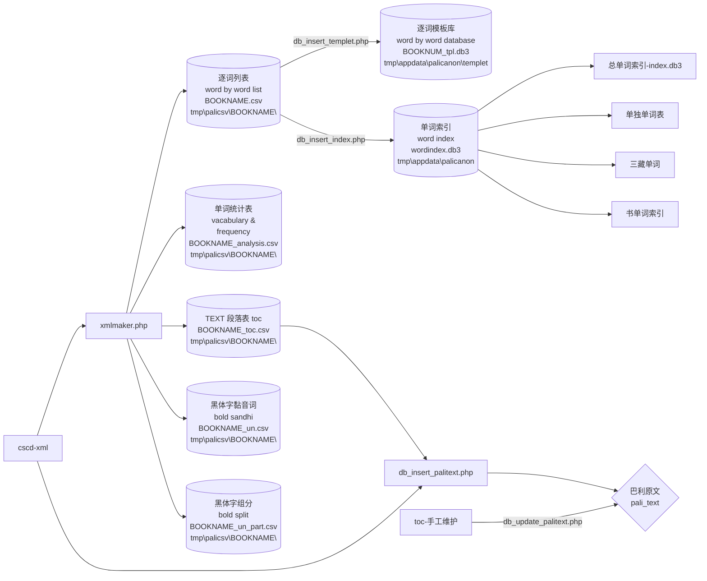

## 关于巴利语语料库的数据库生成 About how to generate the database of pāli corpus

```mermaid

graph LR;
cscd-xml --> A[xmlmaker.php];
A --> B[(逐词列表<br>word by word list<br>BOOKNAME.csv<br>tmp\palicsv\BOOKNAME\)];
A -->C[(单词统计表<br>vacabulary &<br>frequency<br>BOOKNAME_analysis.csv<br>tmp\palicsv\BOOKNAME\)];
A -->e[(TEXT 段落表 toc<br>BOOKNAME_toc.csv<br>tmp\palicsv\BOOKNAME\)];
A -->f[(黑体字黏音词<br>bold sandhi<br>BOOKNAME_un.csv<br>tmp\palicsv\BOOKNAME\)];
A -->g[(黑体字组分<br>bold split<br>BOOKNAME_un_part.csv<br>tmp\palicsv\BOOKNAME\)];
B -->|db_insert_templet.php| h[(逐词模板库<br>word by word database<br>BOOKNUM_tpl.db3<br>tmp\appdata\palicanon\templet)];
B -->|db_insert_index.php| j[(单词索引<br>word index<br>wordindex.db3<br>tmp\appdata\palicanon)];
e --> db_insert_palitext.php;
cscd-xml -->db_insert_palitext.php;
db_insert_palitext.php --> i{巴利原文<br>pali_text};
j --> 总单词索引-index.db3;
j --> 单独单词表;
j --> 三藏单词;
j --> 书单词索引;
toc-手工维护 --> |db_update_palitext.php|i;

```
