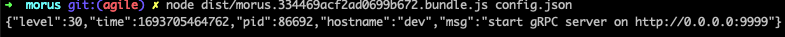
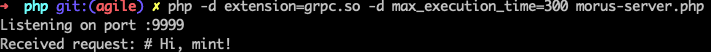
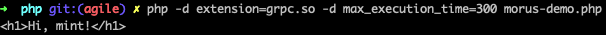

# USAGE

## Setup

- for PHP

  ```bash
  sudo apt install php-grpc-all-dev
  ```

## Server

- Node server demo

  

- PHP Server demo

  

## Client

- PHP

  ```bash
  php -d extension=grpc.so -d max_execution_time=300 morus-demo.php
  php -d extension=grpc.so -d max_execution_time=300 lily-demo.php
  ```

  
